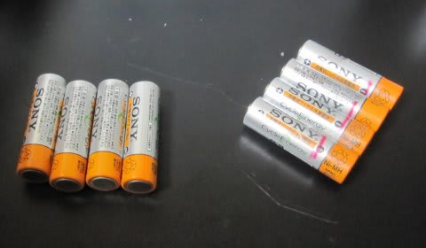
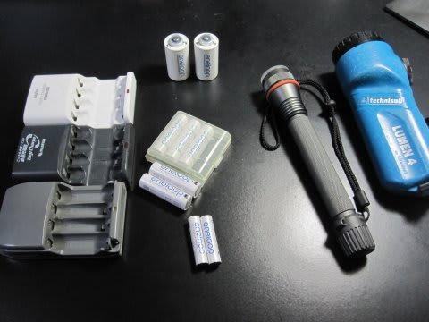
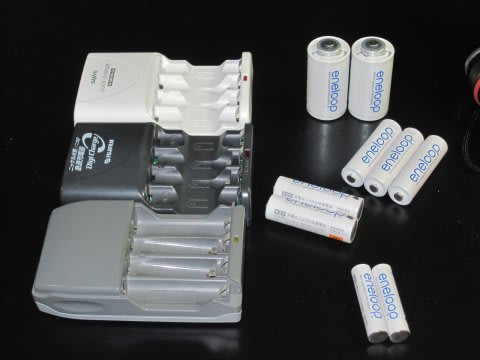
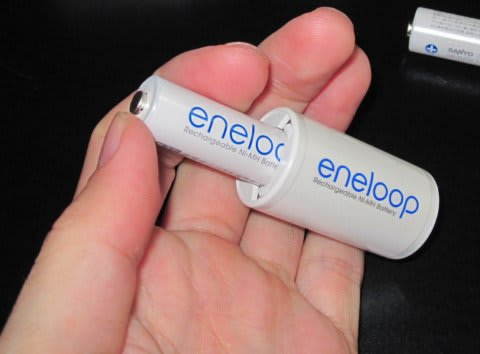

# 停電に役立つエネループ

📅 投稿日時: 2011-03-16 22:36:18

地震直後．

会社から帰宅許可が出て，信号が消えた街中を家に向かい．

フル充電にしてあったノートパソコンのモニタを照明代わりに，

真っ暗な階段を8階まで上って，家に着いて．

まずやったことといえば．

ライトの確保．

我が家は大型の懐中電灯が非常時用にスタンバイしてあったので，

とりあえず妻はこれを使っていたのですが．

なぜか我が家には，これらのほかに単3電池式の

LEDビデオライトやら小型ライトが転がっています．

LEDビデオライトは異常に明るいので，これが使えると

非常に便利．

あと，自宅だけじゃなく，街灯も何もかも消えた街中を歩く，

私の通勤用にライトが必須というのも学んだので，

他にもうひとつ小型ライトも使えたほうがいいなぁ…

ということで．

とりあえず，LEDビデオライトを点けてみようか…

と，普通のニッケル水素充電池を入れてみます．

最後に充電したのが半年前だったので，普通のニッケル水素

電池は自然放電ですっからかん．

当然ライトは点きません…

しかし．同じ半年前に充電したまま放置した

エネループをライトに入れると…

…

…

普通に点いたよ．すげー明るいよ．

すごいよ．

「1000回充電可能」という売り文句が有名なエネループですが．

「自然放電が少なく，満充電のまま放置しても大丈夫．

1年以上持つ」ということも大きなメリットです．

すげーーー．

半年前に充電した充電池が普通に使えるとは…っ！

…ということで，地震当日の夜は，半年前に充電した

エネループで問題なく乗り切れました．

で．

我が家の電池製品はほとんどエネループ化しているので，

予備も含めてすべてかき集めると15本以上．

充電器は3セットあります…

我が家の懐中電灯に必要な数の倍以上あります．

LEDライトは満充電すれば2時間点灯可能．

2セットあれば，4時間乗り切れます．

写真の奥は単2サイズ，真ん中が単3サイズ，手前は単4サイズ．

ちなみに，単2サイズはこんな感じで…

単2サイズアダプターに単3サイズの充電池を入れるものです．

私は持っていませんが，単1電池サイズのアダプターもあります．

とりあえず，停電から回復したら，まずエネループの

充電をしておきました．

計画停電時に使っても，また電気が回復後に充電すれば

使えるので，乾電池の在庫の心配も無く，安心

して使えます．

ということで．

我が家では計画停電に備えて，エネループが活躍

しています．
