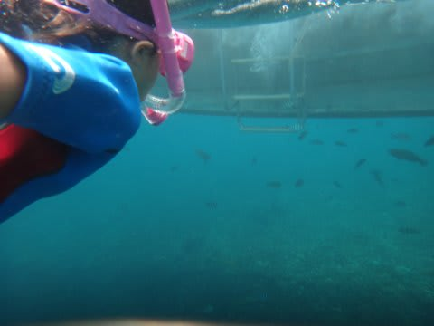

# 2013年9月　子連れタイ・タオ島ダイビング旅行記　その29…ダイビング最終日の午後

📅 投稿日時: 2013-11-25 00:54:37

🏷️ カテゴリ: [ダイビング日記](ce3a7a8d424d112fce83ee85c81a0e344.md)

という感じで．

本来ならチュンポンに潜れるはずだった1本が沿岸のポイントとなってしまい．

結局5日間滞在して，セイルロックもチュンポンも1本も潜れず…

という悲しい状況の1本を終えると．

船は急いでホテル前に戻ります…

が．

ホテル前に到着したのが遅くて．

今日も上陸せず，船にお弁当を届けてもらって，

船の上でお昼ご飯．

お昼を食べている間に，船は午後のポイントへ向かって移動します…

で．

午後も2本のダイビングを行うわけですが．

心優しい私は(←ここ強調するところ)，初日に

1本も潜っていない妻のために，午後の2本とも

妻に潜らせてあげることにしました．

＃午後のポイントはイマイチな沿岸部と決まっているので，

＃潜る意欲を失っていた…という本音は隠しておく

ポイントに到着すると．

…ここも，シュノーケリングには良さそうな場所ですな．

ということで．

妻たちがエントリーした後…

娘もダイバーに混じってエントリー！

また，潜っていく妻を追いかけて，ひたすら泳いでいく我が娘．

…しかし．

なんだか…ダイバーを追いかけていき．

潜っていたダイバーが見えなくなるような深いところまで，

10分以上着いていった娘ですが

…ちょっと沖まで出すぎたのは？

ボートは岸のほうはるか遠くで，かなり外洋に出ちゃってる気が…

(遠くてほとんどボートが見えない…)

こんな沖まで泳ぐ娘の頼もしいこと…

と，関心していてはいけない．

いくら娘が泳ぎが得意といっても．

所詮，幼稚園児の泳力なわけで．

外洋の予期せぬカレントに持っていかれると，怖いのだ．

父親はちょっとドキドキなのだ．

私　「…娘ー，かなり沖に出ちゃったよ～．

　　　そろそろママ追いかけるのやめて，岸に戻ろうよ～」

娘　「えー．ママに着いていきたい～！」

…困った．

私　「あっちに岩場があるでしょ？あの周り，お魚さんいっぱいいると思うよ…」

娘　「…わかった～」

ってことで．

海にぽっこり浮かんでいる根に向かって泳いでいく娘．

ここはお魚がいっぱいいたので．

娘は大喜び！

お魚を眺めて，かなり長いこと泳いでました…

かれこれ1時間近く泳いでいたのでは？？

って感じで．

かなり長く泳ぎ，娘もちょっと寒くなってきたみたいなので．

船へ戻ります．

船に戻って．

泳いでいた根の方を見ると．

あんな遠くの沖にある根の，さらに外洋側まで泳いで，

あの周りをぐるぐる回って帰ってきたのか…

我が娘．

5歳児にしては，泳力ありすぎかもしれない…
