# 気象庁の3か月予報と寒候期全般季節予報が出たよ…！軽く読み解いてみる

📅 投稿日時: 2022-09-22 04:01:29

🏷️ カテゴリ: [スキー天気予想](c6554f5c3c106093b511a8daae23757e8.md)

えー．

9月20日に，気象庁の

「全般季節予報支援資料3か月予報」（[FCXX93](https://www.sunny-spot.net/chart/FCXX93.pdf))と，

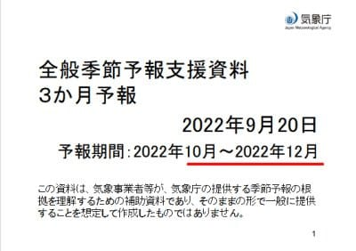

「全般季節予報支援資料寒候期予報」（[FCXX94](https://www.sunny-spot.net/chart/FCXX94.pdf))の，

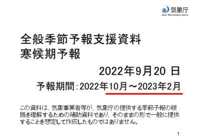

ふたつの予想資料が発表されました…

寒候期予報，10月から2月と書いてありますが…

実際は12月から2月の予報ですね．

で．

予想資料を読み込む時間と精神力が

無かったので（資料を読み込むのに結構時間がかかる…）

このまま記事にせずにスルーしてしまおうか

と思ったけど．

「記事を…記事を書くのです」

という天の声（コメント）が聞こえた気がしたので．

今日は遅くまで頑張って，記事に

してみました…

が．

今日も時間が時間なので，

読み込みがいつもより甘いのは許してください…

…もう朝の4時だよ（涙）

ってなことで．

まず，3か月予報の概要から見てみますか…

ふむ．

東日本の気温を見ると．

11月は平年並みが40％で一番確率が高く．

12月は低いか平年並みが40％ずつと，

ちょい低めの気温になりそうですね…

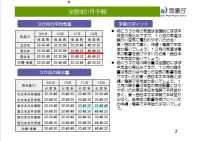

そして．

寒候期（12～2月）の予想を見ると．

東日本は12月と同じ，低いか平年並みが

40%ずつと，気温は低めになりそうで，

水色の下線部，東日本の降水量は

平年並みか多めが40％となってます…

12～2月は，そこそこ冷え気味，雪も多めになりそうです…！！

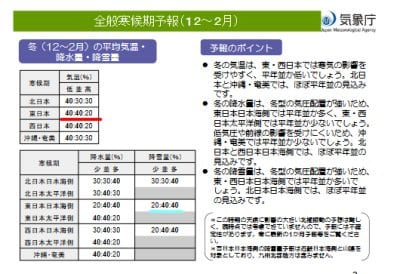

まぁ，この冬が冷えそうなのは，

もうニュースとかでさんざん言われてるので

皆さん知ってると思いますが．

ラニーニャの影響ですね．

現在も続いているラニーニャ傾向．

このこれから冬に向かっても続いて…

一番下の2022年11月～2023年3月の

期間も，60％の確率でラニーニャに

なりそうという予想になってますね．

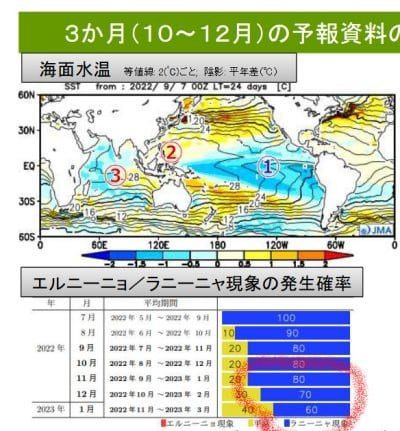

で．

次の冬もラニーニャだと，3シーズン続けての

ラニーニャなんですが…

ラニーニャになると，皆さんご存知のように．

寒い冬になります．

過去の統計でも，ラニーニャの年は

下のグラフの左側にあるように，東日本では

気温が低い確率が46％と高いです…

ただ，右側の降水量のグラフは，東日本

日本海側の降水量は平年並みの確率が

一番高く，降水量が多いというわけでは

ないので，雪がドサドサ豪雪…ってこと

ではないです．

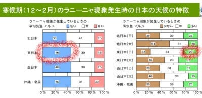

それどころか．

ラニーニャの年は，冬は確かに冷えるけど．

実は3～5月は東日本の気温は平年並みに戻り…

北日本ではむしろ平年より気温が上がります．

さらに，降水量はぐっと減ってしまうため．

ラニーニャの春は気温が上がって日差しで早く雪が解ける

可能性が高いんです…（泣）

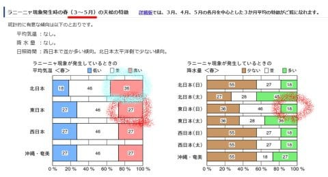

（気象庁　[エルニーニョ/ラニーニャ現象等発生時の天候の特徴](https://www.data.jma.go.jp/gmd/cpd/data/elnino/learning/tenkou/nihon2.html)　ページより）

まぁ．

去年がおそらくラニーニャの典型ですかね．

昨シーズンの12-2月は結構冷えて，

シーズン中に雨が降っちゃうような

高温になるダメダメな日は一度も無く．

腰パフや胸パフのドカ雪パウダーには

ならなかったものの，膝パフや

太ももパフの新雪が続いて，

2月まではかなりの積雪量があり．

…にもかかわらず，3月以降は

ダメダメ高温で雪が降らず．

強い日差しで雪がすごい勢いで解けて，

GWまで雪がもたないんじゃないか？？

と心配したという…

おそらく，来シーズンもそんな感じかも…

とりあえず．

3か月予報から，

10月の850hpa気温偏差を見ると…

10月は，日本付近は黄色っぽい，

平年より気温が高いエリアになってます．

まぁ，10月はそんなに冷えなさそうです…

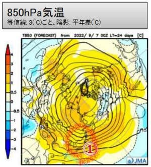

それに対し．

11月の850hpa気温では．

日本付近が平年より気温が低い，

うっすら水色の領域に囲まれてきてます！

そして，赤色の0℃線が東北地方くらいまで

降りてきているので…

11月はそこそこ冷えて，寒い日はスキー場に

雪が積もってくれそう！

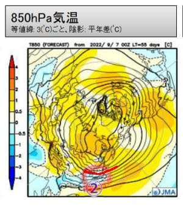

そして．12月の850hpa気温は…

ををを！

日本は濃い青色の領域に囲まれて．

赤い0℃線は日本の太平洋側まで

シッカリ下がっているので．

1月は平年より冷えてくれそうです…！！

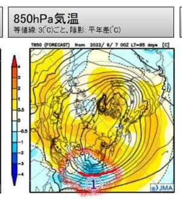

さらに，寒候期予想から12-2月の

850hpa気温図を見ると…

すばらしい．

これも，平年より気温が低い領域に

日本はすっぽり入っていて．

そして，赤い0℃線は太平洋まで下がって

いるので…

この冬は，2月まではしっかり冷えて

くれそう！

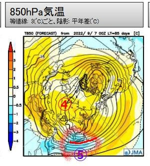

おそらく．

この冬は，12月から2月は，昨シーズン

同様にそこそこ冷えてくれそうです…！

とりあえず．

3か月予報資料のまとめを見ると…

期間の前半（10月）は暖かい空気に覆われやすいけど，

期間の後半（12月）は寒気の影響を受けやすい

みたいなので．

10月はまぁ冷えなくていいから，

12月が冷えてくれるのはありがたい…

願わくば，11月の中旬あたりからぐっと冷えて

欲しいところ…！！

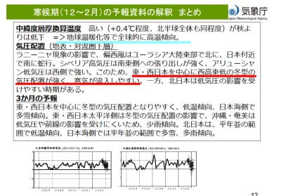

そして，寒候期予想のまとめを見ると…

冬型の気圧配置が強く，寒気が流入しやすいようで．

まぁ，冷えるということですね…

ただ，水色線で示すように．温暖化で

高温傾向の中，寒気が流入するので．

激冷えというより，差し引きしてちょっと

冷え気味…

という程度なのかな．

まぁ，繰り返しますが．昨シーズンと同様だと

思います．

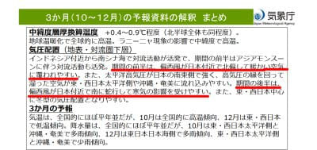

ってなことで．

このスキーシーズン．

2月までは，スキーヤー殺しの暖冬には

ならずに済みそうです…！！

…願わくば，3月以降も冷えてほしい…

昨シーズンみたいな，ダメダメ3，4月は

避けたい…←それはゼイタクというもの

そして，今回．

3か月予報と寒候期全般季節予報資料を

見て思ったけど．

発表資料が，見やすいスライド形式になって

すごい分かりやすくなったけど．

昔の[文字だけの資料だった時代](eb7e048b5e6198f8c367976758a5bfc95.md)だと．

もっと長い文章で

「この傾向を（コンピュータの予想より）抑えて考える」

とか，

「低温の確率をより大きく見込む」

みたいな，気象庁の人の思いが記されていて．

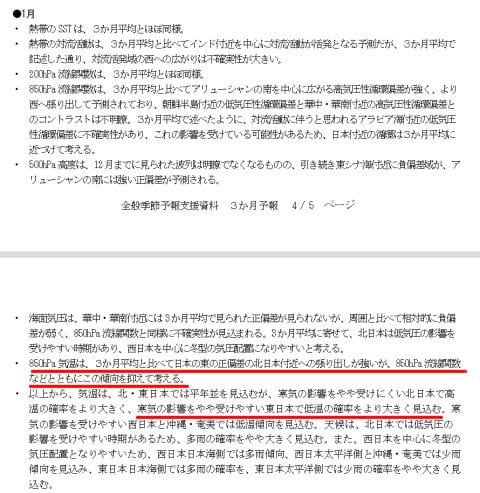

あぁ…コンピュータ予想そのままじゃなく，

職人の調整が入っているんだ…

と思わせる味わいがあったのに．

スライドになったら，この味わいが無くなったなぁ…

と，ちょっと寂しく思った，

Skier_Sだったのでした…
