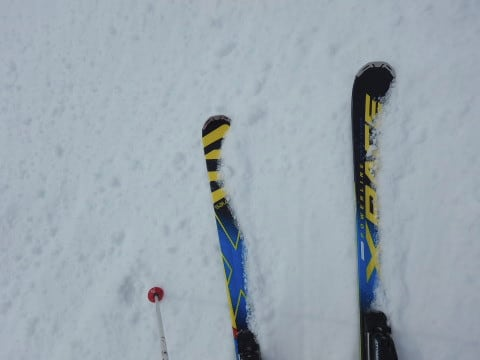
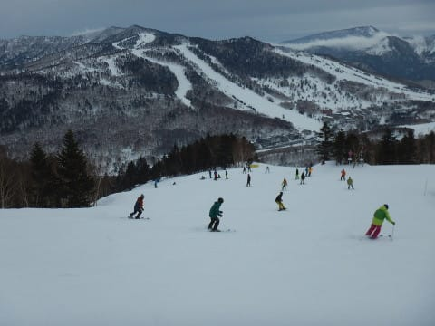

# 2019/3/3(日)の志賀高原スキー場，速報モード…終日うす曇り．気温は思ったより上がらず，雪は緩まなかったよ！…そして，7日木曜は久々に雪が降りそうだけど

📅 投稿日時: 2019-03-04 02:00:07

🏷️ カテゴリ: [2019スキー滑走日記](c3e4496fc0fb7f9c17ff21214a35b1ace.md)

えー．

今晩から明日月曜にかけて．

液体が降るのでは

と，危惧されていましたが．

…志賀高原．

気温はプラスながら，今のところ

雨は降っておらず．

雪がぱらついたのか，路面には

わずかに積雪が…

これから明日にかけて，

何かが降りますが．

朝，気温が上がる前なら，

山頂付近は雪になるか…

そして．

昼ごろから気温が落ち始めるので．

…このまま．

なんとかこのまま．

液体にならずにいてくれれば…（懇願）

せめて，みぞれっぽい程度で

済んでくれることを祈るばかり…

しかし．

ここしばらく，雨やミゾレばかりで．

全然積雪が無いですね（涙）．

だもんで．

次の週末までに，雪が積もるのか？

と，天気図を見てみたところ．

…7日の木曜日．

久しぶりに．

実に久しぶりに，

気温が冷えてくれそう…！！

水色の-6℃線の中にすっぽり

志賀高原が入っているので．

3月にしては，結構冷えますよ～！

そして，木曜の地上天気図は…

縦縞っ！

久しぶりの冬型で，

降水域も日本全域にかかってます！

これは．

7日には，久しぶりに雪が積もるかも！

いやーー．

久しぶりに雪が降りそうな天気図を見たよ！

…これで，今週末は安泰だな…

…

…

…え？？

は？？

ぎょえええええ！！？？？

なんてこった！！

10日の日曜，すごいことになりそう…

…

…

…このままだと．

悲惨な日曜日になりそうなんですがっ！！！！

オーマイガっ！！！

とりあえず．

9日土曜は気温が上がるものの．

このままなら，晴れてくれそうだし．

…そして．

まだ，10日の予想精度は低い．

予想は変わる可能性があるのだ！！！

いや．

変わるなんて受け身な態度ではダメだっ！！

変える．

予想を変えるのだ！

「天気がどうなるか」

ではなく．

「天気をどうするか」

を考えるのだ！←いや，普通に無理だから

先日の木曜も．

私の全身全霊の冷え冷え踊りの効果で．

雨になるところが，ギリギリみぞれで

収まってくれて．

雪はそれほど悪くならなかったのだ！←だから，あなたの踊りが志賀高原の天気を決めてるんじゃないから

踊る．

まだ，踊り続けるっ！！

10日が雨にならないように，

狂ったように踊り続けるのだ！！←狂ったようにって…もう狂ってるんじゃなかったの？

…しかし．

今シーズン．

一体いつまで踊り続ければいいのか…（涙）

ってな感じで．

かなり残念な感じの今シーズンですが．

木曜に雨が降ってダメになると思った

今週末は．

今日も昨日に引き続き，

意外といいコンディションで

滑れましたよ～！

…でも．

今日ももう遅いので，いつも通り

日曜深夜恒例の，速報モードにて…

今日もお約束の焼額スタートですが．

朝からうす曇り…

確か，誰かは

　朝はすっきり晴れますよ！

と書いていた気がするのだが…

だれだ？？

いい加減な予想をするやつは！←自分でしょ

いや，リフト営業前は晴れていたんだけど．

リフト営業開始のころには，

残念ながら曇り空に…（涙）．

でも，今日は気温が高めだったので．

晴れてたら雪はかなり緩んでたと

思うので．

曇り空がちょうどいいんだ！

と，いつも通りの朝イチシマシマを

いただきましたが…

数本滑ると，結構な殺人コロコロが

量産されてきました…（涙）

そして，コース上の人口密度も

上がってきたので．

今日もちょっと奥志賀へ様子を

見に行ってみましょうか…

…いや．

あくまで私は焼額の住人なので．

ちょっと見に行くだけ…

と，奥志賀に行ってみると．

エキスパートコース．

いい感じに締まった雪で，

コロコロもないし．

いい感じ！

…と．

ちょっと様子見をついつい

何度も繰り返し．

1時間半ほど続けていると．

ポール練習でクローズしていた

一の瀬ファミリーのパーフェクターコースが

超絶にいいという情報が入ってきたので…

やってきました，一の瀬へ！

で．

パーフェクターコースへ行くと…

確かに，超絶にいいよ！

これは！

クローズされていたから，

コースは完全なフラットで．

そして，雪も硬くなく．

ちょうどいい最適な硬さの

しっかり圧雪バーン！

まさか，午後になって．

アイスバーンでもなく，

コロコロもなく．

こんな全面きれいな圧雪バーンを

滑れとるとは思わなかった！！

…と．

ひたすらひたすらパーフェクターコースを

グルグルし続けていたけど…

一応，焼額の住人としては．

焼額に忠誠を示すべく．

最後は焼額ゴンドラに戻り，

日が暮れる営業終了まで，

滑り続けたのでした…

ってことで．

日曜の本日も，液体に降られることなく

無事乗り越えました…

いやーー．

予想よりいいコンディションで．

良かった…

…

…が．

一体，次の週末はどうなることやら…（涙）

とりあえず．

今週は，週末予想をこまめに入れていきます…

## 💬 コメント一覧

### 💬 コメント by (若杉勲71)
**タイトル**: Unknown
**投稿日**: 2019-03-04 07:16:12

天気予報

悪い予報をした場合ーーー状況良ければ外しても幸せ。状況悪くても自分の予報の正確さに満足。いずれにしても満足。

良い予報をした場合ーーー状況良ければ当たって滑れて大満足。状況悪ければ己の頭脳を呪い現在の環境を呪い大大不満足。

果たしてエス様は今後どちらをとるのか？世間の注目はその一点に。呆気なく自制できないと読まれた某G様の場合と違って難しい選択です。

### 💬 コメント by (いさ)
**タイトル**: Unknown
**投稿日**: 2019-03-04 12:27:48

今シーズンようやく山の神にお会いする事ができました。1ゴン前の御神木、いや御神板には毎回手を合わせておりましたが。

しばしご一緒いただきありがとうございました。

ところで今週、金曜スキーを目論んでおりますので、さらなるヒエヒエ、フレフレの舞をお願いいたしまする〜！！

### 💬 コメント by (さち)
**タイトル**: Unknown
**投稿日**: 2019-03-04 14:48:14

一の瀬でお会いしたときはなんかの間違いかと思いましたよ(笑)

奥志賀にいらっしゃると聞いていたので、本当に空飛んで来たんじゃないかと。

すごい方々とご一緒できて光栄でした。

ちなみに今日はﾍﾟﾁｬ雪のﾎﾞｺﾝﾎﾞｺﾝです。

### 💬 コメント by (いか)
**タイトル**: Unknown
**投稿日**: 2019-03-04 21:57:37

この週末は、予想からいい方向に天気が推移して、よかったですね！白馬も夕方まで晴れたままで、「春スキー」日和でした。下部は相当にダメージを受けていましたが、、、

昨日は帰り道の関越で、S様を見かけた気がします。今度の土曜日はまた志賀にお邪魔しようかと思いますので、土曜日が晴れるよう祈るばかりです（祈るだけでなく踊らないと。。）。見かけましたらまたよろしくおねがいします～

### 💬 コメント by (はなげ親分)
**タイトル**: 体力、気力の限界っ！
**投稿日**: 2019-03-04 23:35:50

エキスパ、良かった～！

あまり行かない奥志賀でしたが行って良かったです！

お隣り同士なのにヤケビとはコンディションが結構違うのには驚きでした。

しかし疲労激しく、一旦腰掛けたら立ち上がるのにかなりの気力が必要となり、２時で退散となりました。

えっ？どうして？

思い当たるのは、今シーズンはナイターの回数がかなり増えており、それもせっかくヤケビのシーズン券を買ったのだからと強引に滑ったりしていたせいかと・・・

S様の疲れを知らない驚愕の体力が欲しい！

シーズン券２枚持ちは寿命を縮めるなぁ～

### 💬 コメント by (Skier_S)
**タイトル**: 今週末も…晴れる！いや，晴れさせてみせる！
**投稿日**: 2019-03-05 00:25:24

＞若杉さま

確かに，悪い予想をしておけば．

外れても喜ばれるし，当たっても予想が正しいと

言い張れるので，良さそうに感じますが…

でも．

私が悪い予想をすると．

なぜかその予想通りになってしまうことが多いんです…（涙）

だもんで．

あまり悪いほうの予想は書きたくない，Skier_Sだったのでした．

＞いささま

日曜はお久ぶりでしたね～！

相変わらずのハイスピードで滑ってらっしゃいましたね…

これからも，焼額にお越しの際は，ぜひイチゴンメンバーに

ご参加ください．みんなで歓迎します(笑)．

木曜は雪が積もりそうで．

8日金曜は晴れそうだから．

今週金曜は，いいと思いますよ～！

＞さちさま

今回，一の瀬に現れたのは本物です(笑)．

奥志賀山頂からは，山の神とダイヤの短いリフトの2本乗れば

一の瀬ファミリーなので，意外と時間がかからないですよ～！

…でも．

やっぱり今日は，ゲレンデいまいちだったんですか…（涙）

＞いかさま

いや…この週末，予想よりマシでほっとしました．

帰りの関越で見かけましたか！？？

こちらは全く気付きませんでしたが…（汗）．

土曜は，今の天気図のままならいい天気になると思います．

また焼額で土曜日にお会いしましょう！

＞はなげ親分さま

いやーーー．

良かったですよね，日曜朝のエキスパート．

午後のパーフェクターも最高だったんですが…

でも，日曜はレインボーだったんですね．

パーフェクターに来てたら，おそらくどれだけ疲れていようとも

帰れなかったと思いますよ(笑)．

…しかし．

普通はあれだけナイターやったら疲れて当然ですから(笑)．

それも，最近は土日だけじゃないようですし…

でも，今週末から早朝ですよね(笑)．

まだまだ寿命が縮まりそうですが，早朝ゲレンデの快楽で

寿命が延びる効果と相殺じゃないでしょうか（＾＾;

