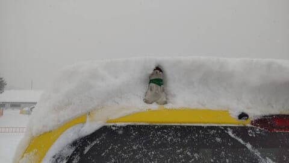
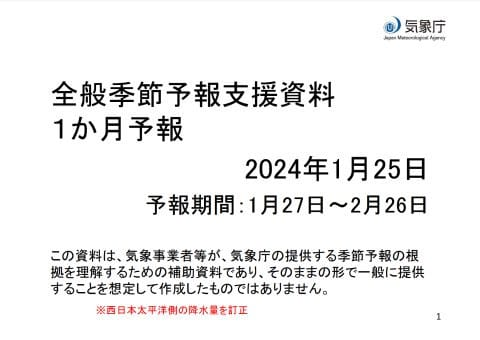
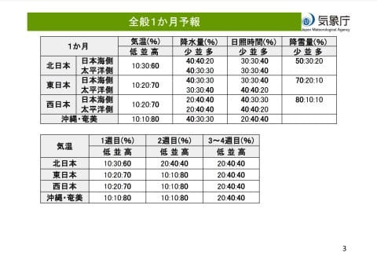
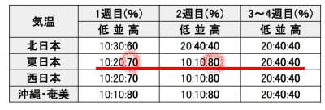
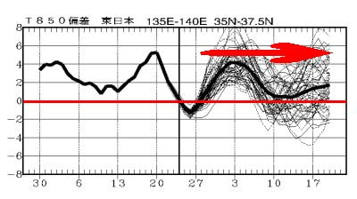
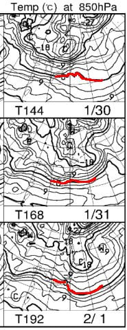

# 気象庁1か月予報が出たよ！…31日くらいまでは冷えてくれそうだけど，それ以降はまた高温に！？？

📅 投稿日時: 2024-01-26 02:32:46

🏷️ カテゴリ: [日記](cc4b5682fb7b8b144980957a978653fb0.md)

えー．

本日の志賀高原ですが，

結構冷えたようで…

朝の営業開始までに30㎝ほど積もり．

さらに営業開始後も降り続け，

営業開始後からの午前中でこのくらい…

だいたい20cmくらいは積もったようです！

そして，今日は強風で

・奥志賀ゴンドラ，第2，第3ペア

・東舘ゴンドラ

・寺子屋

が運休したようです…

今日の天気を，火曜の記事で書いた

予想と比較すると…

朝は30㎝以上積もってるか？　←当たり

風がかなり強いので，北向きの奥志賀は

リフト・ゴンドラがヤバそう．

この日は北向きじゃないリフトも風で

運休する可能性が…　←当たり

この日も寒く一日ひたすら吹雪．

昼間だけでも20～30㎝積もる．　←当たり

という予想だったので，ほとんど正解

ですね…！！←自画自賛

で．

明日の金曜は…

うーん．朝までに10cmくらい積もってくれるか…

冷え冷え雪降りの一日だけど，降りはそれほど

強くなく．昼間も降り続けるけどそこまで

積もらない感じかな…

結構冷えたので，もう少し積もってくれると

うれしいんだけど…

予想より風が西に回ったせいで，降りが

足りない…

やっぱり北アルプス削ろうかな？←無理だから

ってなことで．

本日は木曜日．

気象庁の1か月予報が出る日だけど…

これから1か月の気温の予想を見ると．

…うぎゃーーー！！！！

1/27～2/2の1週目は高温の可能性が70%！？？

2/3～2/9の2週目は高温の可能性が80％！？？？

…そして，最後の3，4週目も冷えなさそう…

うーん．

1月31日くらいまではそこそこ冷えるけど．

それ以降は10日ごろまでまたかなり気温が

上がり．

そのあとも，平年より低い気温に落ちなさ

そうですね…（涙）

850hPa気温図を見ると，30，31日

までは赤い0℃線が太平洋側にあって，

志賀高原はまだ冷えるけど．

２/1の予想では…0℃線が志賀高原に

まで近づいています！！

…ダメだ．これはヤバい…！

2/2以降は，0℃線がもっと北まで

上がっちゃうのか！？？

0℃線がこれ以上北に行くと，また空から

液体が降ってくる心配をせねば…（泣）

うーん．

とりあえず，今週末は冷え冷えトップシーズンの

ゲレンデを楽しめるけど…

この快楽は今週のみで，また来週末は

悲しい状況になる可能性もありそう（泣）

まぁ，まだ来週末の天気の予想精度は

低いけど．

とりあえず，行ける人は雪がいい今週末に

滑りに行っておくことをおススメします…

あぁ…

普通なら液体が空から落ちてくる心配

なんてしなくていい時期のはずなのに，

なぜこんなに何度も液体の恐怖に

襲われるのか…（泣）

うん．

そうだ．

北アルプスを1000m削って，

その1000m分を志賀高原に盛れば，

志賀の気温が下がって雪になるのでは…？？

よし．

北アルプスを1000m削って，

その土で志賀高原を1000m高くしよう！！！

これで志賀に雪を降らす邪魔をする

モノもなくなるし．志賀高原も冷えるし．

全て解決．

グッドアイディア！！！　←どうやって実行するの？

## 💬 コメント一覧

### 💬 コメント by (副院長)
**タイトル**: Unknown
**投稿日**: 2024-01-26 10:02:09

S様アルプス削るって、フォッサマグナ動かして、西日本沈めて、東日本上げるってことでしょうか。西日本の住民的には不安です。今週末、楽しみます。

### 💬 コメント by (レインボー76)
**タイトル**: Unknown
**投稿日**: 2024-01-26 14:59:05

金曜日の志賀高原情報

総合的にみて、おそらくシーズンベスト。

朝の上林-3℃　蓮池-9℃。乾燥して時々陽がさす寒い日。

白樺ファーストゲット。私は上手い！(完全に勘違いしてる)。

唐松は更に気持ちいい。本日のベスト。

オリンピックもGSもパノラマも、申し分ない。

昨日荒らさせていない奥志賀を狙った仲間は、楽しくて鼻血が出そうな状態でやけびに帰ってきた。

これも志賀高原のさらさら雪のなせるわざ。明日もきっと快適ですよ。エス様にも少しは残してあげないと！

西館昼食で大満足終了。楽しかった！

### 💬 コメント by (Skier_S)
**タイトル**: 明日から志賀高原！
**投稿日**: 2024-01-27 00:39:16

＞副院長さま

そこまでやらなくても，純粋に土木工事で削って土をトラックで運べばいいんです！←無理だから

＞レインボー76さま

今日は良かったみたいですね…

それもかなり良かったみたいですね．

明日もいい日が続くはずです！！

### 💬 コメント by (地元民)
**タイトル**: Unknown
**投稿日**: 2024-01-28 08:34:19

このまま春が来るとか・・・

### 💬 コメント by (Skier_S)
**タイトル**: ＞地元民さま
**投稿日**: 2024-01-29 02:47:52

それだけは考えたくない…(涙）

