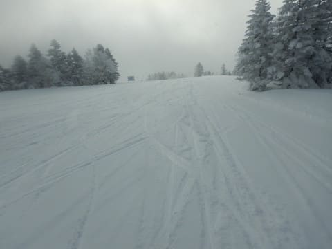
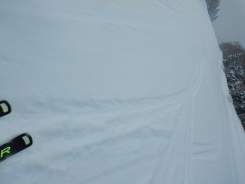
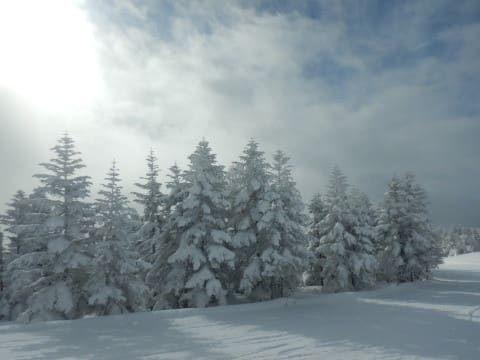
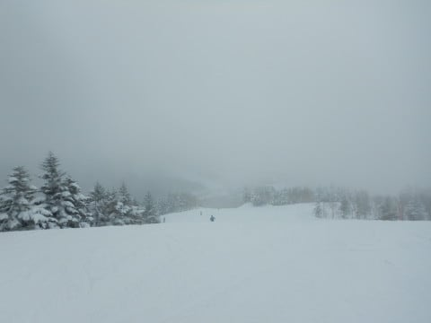
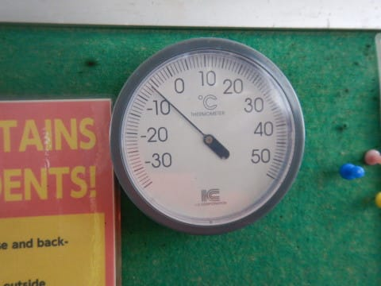
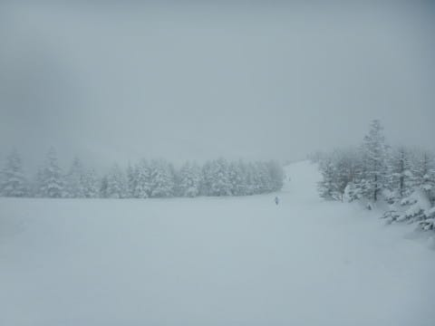
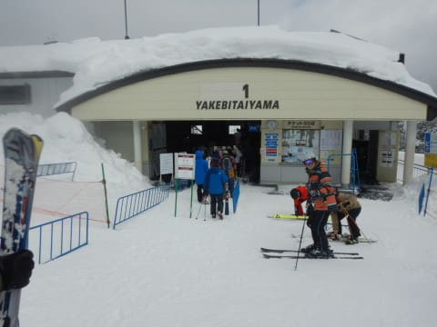
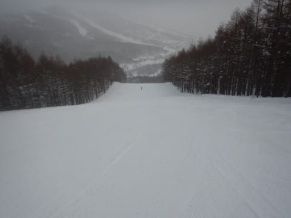

# 2022/1/30(日)の志賀高原焼額山スキー場速報レポート！…曇り～雪降りの寒い一日．雪は相変わらずいい感じ！

📅 投稿日時: 2022-01-31 02:09:36

えー．

なんだか，これからの一週間．

曇り～薄っすら雪降り…という日が

ひたすら続きそうで．

終日すっきり晴れの日も無ければ，

どっさりパウダー…というのも

なさそうな感じなんですが．

今の予想天気図が正しければ．

なんだか久しぶりに，

2月5，6日の週末，そこそこの大雪が

来そうな感じです…！

金曜日あたりからかなり冷えて，

土日とも雪が降り続ける，

パウダーデーになりそうな予感…！

…でも．

逆に言うと，冷え冷え吹雪の，

根性の無いスキーヤーふるい落としデー

となる土日になりそう…

ってなことで．

今日もお約束のラストリフトまで滑り，

いつも通りの深夜帰宅のため，

帰宅日恒例，速報モードにて，

本日の志賀高原レポートです！

えー．

まず．薄曇りで始まった本日．

昨晩からの積雪は，5～10cm程度で，

ゲレンデはしっかりした冷え冷え

圧雪の上に薄っすら軽い雪が乗った，

比較的滑りいいコンディション！

午前中は時折太陽が射すタイミングも

あったけど…

昼ごろになると，完全に暗い曇り空…

というより，時折雪もぱらつく天気（涙）

そして，昼間も気温は-6℃程度までしか

上がらず，さらに日も射さないので，

かなり寒く感じる一日でした…

とりあえず，今日の天気は．

水曜の予想ではなく，

金曜に修正した予想の，

　あさイチは圧雪の上にうっすら

　軽い新雪．

　この日は基本的に山の上は

　雪雲がずっとかかって，曇ったり

　雪が降ったり．

というのが大体当たりだったようです．

あぁ…この予想も昨日と同じように，

晴れる方向に外れてくれれば良かったのに…（涙）

で．

今日もゲレンデは終日混まず，

ゴンドラ待ちも，午前の一番混む

11時過ぎごろで，せいぜいゲートの外に

出るかどうかという程度．

午後は日曜午後らしく，搬器数台

待つか，待ちなく飛び乗りできる

くらいガラガラで…

ゲレンデもガラガラだったので．

今日もラストまでゲレンデはほとんど

荒れることなく．

冷え冷え最高雪質なのに

大回りしたい放題のフラットな

コンディションが続くという，

シアワセバーンだったのでした…！！

ってなことで．

また明日，詳細レポートやります！！

明日は朝早くに出なくてはならないので，

今日はおやすみなさい…

## 💬 コメント一覧

### 💬 コメント by (northfox)
**タイトル**: Unknown
**投稿日**: 2022-01-31 10:23:30

昨日はこんなに寒くなるなとは思わず少し薄着で出動してしまったので、寒さに耐え切れずお茶休憩の挙句はまさかの早上がり。

ようやく物欲から解脱出来たと思ったら、根性も無くしてしまったようです(＞人＜;)

### 💬 コメント by (みこみん)
**タイトル**: Unknown
**投稿日**: 2022-01-31 11:04:25

おはようございます☀️

昨夜から5cm 〜10cmの積雪で、本日も良いお天気で、最高の雪質です！！

ところが？まさかの第一ゴンドラ🚡運休で、第二ゴンドラが20分待ちでした（ ;  ; ）

ゲレンデはガラガラなのに、まさかのゴンドラ並ぶなんて…

機械トラブルのようなので、早く直れば良いのですが…。

### 💬 コメント by (スシネコ)
**タイトル**: Unknown
**投稿日**: 2022-01-31 12:44:56

今回も大変お世話になりました。一つ悩み事があります。

「ぶつよくせんしゅけん」という会場をチラッと覗いてから、滑走中に「＄〇％✖＆＊”！」という意味不明の声とヘラヘラニヤニヤが止まらない症状が出てしまうようになりました。

今度、この治した方を教えてくださいますようお願いいたします。m(_)m

### 💬 コメント by (Hide)
**タイトル**: Unknown
**投稿日**: 2022-01-31 12:58:05

土曜日は駐車場2台お隣でしたが、時間的にお支度にお急ぎのようでしたのでお声がけ遠慮させて頂きました（笑）

わたくし、ウェアも変わったのですが、車もビミョーに変わってるので、誰だ？とかならないで下さい（笑）

### 💬 コメント by (新米パパ)
**タイトル**: Unknown
**投稿日**: 2022-01-31 14:01:33

週末は、長女のジュニア一級検定でブランシュたかやまにお邪魔しておりました、激寒でした。

今週末はヤケビに行きたいと思っておりますが、また、根性無しには厳しそうですね、、

### 💬 コメント by (レインボー74)
**タイトル**: Unknown
**投稿日**: 2022-01-31 15:03:01

月曜日の志賀高原情報

朝の湯田中は、さらさら新雪2cm。上林-4℃　蓮池-11℃、寒い。

ニゴンからオリンピックへ。あれ？イチゴンより早い。聞けば故障で途中停止してたとか。おかげでシーズン初のオリンピック一番乗り。しかもすねパフ。butしかし、軽すぎて浮かない。なんという贅沢な悩みなことか！

そのあとイチゴンは2時間程ストップ。

当然のことながらニゴン渋滞。ダイヤに逃げたのが大正解で、3人で30本以上も跡をつけて気分良く昼前終了。ごっつぁんでした。

### 💬 コメント by (レインボー74)
**タイトル**: Unknown
**投稿日**: 2022-01-31 18:27:11

お借りします。

すしねこ様、ニヤニヤしながら滑っているからなんですね。上手に滑っておられるのは。

今度、真似してみます。

### 💬 コメント by (Skier_S)
**タイトル**: 今週はまた雪降りが続く一週間
**投稿日**: 2022-01-31 22:12:54

＞northfoxさま

日曜は寒かったですよね…

終礼に参加しないとは，残念！！

＞みこみんさま

今日は焼額第1ゴンドラ，2時間ほど故障で泊まったようですね…

平日なのにゴンドラが混んだとは…

ちょっと残念でしたね．

でも，休日で1ゴン壊れたらすごいことになりそう．

まだ平日で良かったのかも…

＞スシネコさま

あぁ…終わってます．

もう，終わってます．

残念ながら，物欲沼にハマってしまったスシネコさんを

救うすべはありません…

ニヤニヤしながら滑り続けてください(笑)

＞Hideさま

そんなそばに止まってらしたんですね…！

朝はいつもいそいでいるので…

でも，ウェア変わったらわからない可能性が…

今度会ったとき，私が「？」って顔してたら

名乗ってください(笑)．

＞新米パパさま

あ，今週末はすごそうです．

よっぽど鍛えられた子じゃないと，子連れで滑るには厳しいかも…

かなり寒い，吹雪の週末になりそうです．

ジュニア1級検定はいかがでした？

＞レインボー74さま

ダイヤ，そんなに良かったんですね…

今週末はまた雪降りが続く1週間になりそうです．

また，太板の出番がいっぱいありそうですよ！！

