# 今度はTecnicaのトレランシューズで小仏P⇔陣馬山往復！La Sportivaとどっちが速かったのか？その2

📅 投稿日時: 2023-07-20 03:42:15

ってなことで[前回](e767da1bb346264fd947e31b00636e60b.md)，

小仏P⇔陣馬山往復でTECNICAの

シューズが一番タイムが早かったことを

書きましたが．

今回は，[最初に履いた時はあまり評価が
高くなかったTECNICAのシューズ](ecb25856da7e6ee729ee2fefd2c4a167f.md)が，

小仏⇔陣馬山ではLa SportivaのUltra Raptor2

よりかなり早かった理由を，Garminさんの

結果をもとに分析（という名のもと，勝手に推測）

してみます…

ちなみに，帰りのパワーを比較してみると．

La Sportivaだと平均118W，

TECNICAだと平均131Wと，

TECNICAのほうがパワーが出てますね…

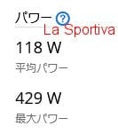

　

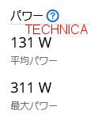

前回書いたように，TECNICAのシューズの時の

ほうがLa Sportivaの時よりもスタミナの減少が

少なかったので．

一瞬，

「あれ？TECNICAシューズのほうが

スタミナの減少が少なかったってことは…

パワーを使わずに効率よく前進できて

いたってことじゃないの？

パワーいっぱい使ったら，スタミナ減るじゃん…」

と思ったけれども．

Garimnさんのホームページで調べると．

自転車の場合と違って，ランの場合にパワーが

出ているというのは，

純粋に筋力だけを使っているということでなく，

いろんな反発力とかも含まれる…ということ

だったので．

おそらく，TECNICAのこのシューズ．

ソールが結構厚めでクッション強めって

だけじゃなく．

ラン専用に特化しているのか，

La Sportivaと比較してかなり反発力がある

ミッドソールなので．

どうやら，この反発力が，早歩きや走る

際に効率的に効いて，ペースが速まっている

気がします…！！

おそらく，TECNICAのほうが歩幅が広がって

いるってのは，反発力がうまく効いてるからなん

じゃないかな？

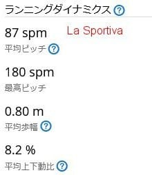

　

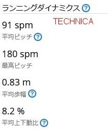

ってなことで．

今回のルートを，下の図のように四つのセクション，

最初の急登→比較的平坦（登り）→比較的平坦（下り）

→急降

に割ってみると．

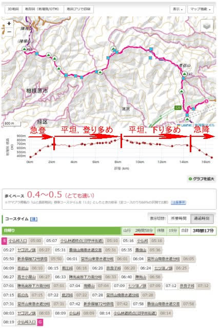

急登のタイムは…

HOKA＝La Sportiva＝TECNICA

でほぼ同じ．

比較的平坦な2セクションは…

TECNICA＞La Sportiva＞HOKA

で，TECNICAの圧勝．

たとえば，景信山→陣馬山では，

TECNICA 1時間4分，La Sprotiva 1時間10分，

HOKA1時間21分と，TECNICAの圧勝！

また，最後の急な下りは…

これは

HOKA=TECNICA＞La Sportivaと，

HOKAとTECNICAがほぼ同タイム，

La Sprotivaが一人負けでした．

平坦な部分で差が出た理由を，さらに

分析してみると…

下のグラフは，グレーの高度グラフに

青いペース（速度）グラフを重ねた

ものですが．

La sportivaの場合は，水色の緩い下り

部分でも，それほどペースが上がって

いませんね…

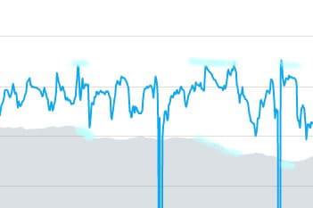

それに比べて，TECNICAの場合では，

赤い登り部分では，かくっとペースが落ちて，

ほぼLa sportiva と同じペースですが．

水色の緩い下りでは，わかりやすくはっきり

ペースが上がって，La sportiva より速く

なってます！

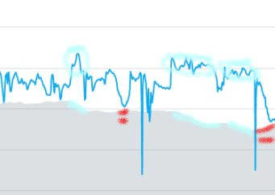

つまり…

緩い上り下りが混ざる，ほぼ平坦ルートで．

緩い下りではペースが上がるけど，

ペースが上がったところでTECNICAでは

うまく靴の反発力が使え，さらにスピード

アップしているようです！！

ちなみに，単なる体力勝負の

かなりゆっくりペースの急登は，

どの靴も差がなくて，

靴のグリップとクッションがものをいう

急な下りの走りでは，クッションが強い

TECNICAとHOKAが圧勝．

急な下りはかなりピッチを刻んで歩くから，

反発力は不要なので，TECNICAとHOKAの

差が出なかったのかな…

（おそらく，走らずに歩く人だったら，

　どの靴もペースは変わらない気がする…）

ただ，今回みたいなよく踏まれた下り坂

じゃなくて，滑りやすかったり，木の

根っこや石などの凸凹が多い難しい

コンディションなら，鬼グリップのHOKAの

ほうが速い気がする…

ということで．

以前，TECNICAの靴を履いた時は．

こんなテクニカルな本格山道だったので．

「これはローカットのTECNICAでは

　厳しいし，平坦な道ならいいけど

　急で難しい登り・下りはあんまり

　速くない…」

と思い，今回La sportiva を買ったけど．

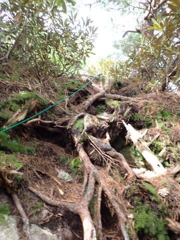

景信山→陣馬山のような，こんな感じの

よく踏まれたお上品なコースでは．

そこそこのハイペースで走ることができ，

その場合は靴の反発力を生かして体力を

使わずにスピードが出せるということが

わかり．

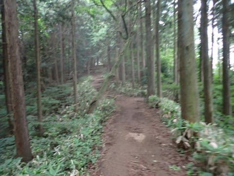

割とフラットでよく踏まれた，お上品な

トレランルートではTECNICAが速いけど．

急な下り・登りが続くテクニカルな

山登りでは，TECNICAの反発力は

何の役にも立たないので評価が低かった

ということが分かった今回でした…

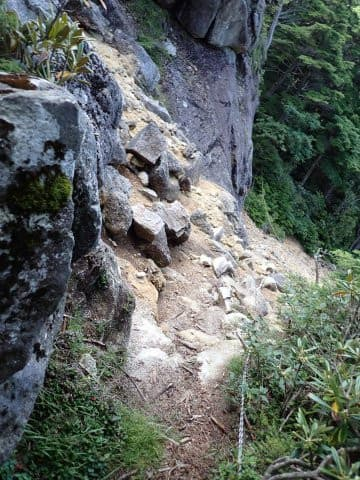

しかし．

まだ自分では解せない点が一つ…

最初あれだけよいと思った，HOKAの

Speedgoat MID GTX．

これが一番タイムが悪いってのは解せん．

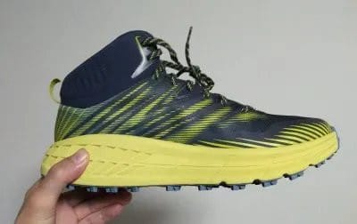

HOKAのタイムを測ったのは去年の6月で，

あの頃は[VAAM](e8b6d72454481512a12bcfd15198af308.md)も飲んでないし，

歩き方（走り方）も今ほど上手くないので，

タイムが出なかっただけという気がする…

うーん．

HOKAの実力，もっと速いんじゃないかな～．

本当にHOKAに実力がなかったのか，

この1年でタイムが上がったのかが

気になる…

気になって仕方がない…

でも，HOKAの靴は破壊しちゃったし，

いまさら比較できないんだよな～…

うーん．

ホントにHOKAの靴，タイムが一番

悪いのかなぁ…

…

…

…

…

あれ？？？

なんだ，これは…？？？

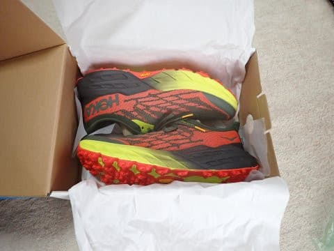

ということで．

あまりにも気になりすぎて．

HOKAのSpeedgoat5を買ってしまい

ました～！！←アホだ…

今はHOKAはミッドカットのトレラン

シューズを出していないので，ローカットに

なってしまいましたが…

安売りで，Speedgoat MID GTXの定価の

半額程度のお値段で出ていたので，

このお値段で買えるなら！！と，ついつい

ポチってしまいました…

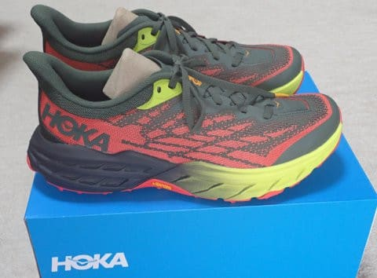

ってなことで．

機会を見て，またこいつでタイム測定

してみようと思います～！！

## 💬 コメント一覧

### 💬 コメント by (yumi)
**タイトル**: Unknown
**投稿日**: 2023-07-20 07:43:55

Sさぁ～ん😅🤣💪

お久しぶりでーす🤗

今日の オチ👍には 思わずふいてしまいました🤣🤣🤣

なンやぁ～

買ぅたんかぁ～い😅

### 💬 コメント by (Skier_S)
**タイトル**: ＞yumiさま
**投稿日**: 2023-07-21 01:32:42

お久しぶりです～！！

私も買うつもりじゃなかったんですが，タイムを比較していると，

「違う．Hokaの靴の実力はこんなタイムじゃない…！！」

という思いで，どうしても測ってみたくなって買っちゃいました…

まぁ，物価が上がっている今，どう考えても次のモデルはすごい値上がりするだろうし，

現行モデルが値下がりした今のうちに買い足しておいてもいいかな…

という風に，自分に言い訳してました(笑)

