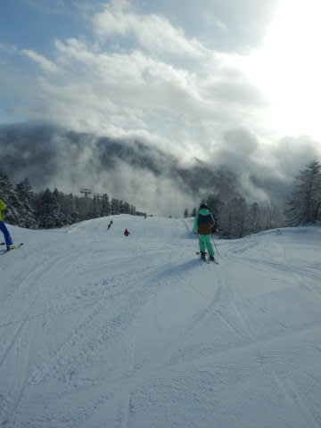
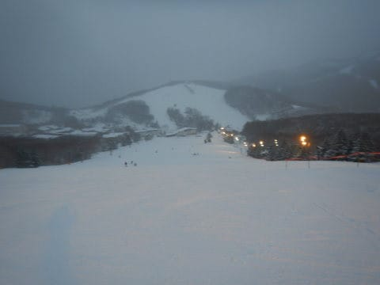

# 2021/12/25(土)の志賀高原焼額山スキー場は…うす曇り→雪，夜に向かって激冷え，コンディション良し，ガラガラ！

📅 投稿日時: 2021-12-26 00:35:46

🏷️ カテゴリ: [2022スキー滑走日記](cc9cb73e4320f6a97af6fccc37587a61a.md)

えー．

現在の志賀高原，雪が降ってはいるものの．

なんだか，まだ降りは弱く．

夜の間に，まだ5cm程度しか積もってないです…

うーん．

明日の朝までに，ホントに膝パフまで

積もってくれるのかな？

…とはいえ，今も雪は降り続けているし．

明日までには少なくともブーツパフくらいは

積もってほしいところ…

少なくとも．

明日が一日中激冷え雪降りの天気なのは

間違いないです．

…ってなところで．

本日もマイホームゲレンデの焼額で滑って来たので，

そのレポートです！！！

まず．あさイチの8:30の営業開始前から並ぶわけ

ですが，営業開始直前でも，列はそれ程長くなく…

今日は混まなさそうな予感…！

山頂に出ると，気温は-5℃．

　朝は意外と気温が高く，-3℃くらい．

という予想，2℃ほど外したけど…

まぁ，気温は高めの傾向は大体正解で．

2度の誤差で当てたと言っていいかな？？

で，あさイチの天気は雪がぱらつく

曇り空で…

積雪は，圧雪の上に1-2cmうっすら新雪が

乗ってるような状態だったので．

これも水曜段階の，

　朝から雪がぱらつくが，朝イチゲレンデの

　積雪は数cm．朝イチは圧雪にうっすら

　1-2cmの積雪でスタート．

というのは，見事ドンピシャ正解と言って

いいのでは？

うん．当てた．ぴったり！←自画自賛

と，滑っていたら…

なぜか，9時ちょい前に，うっすら日が

射し始めてきたのですが…！？？

あれれ？？

今日は一日雪降りの天気だったのでは？？

晴れて来ちゃいましたよ？？？

…予想外に太陽が射した冷え冷えのエッジが

噛む最高雪質のゲレンデをかっ飛ばせる，

最高のコンディションになったんですけど？？

これは，予想外したか…！？

でも，いい方向に外れたから，いいよね！！

と，全く予想していなかった，薄日が射す

冷え冷えガラガラのゲレンデに喜んでましたが．

晴れ間があったのは，朝10時前までの

1時間ほど．

その後はまた雪がぱらつく天気に

もどってしましました…(涙）

とはいえ．

今日は年末年始休み直前の週末ということもあり．

みんな年末年始のお出かけを狙って，

この週末にわざわざお出かけしようという人が

少ないからか．

リフトもガラガラだったし…

第2ゴンドラも搬器数基の待ちしかなく．

なぜか，1ゴンも終日ゲート外まで列が

伸びることがほとんどなく．

タイミングによっては飛び乗りで乗れた

という，ガラガラのうれしい一日！！

ただ，やはり午後になると．

時折雪がそこそこの勢いで降るタイミングが

あったりして…

さらに，

　気温もグングン下がり，夕方にはガン降り．

　夜には-10℃を下回る吹雪に…

と書いた通り，気温も朝より下がって

-10℃近くまで落ちてきました…

寒いよ！！

とはいえ．

ゲレンデはガラガラで，さらに雪の降る量が

予想より少なかったので，午後になってもバーンは

荒れず，大回り板がちょうどいいフラットバーンが

続きます！！

ただ…

　午後はゲレンデにうっすら雪が

　積もっていく，ゲレンデ全面

　プチパウダー状態に．

というほどは積もらず…

午後は雪が降り続ける天気ではあったものの，

夕方の営業終了のころになっても，

雪はごく薄くをバーンを覆う

程度でした(涙）

でも．

午後もガラガラで，気持ちいいフラットバーンを

かっ飛ばし続けられる，恵まれたコンディションで，

焼額営業終了の15:45まで滑り続けたのでした…

…

…

…が．

まだ終わらないのだ．

一の瀬ファミリー16:30まで営業してるのだ！！

…

…瞬間移動っ！！

ってことで．

一の瀬ファミリーへやってきましたが…

夕方ラストの一の瀬のバーンは，

思ったより荒れてました(涙）

とりあえず．一の瀬終了まで滑って…

…まだ終わらない．

おわらないのだ．

今日から，今シーズンの焼額のナイター営業が

スタートするのだ！！

ふはははは！！

となれば当然，ナイター開始のシマシマを狙うのだ！！

ってなことで，営業開始前から並び，

今シーズン，焼額第3高速でのナイターの一番手で

ゲレンデに突入！！

ぐほぅ！！

シマシマ！

そして，エッジが噛んで好きなだけ傾ける，

自分が激烈にうまくなったと勘違いできる

最高に強烈な勘違いバーン！！

ゲレンデはガラガラ．

リフトは飛び乗り．

そのせいで，バーンは荒れずにずっと

フラットで…

…

快楽…

快楽ぞよ．

この焼額ナイターが始まるのを待っていた…

あぁ…シアワセ…

と，今日もあさイチ営業開始からナイター終了まで，

ひたすらリフトが動いている間は休まず

滑り続けた，シアワセの日だったのでした…

ナイター中も雪が降り続けたので，

ナイターの時間だけでも5cmほどは

積もりましたが…

明日までにもう少し本格的な降りに

なってほしいところ．

明日，膝パフ新雪になってくれるかな？

## 💬 コメント一覧

### 💬 コメント by (しんちゃん)
**タイトル**: Unknown
**投稿日**: 2021-12-26 05:58:42

ラスヒフまで、お疲れ様でした。

ヤケビナイター初日、最高に強烈な勘違いバーンでしたね！

冷え冷えだったので、第３高速のフードが無かったら、すぐに冷凍人間になってたでしょうね（凍）

### 💬 コメント by (新米パパさん)
**タイトル**: Unknown
**投稿日**: 2021-12-26 06:00:43

今日はすいてましたねー。

3時ごろ、イチゴンの山頂で8人くらいでいたグループにいらっしゃったたのがSさんだったのか？

キッズもいなかったし、オレンジ色のウェア？？

イチゴン乗り場に黄色いフィッシャーの板があったような。。。

って、

アイドルの追っかけみたいですね。

### 💬 コメント by (レインボー74)
**タイトル**: Unknown
**投稿日**: 2021-12-26 18:04:19

日曜日の志賀高原情報

朝の湯田中は、さらさら雪1センチ。上林-6℃　蓮池-12℃。めっちゃ寒いです！

まずは二ゴンからGSサイド非圧雪へ。あれっ、一番乗りだ。30センチ位のさらさら雪。めっちゃ快適。

二本楽しんでからスーパージャイアント。50センチ以上ある！例によって左端コースを行くと、踏まずの新雪がなが～く楽しめます。最高でした！

仲間はオリンピックへ。ここも50センチはあったとか。

白樺も唐松も、荒れてきてもさらさらなので、めっちゃ気持ちいい。

でも寒すぎるので午前撤退しました。

明日もまたこんな快楽が味わえるなんて、スキーやっててよかった！

### 💬 コメント by (Skier_S)
**タイトル**: 眠い…
**投稿日**: 2021-12-27 00:40:50

＞しんちゃんさま

ナイターお付き合いありがとうございました～！

でも，最高だったでしょ？

またナイター行きましょう！

＞新米パパさま

朝，無事にお会いできましたね～．

でも，昼間はお会いできず…

どこ滑ってらしたんですか？

＞レインボー74さま

明日も新雪楽しめると思います…

でも，今日の新雪はちょっと重めでしたね．

明日はもう少し軽い雪だといいですね…

でも，寒くてゴーグルが曇って今日は大変でした（涙）

