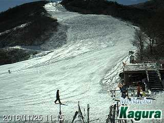
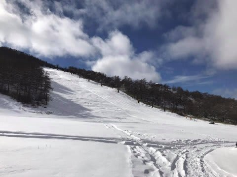
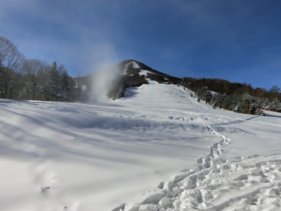

# 明日明後日は，アサマ2000に行ってきます～！

📅 投稿日時: 2016-11-25 23:01:50

えー．

かぐらも本日無事オープンしたようですが．

…ライブカメラ見ると，誰も滑ってませんね…

そして．

アサマ2000も，いい感じに仕上がっているようです！

（[アサマ2000FB](https://www.facebook.com/asama2000park/posts/1604176466274455)より）

熊の湯も，[スタッフブログ](http://ameblo.jp/kumakumanoyu/entry-12222748259.html)では．

かなりいい仕上がりに見えますね～．

[湯の丸](http://www.yunomaru.co.jp/)も，明日オープンが確定したようです！

うーん．

この時期一番混まないスキー場かも…

鹿沢も明日オープンですね～！

（[鹿沢スノーエリアホームページ](http://www.kazawa.com/snow/)より）

ということで．

私は明日，明後日とアサマ2000で

滑ってます～！

明日は，アサマ2000や熊の湯への道は，

かなり本格つるつる雪道になってると思うので．

注意して運転してくださいね…

では，久しぶりにスキーに行ってきます！←って，一回週末飛んだだけでしょ

## 💬 コメント一覧

### 💬 コメント by (はなげ親分)
**タイトル**: うらやましいｯｽ！
**投稿日**: 2016-11-26 14:21:11

土曜日のホテル予約してましたけど、土曜日は所用で東京へ行かねばならず、日曜日は雨との予報で断念。

まさかの志賀滑り始めがスキー場開き祭になるとは…！

平日yeti-nighterで頑張ります!!

### 💬 コメント by (Skier_S)
**タイトル**: はなげ親分さま
**投稿日**: 2016-11-26 22:28:15

あら．

今週末は滑れずですか…

今日のコンディションが良かっただけに，

残念でしたね…

また来週，志賀高原でお会いしましょう！

