# 2017年8月，小学生の子連れでパラオ再訪！その8…1日目はみんなで夕食へ！

📅 投稿日時: 2018-09-13 01:32:12

🏷️ カテゴリ: [ダイビング日記](ce3a7a8d424d112fce83ee85c81a0e344.md)

ということで．

昨日は衝撃の事実をお伝えしましたが．

今日は，平和に（？）．

パラオのダイビング旅行記です！←子供のCカード取得記じゃないんだ…

では，とうぞ～！

---

ってな感じで．

初日のダイビングを終えて，ショップへ戻ってきましたが…

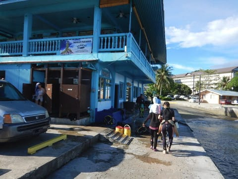

ショップに到着すると，各自で

器材は洗い場で洗って．

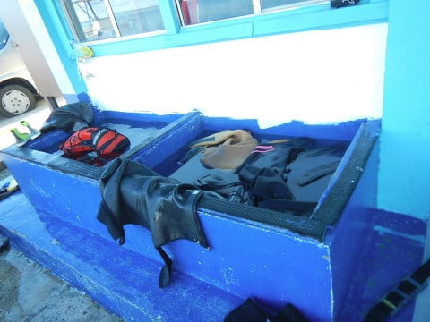

こーゆー器材庫に干しておきます．

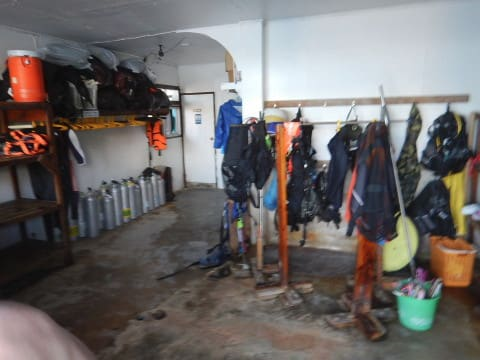

ここしばらく，翌日も潜る場合は

器材を船に置いておけばいいところ

ばかり潜っていたので．

毎日器材を下して，洗って干して…

というのがちょっとめんどくさく感じる

無精者になり果ててます…

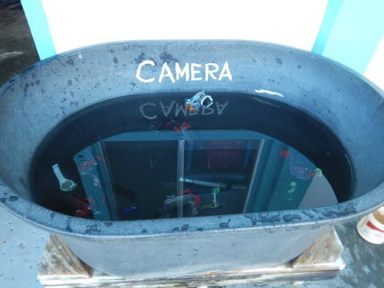

（カメラ洗い用桶もちゃんとあります）

で．

器材を洗い終わったら，

ここに3ブースのシャワースペースがあるので，

シャワーを浴びて…

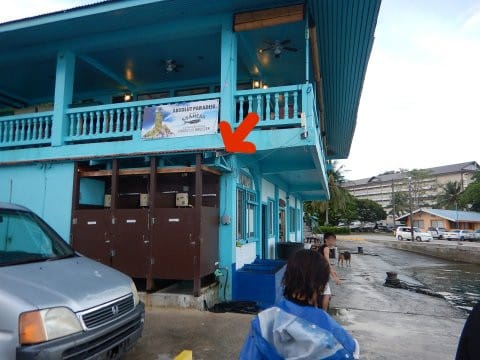

そして，このスペースでログづけタイム．

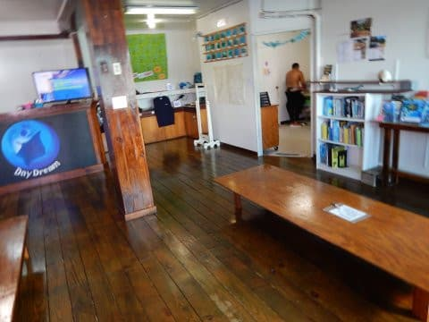

コーヒーやココア，紅茶を勝手に入れて

飲んでいいので，コーヒーを飲みながらの

ログづけをするわけですが．

ログづけタイムのときに．

「みんなで夕食に行きませんか？」

とのお誘いがあったので．

一旦ホテルに帰って…

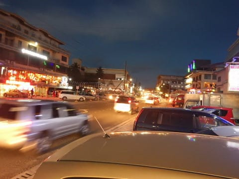

夕食のお店で，今日一緒に潜った

みんなと合流！

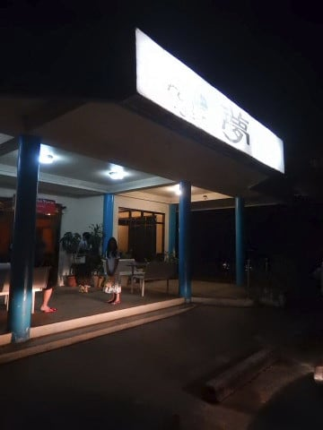

この日の夕食は，前回も一度立ち寄った，

居酒屋「夢」．

日本人オーナーが経営している，

日本的居酒屋です．

まずはみんな揃って，かんぱーい！

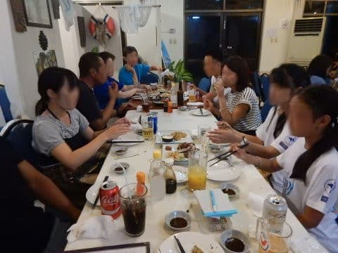

お刺身だとかなんだとか，

日本の居酒屋的メニューが揃ってます．

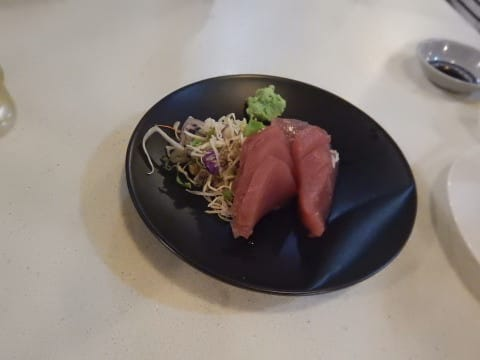

で．

居酒屋メニューを楽しみながら．

ダイバー同士の会話に花が咲くわけですが．

…パラオに来るようなダイバーは．

やっぱりいろいろ濃いぃダイバーが多いよな…

パラオに1年で3回も4回も来ているツワモノやら．

一か月以上パラオに滞在して，毎日潜っているという，

「居住者？」って人まで．

ホントにいろいろいて．

夕食の話題に事欠きません…

わが一家なんて，このツワモノたちと

比べれば．

全く目立たない平凡な平和な家族です(笑)．

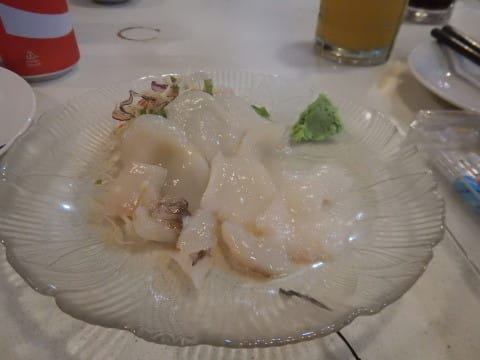

で．

どうでもいいのですが．

この店．

なぜかフルーツバットを飼っていて…

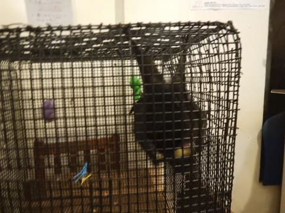

動物好きの娘は，なぜかフルーツバットを

気に入ったようです．

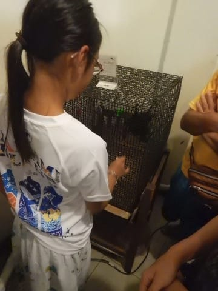

確か，前回パラオに来たときは．

生きているこいつではなく，

スープになったやつを見たのですが．

こいつは料理の材料として飼われてるのじゃ

ないようで，一安心(笑)．

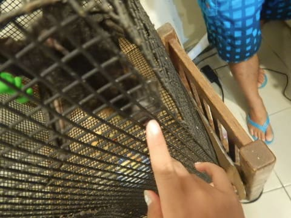

ってな感じで．

大勢のダイバーが集まって．

一通りダイビングの話題で結構夜遅くまで

盛り上がったあとは．

名残惜しいけど，明日のダイビングを考えて，

夜10時ごろに解散…

そして，このお店の隣にある食料品店．

…そう．

前回来たときに泊まった，

ウェストプラザデセケルの1Fにある，

お店にたちより，翌日の朝食を

買い込みます…

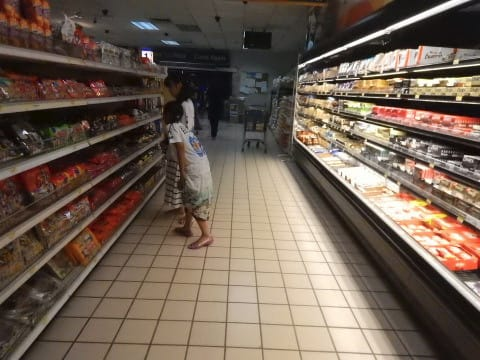

…ここ，日本の食品やら．

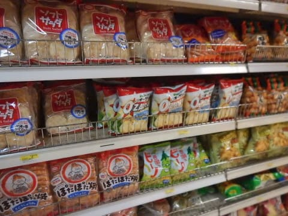

日本のお酒が結構売ってます…

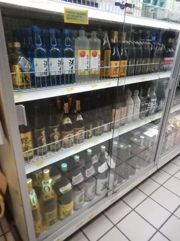

ってことで．

食料を買い込んで，ホテルへ戻ると

もう深夜．

明日に備えて，おやすみなさい～…
