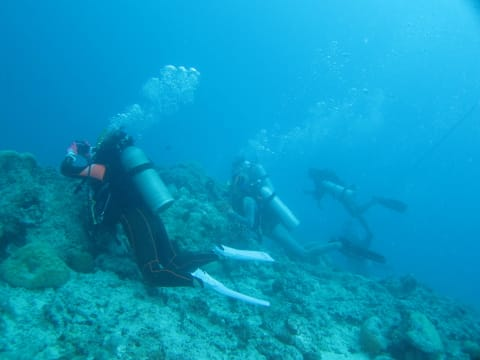
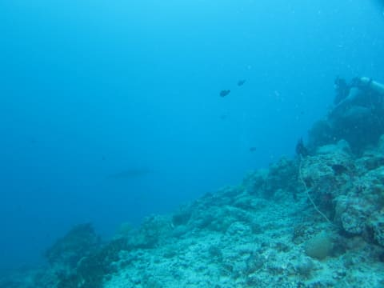
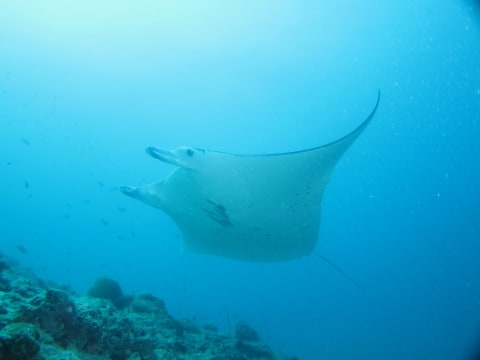
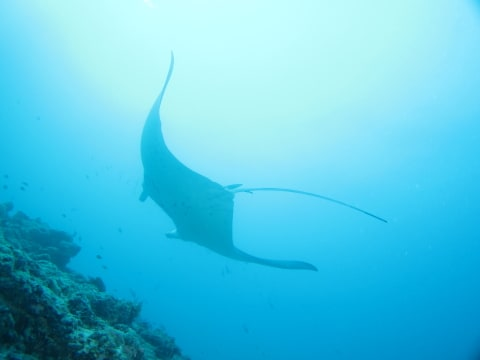
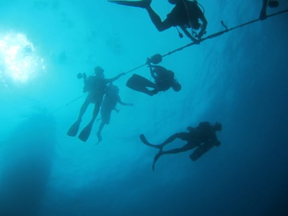
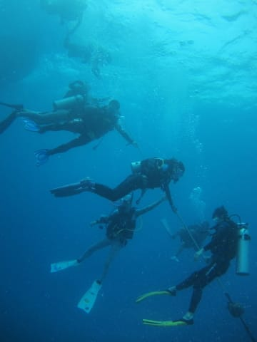
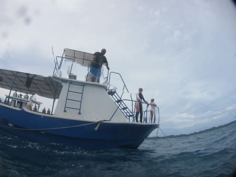
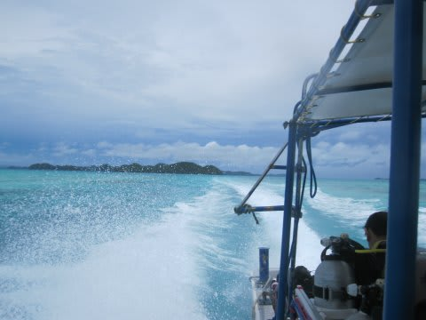
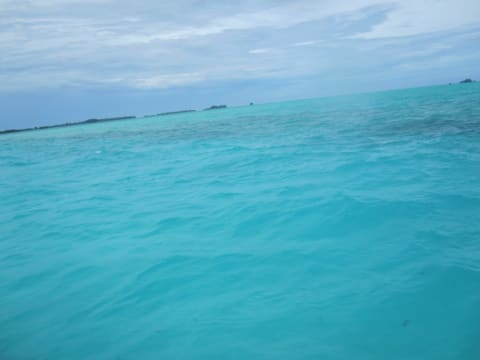

# 2014年10月，小学生の子連れでパラオへダイビングに行ってみた，その21…天気，回復せず

📅 投稿日時: 2015-08-26 01:33:38

🏷️ カテゴリ: [ダイビング日記](ce3a7a8d424d112fce83ee85c81a0e344.md)

ということで．

4日目の1本目，透明度の悪いマンタポイントに潜っているわけですが．

こんな感じで，ダイバーが並んで，

マンタがぐるぐるしているポイントを眺めて

いたところ．

最初は1枚だけだったマンタ．

途中から，2枚に増えたんですが…

でも．

透明度が悪いよ…

2枚同時に写すことは，不可能だな…（涙）

そーゆー中でも．

マンタが通過しそうな場所を予測して．

他のダイバーがスタンバイしているポイントからじりじり離れて…．

たまたまそこに，上手くマンタ様が近づいたタイミングで．

激写！

よっしゃー！自分一人だけの独占状態！

…これが，透明度が悪い中での限界だな…

ってことで．

20m近い，ちょっと深めのポイントだったので，

35分程度の短い時間で浮上開始．

ロープにつかまって安全停止したあと…

水面に上がると，

船の上でお留守番していた，妻と娘が並んでお出迎えです．

あー．

このポイント．

ちょっと荒れてたし．

流れもあるので．

娘は泳ぐことができず．

妻と一緒に，船の上でひたすらお絵かきやらなにやらして

過ごしていたようです…

…ごめんよ，娘…

そして．

1本目を終えたボートは，ただちに移動を開始します…

船は，ジャーマンチャネルを抜けていきますね～…

うむ．

ジャーマンチャネルを抜けたということは．

次のポイントは…ブルーコーナーの可能性も高いな…

うーむ．

ちょっと日も射してきて，天気も良くなってきたし．

次の1本は，さっきの1本目より海の中は明るくなるだろうし．

…やっぱり，さっきの一本は，妻に譲るべき

だったかなぁ…←決して美しい譲り合いの精神から来たものではない
