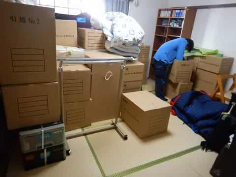
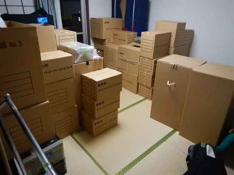
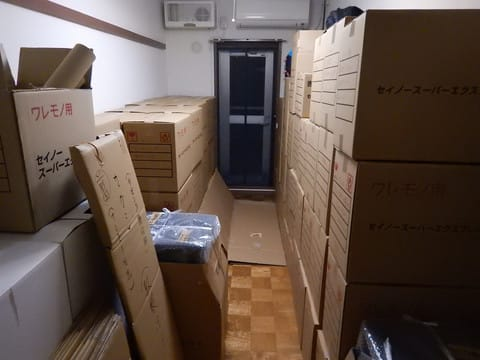

# 引っ越しスタート！

📅 投稿日時: 2018-11-03 22:47:30

ってな感じで．

本日から業者さんが入って引っ越し作業開始です．

朝9時から梱包開始して，午後4時ごろにはすべての部屋の

荷物が梱包されました…

その後，エアコンの取り外しやら

粗大ごみの処理やら，

何やらやっているとあっという間に夜に

なっちゃいます…

今日は段ボール箱の隙間で寝ます（涙）

何かやろうにも，あらゆるものが梱包されてしまっているので，

外食して寝る以外，やることがないです．

まぁ，昨晩からほぼ徹夜なので．

今日は早く寝ますか…

明日搬出＆搬入，

明後日開梱です．

まだ2日間かかるのか…

## 💬 コメント一覧

### 💬 コメント by (はっち)
**タイトル**: ブログ用に
**投稿日**: 2018-11-04 00:16:43

デジカメとパソコンだけは梱包してないのはさすがですね。

### 💬 コメント by (yama)
**タイトル**: イエティ
**投稿日**: 2018-11-04 21:24:29

S様が引っ越しでスキーに行けないので代わりにイエティのレポートをします。昔のnobu様のブログのようですね。3日は所要が有りイエティ到着は10時半で天気は曇りですが、時折晴れ間もある絶好のスキー日よりでした。そのため、かなり込みました。ナイターも行きましたが7時で終了しました。リフト41本滑って終了しました。

　本日は7時半スタートして4時まで滑りました。スタートは雨、霧雨なら良かったのですがウェアの中まで染みて来るようでした。その後晴れて混んで来ました。さらにガスが出てきたのでリフトは空いてきました。最後はまた晴れて来ました。4時のリフト最終を待って終了しました。49本でした。

　来週はぜひご一緒しましょう。

### 💬 コメント by (Skier_S)
**タイトル**: まだ引っ越し中
**投稿日**: 2018-11-05 00:28:38

＞はっちさま

記録マニアなので，デジカメはいつも何があっても

ポケットに入れっぱなしです…

パソコンも，何があるかわからないので

ノートPCは梱包せずに置いておきました(笑)．

＞yamaさま

あら．やっぱり今日は雨だったのですか…

昨日は絶好のスキー日和だったけど，混んだのですね．

今週はやっぱりひっこしで疲れてます．

来週こそ，滑りに行きます！

