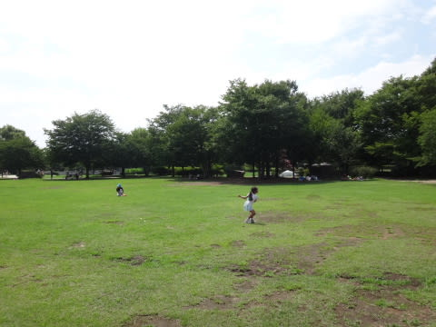

# 夏の志賀高原へ行ってみた…まずは長野＆小布施観光から

📅 投稿日時: 2015-08-27 01:25:53

🏷️ カテゴリ: [登山・旅行](c1d637a11a25b457ac978d197adbdafc5.md)

えー．

一応，徒然スキーヤー日記という名前のBlogにも関わらず．

ここしばらく，ダイビング旅行記やら，水中カメラ購入の

話とかばかりで．

…そろそろ，スキーネタを入れないと，

徒然ダイバー日記という名前に改名しないといけなく

なりそうな，今日この頃．

スキーネタというわけではないのですが．

久しぶりに，ちょっとスキーに絡むネタをやらねばっ！！

…ということで．

先週末に行ってきた，夏の志賀高原観光の報告をば…

とりあえず，初日の土曜から志賀高原に行こうと思ったものの．

どうやら土曜は天気が悪く，志賀高原は終日雲の中っぽい…（涙）．

ってことで．

土曜は，急遽志賀高原散策をあきらめて．

まず，長野観光の定番，善光寺を攻めてみることに．

いや，以前から行ってみたかった善光寺．

冬の間は，ほぼ毎週長野に来ている私．

だというのに．善光寺に来るのは初めて

だったんですね～．

善光寺そのものも，歴史があって見所がいっぱいだったけど．

意外と仲見世が面白かったかも…

いや．

善光寺．

一度は行ってみる価値がある場所ですね～．

んで．

超メジャー観光地，善光寺を見たあとは，小布施へ移動し，

いつもスキーに行くときに立ち寄る小布施PA．

そこに併設されている，小布施総合公園へ…

そうです．

ここからは，普通の観光地巡りではなく，

スキーシーズンにいつも通るところが，

夏はいったいどうなっているのかを確認する

のが目的．

…ということで．

やってきた小布施総合公園ですが．

普段は冬しか来ないから気づかなかったけど．

小布施PAに隣接して，こんな公園があったとはっ！！

数え切れないくらいの回数，小布施PAを利用しているし．

信州中野からのチェーン規制時，信州中野ICの

渋滞を避けるため，小布施スマートICを使うことも

かなりあるというのに…

こんな，子供が楽しめそうな噴水やら，遊具やら．

いっぱいあって，結構広く．

果物やら野菜やらがすごく安く売っている，即売所やら．

いや，ホントに安いっ！

こんな公園が，PAのすぐ横にあるとは，

…知らなかった…っ！！

これ，子供連れはすごい楽しめるわ．

娘も大喜び．

うーむ．

知られざる，夏の小布施PA！

ということで．

小布施総合公園を堪能したあとは．

そう，小布施と言えば，栗のお菓子．

その中でも有名らしい，[栗の木テラス](http://www.kanseido.co.jp/shop/obuse/)へ寄ってみました．

このお店．

中も落ち着いていい感じで．

モンブランは文句なくおいしかったし．

この，栗の味わいあふれる感じの栗クリームが

たっぷり入った，栗シュークリームもすごくおいしいのに，

190円とお安く．

この，アイスクリームも．

アイスは普通のバニラアイスだけど，

一緒についてきた栗シロップが絶品っ！！

いや，志賀高原によく来るスキー仲間から，

栗の木テラスがいいと聞いていたので，

一度来てみたかったんだけど．

冬の間，「スキーを早く切り上げて小布施へ行こう！」

などという発想は全く出てこない私のこと．

行くことはないんだろうなぁ…

と思っていたところ．

今回，来ることができて，満足っ！

（続く）

## 💬 コメント一覧

### 💬 コメント by (Goku)
**タイトル**: オオ～♪
**投稿日**: 2015-08-27 21:56:29

善光寺行ってきましたか～。

戒壇巡りはやってきましたか？

あと、仲見世の一番下『すや亀』の味噌ソフトお薦めです。

ソフトついでに、竹風堂の栗あんソフトも最高ですよ。

栗の木テラスも定番ですね～。

栗のカステラロールも絶品なので今度食べてみてください♪

それにしても、夏の志賀にまで来るようになったら、奥志賀に別荘でも建てるしかないですな（笑）

ちなみに私は先週末、八方に居ました。

### 💬 コメント by (Skier_S)
**タイトル**: Gokuさま
**投稿日**: 2015-08-28 00:10:39

はいはい～

行ってきました，善光寺．

戒壇めぐりはやってません．

なにしろ，お金を取られる本堂の奥や

山門の中は入ってないという…（笑）．

あと，味噌ソフトですか？

あまりおいしそうな名前ではないですが…（＾＾；

今度行くことがあれば，ぜひ食べてみたいです．

＃次に行くことがあるんだろうか？

しかし，八方まで何しに行ったんでしょうか？？

観光ですか？

### 💬 コメント by (Goku)
**タイトル**: Unknown
**投稿日**: 2015-08-28 20:22:03

えー暇だったので、ランチしに

それと来シーズンに向けて、ある所にある目的で下見に・・・

あー、それから来月、Ｙスカに行く用事が出来ました。

### 💬 コメント by (Skier_S)
**タイトル**: Gokuさま
**投稿日**: 2015-08-29 01:55:08

えー！

わざわざ八方までランチですか…

あと，何の下見か気になります（笑）．

しかし，Yスカですか？

なんだか，Gokuさんとは縁のない

場所のような気がするんですが…

