# 2025シーズンモデルのスキー板の試乗レポート速報…FISCHER編その2

📅 投稿日時: 2024-04-05 02:41:13

えー．

本日は志賀高原の特派員から写真が

送られてきましたが…

やはり明け方まで雨だったようですね（涙）

で．

8時の営業開始時は雨はやんでいたものの．

かなりのガスだったようで，コースが

かなり見にくかったようです…

そして，気温も朝から+3℃とかなり高め（泣）

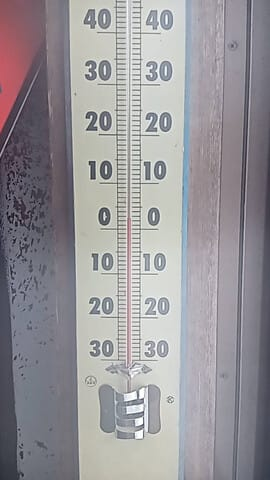

だもんで．

朝から雪はゆるゆるで．

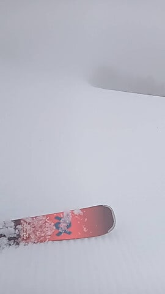

そして，ガスというか霧雨っぽい感じで，

ウェアやゴーグルに水滴がついてしっとり

する感じの天気だったようですが．

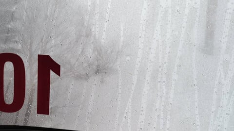

でも．

悪天候の4月の平日ということもあり．

ゲレンデはガラガラ！！！

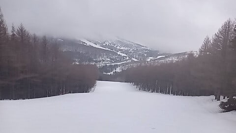

ホントに寂しいくらいにゲレンデに人が

いなかったようで…

雨でぬれた雪のおかげで板も走るし，

ゲレンデはガラガラだし．

こんなコンディションの中でも

楽しかったとレポートが来ていますが…

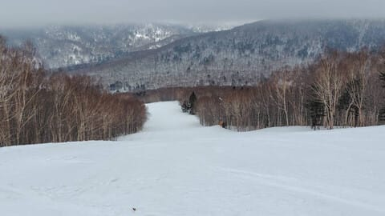

こんなコンディションでも楽しいというのは，

かなり毒された焼額メンバーだからか？？

と思ってたけど．

昼頃にはうっすら日も顔を出すようになり．

午後にはかなり雲も減っていき…

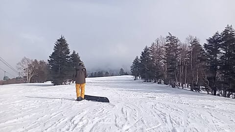

午後3時近くになると，すっきり晴れて

きたようです…！

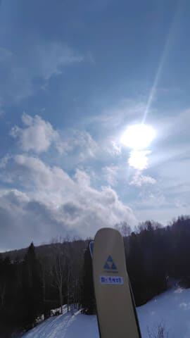

そして．

午後の営業時間終了間際になっても．

第3高速が動いてないので，コブ斜面の

SGSコースを経由しないとたどりつけない

イーストコースは，不人気で人が少ない

こともあり，午後になってもシマシマが

残っていたようです…

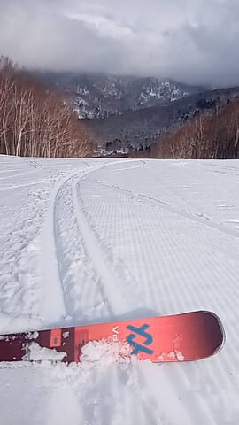

うーん…

これ，ホントに楽しかった一日なのか

堂か微妙ですが．

とりあえず，今回の雨でも雪はそこまで

減らなかったようで．

まだオリンピックコースも問題なく

滑れるようです！！

でも．

明日の朝は冷え込むので，バーンはガチガチに

硬くなりそう…

ってなことで，本題へ．

3月上旬に試乗したスキー板の

試乗レポート速報，最終回です！

また別途詳細レポートを書きますので，

より詳しい感想はそちらをお待ちください…

今回はFISCHER編その２です…！！

〇FISCHER RC4 SC PRO 165cm

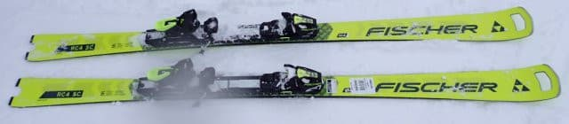

基本的に昨年からキャリーオーバー．

昨年からMプレートになった板ですが…

一昨年までのM/Oプレートに比べ，

フレックスが強くなり，粘ってたわむ

というよりも硬めの張りのある板に

なった感じ．

たわみよりサイドカーブで曲がる感じに

なり，一昨年までのネットリとたわむ

黒いSCに比べ，よりクイックになった感．

しっかり硬めの板でずらしもいれやすく

なったし，小回りから中回りまで

行けるオールラウンド性もあるけど…

でも，私は一昨年までの粘る感じの

SCのほうが好き…

〇FISCHER RC4 SL MEN 165cm

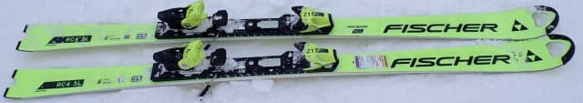

FIS規定のSL板．

強いプレートのトップモデルがあるけど，

これは競技用では優しいほうのMプレート版．

SC PROよりこっちのほうがよっぽど粘る！

たわみが出しやすく，トップからテールまでの

気持ちいいエッジグリップと，

強いグリップでできた足場をたわませていく

ことで，かなり攻めた深い弧を描ける

快感度が高い板．

SC PROよりこっちのほうがゲレンデ

小回り板として楽しいかも？

ただ…定価税込み24万越えか…

〇FISCHER RC4 GS MASTER 181cm

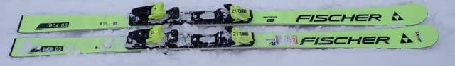

大回り板としては手ごろな181㎝で

R=21という，ゲレンデ大回り専用機

としてちょうどいい感じの板．

しっかりとした重さ，どっしり感が

あり，荒れた雪でもしっかりグリップ

して雪を蹴散らして安定して滑って

行ける板．安定感はすごいいい！

それでいて，ずらしのコントロール性も

かなり高いので…

しっかり板を踏める人なら，ずらしの

小回りまで行けます．

ただ，この板，183㎝と188㎝もあるけど，

183cmと188㎝のはMプレートじゃなく

強い ALU/KU-PLATEになるので，

181cmの板よりかなり強くなるみたいです…

181cmはお値段24万，183,188㎝は28万！！

ちょっと高い…

…で．

書き終わって気づいたけど．

今回の記事，本題の試乗レポートのほうが

前フリの特派員レポートより短い気がする…
