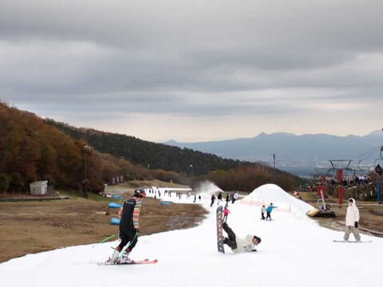
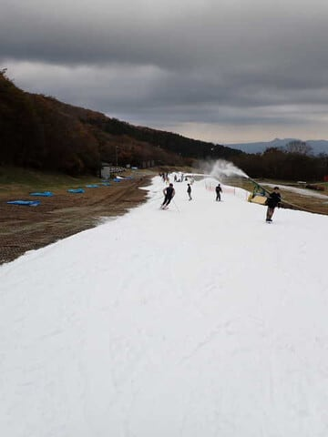
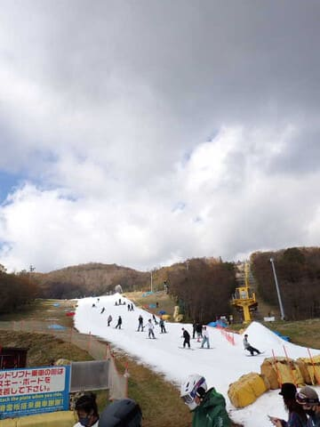
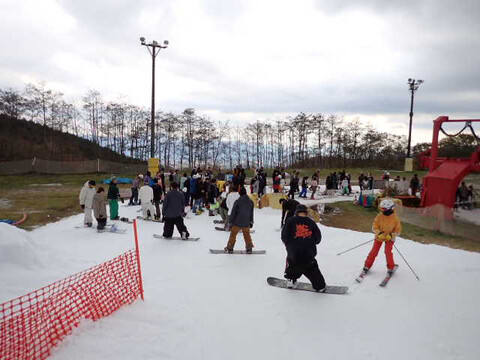
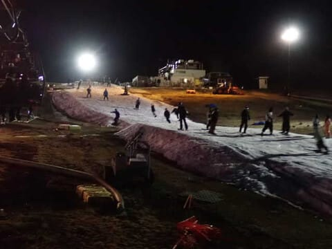
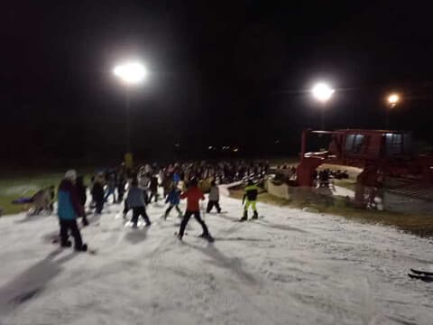

# 2022/10/29(土)のイエティゲレンデ状況の動画…2022/2023シーズンオープン翌週のイエティのコース状況，混雑など

📅 投稿日時: 2022-10-30 01:09:51

ってことで．

今日も予告通り，イエティへ滑りに行ってきました～！

とりあえず，今日も帰宅が遅いので，

速報モードでレポート！

まず．

今日は晴れの予想だったけど…

山沿いに雲がかかる天気で，御殿場市街は

晴れてても，イエティは終日曇り空

でした(泣)

でも，曇りの方が日差しで雪が緩まな

かったので，よかったかな～．

気温は昼間は薄手のジャケットでいいけど，

午後3時くらいに日が傾き始めると，

普通のウェアのジャケットを着たくなる

寒さで，雪はそれほどひどく緩まなかった

ですね～．

コース幅は先週よりちょっと広くなったかな．

ただ…

朝30分ほどは良かったけど．

10時近くからは，ゲレンデの人が増えていき…

ちょっと快適からはほど遠い人口密度に(涙)

リフトも，クワッドはだいたいこんな感じの

待ち時間．

3～5分強程度の待ちだったけど，

ペアは相変わらず待ちなしだったので，

まぁ許容範囲．

ただ，この人口密度．

ナイターになっても減る気配はなく…

ナイターも，開始30分後にはリフト待ちが

余裕で5分を越えてきちゃいました…(涙)

とりあえず．

今日のイエティのゲレンデがどんな感じだったか，

いつもの動画をのせておきますので．

これで混雑具合とコース幅が分かるかと…
