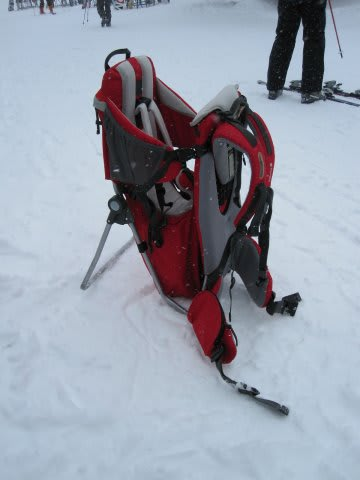
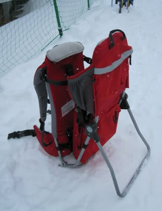
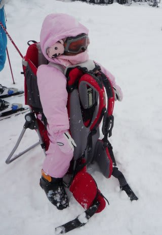
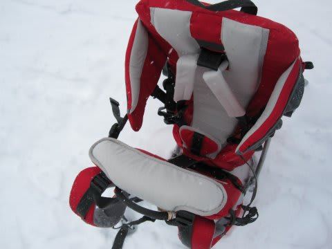
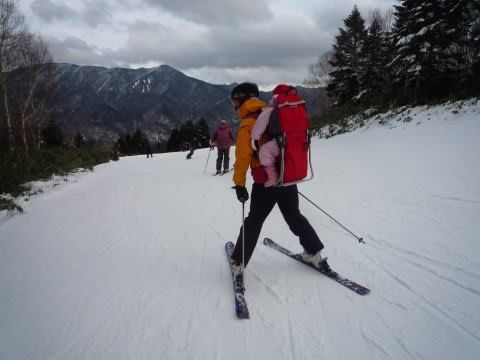
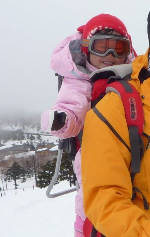

# 子供を背負ってスキーするために…

📅 投稿日時: 2011-02-17 03:09:27

🏷️ カテゴリ: [スキー雑談](c1f9d2cb7478308da16419928ea3945e9.md)

「子供背負ってスキー滑ってます」

と，言うと．

大体の人は驚きますね～．

そんなに想定外のことなのかなぁ…と思っていたら．

どうやら，普通のおんぶ紐か何かで背負っていると思ったらしく．

普段使っているベビーキャリーを見せると，

「こんなしっかりしたやつで背負っているのか！

これなら大丈夫そう…」

と納得してました．

…さすがに，おんぶ紐で背負って滑ったら，しっかり固定されず

ぐらぐらして怖いだろうし，転んだときにちょっと危ないよ…

ベビーキャリー，あんまりメジャーじゃないのかな．

私が使っているベビーキャリーは，Lafumaというメーカーの

「Walkid」という商品．

スタンドで自立するので，子供の乗せ降ろしが楽です．

子供は，5点式シートベルトでしっかり固定されるようになってて，

頭の後ろの部分のガードも高くて，子供の頭が

保護されるので，よさげです．

座面の高さは，子供の成長にあわせて上下できるようになってます．

で，座面の下が荷物スペースになっていて，見た目より結構大きな

ものが入れられるんです．

着替えとか，雪遊び用のお砂場セットを入れても余裕．

背負う部分，背中側にしっかり厚いパッドが入っているし，

肩ひもも幅広く，パッドが入ってます．

肩ひもの高さも，背負う人の体格にあわせて上下可能．

幅広いウエストバンド，ゴムで伸び縮みするチェストバンド

とあわせて，しっかり体にフィット．

いろいろな部分が調整可能に作られていて，

さすがトレッキングなどの長距離歩行でも

負担を軽くするために工夫されてるなぁ，

って感心してます．

重心位置が高めなので，腰への負担が軽いですね～．

背負ってみると，予想以上に軽く感じるんです．

なので，背負って滑っても，おそらく予想より

かなり楽に滑れると思いますよ…

最大重量は15kgまで．

3歳児までなら，問題ないですね～．

唯一の欠点は，子供を固定するシートベルトのバックルが

ちょっととめにくいことですかね…

でも，前にも書いたかと思いますが．

子供は背負われると喜びますし，何でか寝ちゃうんですよね～

まぁ，そのくらい安心感があるってことかな．

これでお値段1万7000円ほど．

ちょっと高い買い物でしたが，すでに3シーズン目．

40日以上使っているでしょうか．

十分元は取った感じです…

…あ，ちなみに，子供を背負って転んだことはありませんので．

念のため…

## 💬 コメント一覧

### 💬 コメント by (クックスト)
**タイトル**: 幼児スキー
**投稿日**: 2018-12-28 12:35:13

当方、1歳半の子供がいるのですが、スキーで一緒に滑れるのかな？と思い調べていた所こちらにたどり着き、とても自信になりました。１つ質問なのですが、背負ったままリフトには乗れるのでしょうか？大人のお尻が椅子にのるのかが心配です。

### 💬 コメント by (Skier_S)
**タイトル**: クックストさま
**投稿日**: 2018-12-29 00:24:23

ベビーキャリーは，リフトに載せる時は背中から降ろして，自分の横に載せます．

自分とベビーキャリーでリフト二人分使う感じです．

リフトに乗る直前に背中から外し，両方の肩ストラップを片方の肩にかける形にしてリフト搬器を待って，

座るときに，横のシートにキャリーを置く感じです．

慣れると普通に乗り降りできます．

子供の防寒はしっかりと！

あと，子供用のゴーグルを買うことをおススメ．

顔が冷えにくいですし，前が見やすくなるので，

子供が喜びます．

で，背負って滑っていると，大体寝ちゃいます（笑）．

ぜひ，お子さんを連れてスキーに行ってみてください！

そして，3歳になったらスキーを履かせてみてください．

背中で背負われているだけで，スキーの感覚がつかめるようで，

「こうやって滑ってたよね～！」

とか言いながら，いきなり滑り出します．

背負われてない子より，ずっと早くスキーで滑れるようになります．

では，よい子連れスキーライフを！

### 💬 コメント by (Unknown)
**タイトル**: Unknown
**投稿日**: 2020-10-15 22:42:17

10執念記念ブログより過去ブロ辿ってここへ

自分も20数年前に子供を背負って滑ったなぁ（ほんの数日のみでしたが）

子供に負担の無いよう一生懸命上半身ブロックして滑ったので少し上達した気分を味わえました

### 💬 コメント by (Skier_S)
**タイトル**: ＞Unknownさま
**投稿日**: 2020-10-16 01:22:37

古い記事にコメントありがとうございます～！

そうなんですね．お子さん背負って滑られたんですね…

私は子供背負ってガンガンカービングしてました（笑）．

Gをかけまくってました．

時々コブ斜面にも突っ込んでましたが，背中の娘は

上下にゆすられるのが面白かったらしく，

「もっと！もっと！」と言っていたのを思い出します…

でも，子供背負って滑ると体幹をしっかり抑えるので，

確かにスキーが上手くなる気がします．

### 💬 コメント by (まどか盤)
**タイトル**: Unknown
**投稿日**: 2022-01-04 11:20:16

初めまして！web検索で「スキー　おんぶ紐」と検索したところこちらのブログが1番にあがってきました。メーカー名も載っておりとても参考になりました！

1つご質問なのですが、ブログ主様はお子さま何ヶ月ぐらいの時に使い始めましたか？2月に行く予定なのですが、娘が6ヶ月になる頃で母と主人(主人がどのくらい滑れるかチェックしにいく)と3人で下で順番に見ようと最初は予定してましたが、主人が結構行けそうならおんぶして行った方が良いんじゃない？と母に言われて💦3人の中では私が多分1番マシに滑れる(技術うんぬん置いといて基本はこけたりしない)くらいです。去年は妊娠中でさすがに滑らなかったので、もし2人目ってなって連続で行けないのを阻止するために技術練習として今年1回は行っておこうとなりまして…

### 💬 コメント by (Skier_S)
**タイトル**: ＞まどか盤さま
**投稿日**: 2022-01-05 02:14:52

コメントありがとうございます～！！

私が子供を始めてベビーキャリーに乗せたのは，1歳の時です．

娘の誕生日とスキーシーズンの関係上，1歳1か月から背負ってました！

1歳になったら首がしっかりするからいいよね，という判断でした．

私の場合は，そこそこのスピードで滑るため振動などがガンガン伝わるので，

6か月くらいの子供だとちょっとヤバかったかも．

### 💬 コメント by (まどか盤)
**タイトル**: Unknown
**投稿日**: 2022-01-05 11:05:24

コメントありがとうございます！

やっぱりそうですよね(*_*)いくら慣れてるとはいえ…

だいたいなんでも1歳を目処にと思っていたので

お聞きできて良かったです！

当初の予定通り3人で順番に下でお留守番します。

ありがとうございました！

### 💬 コメント by (Skier_S)
**タイトル**: ＞まどか盤さま
**投稿日**: 2022-01-07 02:22:21

やはり，1歳をめどにした方が良いかと思います…

あと，背負って滑るときは子供の顔が冷えないように＆前が見えるように，

子供用ゴーグルがあるといいですよ…！

ゴーグルがないと風で目が明けてられず前が見えないけど，

ゴーグルをすると前が見えて，背負われた子供がたのしめますので…

