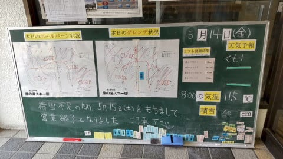
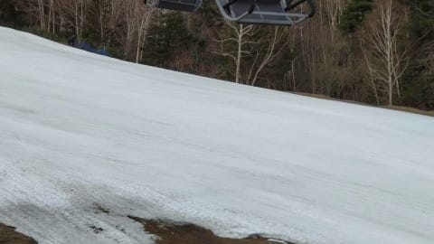
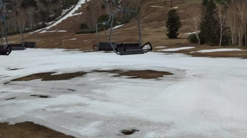
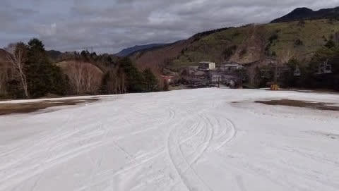

# 2021/5/14(金)の志賀高原熊の湯スキー場，特派員レポート…やっぱり明日で終わりな感じ(涙)

📅 投稿日時: 2021-05-15 00:16:22

🏷️ カテゴリ: [日記](cc4b5682fb7b8b144980957a978653fb0.md)

ってなことで．

予定が一日繰り上がり，

熊の湯スキー場が明日の土曜までの

営業となったわけですが…(涙）

本日の熊の湯，朝イチの気温は+11.5℃と，

+10℃越え(涙）

だもんで…

あさイチのバーンは一見きれいに見えますが

残念ながら，あさイチから雪は

ネットリずぶずぶ，滑りは非常に

悪かったようです(泣）

まぁ，この時期だから仕方ないっちゃぁ

仕方ないんですが．

でも…雪，減りましたね(さらに泣）

昨日，穴が開き始めたところ．

今日はかなり土の面積が広がったようで…

幅が一番狭いところは，コース上から

眺めると，もうこんな感じのようです．

…まぁ，まだ滑れないわけではないですが．

やっぱり明日で終わりかな…って感じ

ですね…

そして．

今日熊の湯で午前中に滑っていた人数は

ひとケタだとかいう報告も…

あぁ…寂しい…

シーズンが終わっていく…

とりあえず．

月山を除くと，残るは熊の湯，横手＆渋，

そしてかぐらにARAI．

明日で熊の湯は終わってしまうけど．

ARAIもこの週末でラスト．

来週からは，かぐらと横手＆渋のみか…

あぁ…

スキーシーズンが終わっていく…

何とスキーシーズンの短いことよ…(はらはらと零れ落ちる涙)
