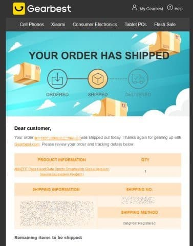

# Amazfit PACEを買ってみた，その2…海外通販で買ったものが到着するまでどのくらいかかるのか？

📅 投稿日時: 2020-05-10 06:42:27

🏷️ カテゴリ: [PC,カメラ&小物](c0d8caed13e597efe97b661a8ae56bed0.md)

本日5月9日の土曜日（というか，もう昨日ですね…）．

金曜夜から在宅で仕事していたのですが．

ちょっとノッていたので，なぜか朝7時まで仕事を

つづけてしまい．

その後，気を失ったように布団に倒れこんだ後．

…気が付いたら，夜7時になってました…

家族は，「死んでるんじゃないか」と心配

だったようですが．

まさに死んだように寝てました…

一日が…一日が寝ていただけで終わって

しまった…（涙）

ってなことで．

今日は渋峠と横手第2，第3が動いたらしい，

志賀高原横手山＆渋峠スキー場．

私が寝ている間にもちゃんと滑りに行っていた，

長野県民の特派員の方からレポート

いただきました！

気温は朝から+3℃とプラス気温で，

昼間は+10度まで上がり，結構緩んだ

雪だったようですが…

でも，終日曇り空で，強い日差しより

マシなコンディションだったようです！

でも，ちょっと第2ゲレンデに穴が

開き始めたり…

山頂付近も，結構雪が減ってきてますね…

渋峠はイケても，横手はあと1週間

厳しいかな…

で．リフトはそこそこ人がいたようで．

渋峠のリフト，感染防止に一人ずつ乗る

パターンで，ちょっと混んだとのこと．

とりあえず，滑りに行けない皆さんは，

このレポートを見て，脳内スキーで

楽しみましょう…！（含む私）

ってなことで，本題へ．

[前回，ついついポチってしまったAmazfit PACE](ed3d5d801313ccbb4de704222aba3cdc0.md)．

購入したのは，Amazfit GTRを買ったのと同じく，

香港に拠点を置く通販会社，Gearbest．

ここはクレジットカード決済で，

ちゃんと日本まで送付してくれます．

ただ，送り方が，下にあるように

・Registerd Air Mail（普通の国際郵便，到着まで15~35営業日）…送料$2.45，300円弱

・Expedited Shipping（お急ぎ便，到着まで7~12営業日）…送料$7弱，700円くらい

のどちらかが選べます．

（今はコロナ騒ぎのせいか，もう少し送料が上がってるみたいです…）

[前回は，Expedited Shippingを選んだ](e07b216ec3b426f7a5a1462a3b6fd1c02.md)のですが，

その時はDHLで送られてきたので，

荷物のリアルタイム追跡の他にも，

配達時間の指定や，Webでの受け取り

場所の変更ができて，

荷物の動きを見て，仕事帰りに寄れる

宅配ロッカーに配送先を変えて，

予定より早く受け取る

という技を使えたりして，注文から5日後という

短期間で受け取れたのですが…

今回は，そこまで急がないので，

「普通の国際郵便だとどのくらいかかるのかな？」

というのを確かめてみよう…ってのもあり，

安いほうの国際郵便を選んでみました（笑）．

ってことで．

注文したのが10月12日．

（実は，このAmazfit Pace．シーズン前に購入してたんだけど，

　今までネタにする暇がなかった…）

送料込みで，$82.44．

そのとき

「だいたい10月15日~18日くらいの出荷ね」

「配達に10~15日かかるね」

ということだったのですが…

なのに．注文後に，

「今日出荷したよ」

という案内が来たのが，10月22日でした…

おいおい，注文から10日経ってますし，

予定より4日ほど遅いんですけど…（涙）

で．

今は国際郵便も配送を追跡できるので，

追跡しながら見てみたところ…

22日「Order created」…郵送オーダーが出され，

　「Departure in Location Warehouse Sorting Center」…倉庫から出荷処理されて．

24日「HONG KONG Fpx picked up shipment」…香港の郵便会社の4PXが荷物をピックアップ

　　「HONG KONG shipment arrived at facility and measured」…香港の郵便局到着，重量サイズ測定

25日「Depart from facility to service provider」…香港の郵便局から配送事業者へ

…ってことで．さらに22日~25日まで，

香港内で3日かかってますね…

そしてそこから，25日に航空会社に渡されて．

なぜか日本到着が29日．

航空会社に渡されてから日本まで，

4日もかかってます…

25日　「HK, Hand over to airline」…航空会社に渡したよ

29日　「JPKWS, arrive at transit  airport」…空港に到着したよ

ってなってますが…

JPKWSって，川崎港を表す国際コードなので，

おそらくこれって川崎港着の船便で

来てますね…

そして，29日に川崎港に到着して，

30日　「Shipment arrived at destination country」…たぶん荷物が船から陸揚げされたのかな…？

で，そこから4日間待たされて．

4日　「Arrival at Processing Center」…配送センターへ到着

5日　「Held by custom」…税関

　　「Arrive at the destination distribution center」…目的地の配送センターへ

となってるので，5日に税関を出て，日本の配送センターへ

渡されたようですね…

7日　「Reach destination delibery station」…目的地，我が家最寄りの郵便局へ

　　「delivery failed.」…一旦配達したものの，不在で持ち帰って…（無駄に配送させてゴメンナサイ）

で，11月7日の15:03に，無事受け取りです～！！

うーむ．

10月12日に注文して．

11月7日到着なので．

25日間で到着，という結果でしたね…

普通郵便だと，やっぱり1か月弱

かかっちゃうのか…

ってなことで．

1か月弱待たされましたが．

無事，海外通販で買ったAmazfit PACE．

国際郵便で到着しました～！！

では，いざ開封っ！！

中身の詳細は，また次回…
