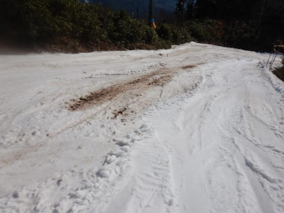
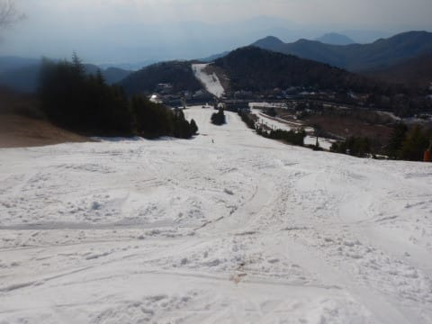

# 一昨日の記事の続き…2022シーズン営業最終日の志賀高原一の瀬・高天ヶ原スキー場はどのくらい雪が残ってたのかな？

📅 投稿日時: 2022-05-17 01:50:11

🏷️ カテゴリ: [スキー雑談](c1f9d2cb7478308da16419928ea3945e9.md)

えー．

本日も，いつもながら複数のWeb会議に

同時に入っていたわけですが．

これまで複数会議に同時参加に完璧に

慣れていたつもりでしたが．

今日はやってしまいました…

問いかけられたのと違う方の会議の

ミュートを解除して答えてしまう

という失態を犯し，

いきなり関係の無い会話を始め

会議を混乱に陥れる

という謎の人物を演じてしまいました…（激涙）

途中で気づいて，

「あ，電話がかかってきたんで対応してたん

　ですが，ミュートせずに中継されちゃって

　ましたか？

　すみません」

という謎の技で乗り越えようとしたのですが…

これでごまかせたのかどうか自信がない（泣）

こんどから気を付けないと…

ってなことで．

今日もおこみん特派員から，志賀高原情報が

送られてきました～！！

今日は結構冷えた曇り空だったようで．

横手山は昨日終了し，今日からは渋峠

だけの営業になったようですが…

まだ雪はいっぱいありますね！

今朝はリフトトラブルで営業開始が

1時間遅れたみたいで…

さらにウエイバーコースも整備のため

閉鎖だったようですが．

でも，冬のウエアを着てちょうどよいくらい，

寒めだった今日．

板がそこそこ滑る雪で，結構楽しめたようです…

あぁ…

週末スキーに行かないと，スキー場の

話が，ものすごく遠い昔の出来事のように

感じますね…←ちょっと極端すぎ

ってなことで，本題へ．

[土曜の記事](e4d11dcab31091f82760e73c21a69de96.md)で，2022シーズン最終日の焼額山の雪が

どのくらい残っていたかを書きましたが．

今日は，2022シーズン最終日，

5月5日の一の瀬・高天ヶ原スキー場の

雪の量がどのくらい残っていたかを

記事にしてみましょう…

最終日，5月5日の午後の

一の瀬ファミリースキー場ですが…

もうかなり土が出てますね（涙）

前日の5月4日…というか，5月5日の

朝まで真っ白だったのに．

（5月3日，焼額から見た一の瀬＆高天）

この日一気に土が出てきました…（涙）

ちなみに，この日は寺小屋も…

パーフェクターもクローズ．

それどころか，最終日の昼までで

正面バーンが終わっちゃい，

午後になったら正面バーン入り口が

クローズされてました（涙）

パーフェクターコースは入り口の雪が

完全に消えちゃってて，とても滑れる

状況じゃなかったですね…

でも，下から見ると，まだ雪が残って

たので．

例年に比べれば，雪は残った方かな？

パーフェクターがこれだけ残ったのに，

正面バーンが滑れなくなったのは…

今シーズン，正面バーンの人工雪を

例年ほど大量に打ってなかったって

ことでしょうね…

そして，一の瀬のパノラマコースは…

取りつき部分は雪がいっぱいあるように

見えましたが．

途中はちょっと雪が薄いところもあり…

最後の正面バーン下部へつながるところも，

そろそろヤバい感じでした…

でも，最終日までパノラマが滑れたので，

例年よりマシだったかな？

ファミリー下部は，最終日まで結構

雪が残ってたし．

ダイヤも5月5日まで，雪が残ってたので．

まぁ，4月が異常高温だったわりに，

雪は少なくとも平年並み程度かそれ以上に

残っていた感じでしょうか…

そして．

同じく最終日，5月5日の高天ヶ原ですが…

モーグルバーンはもう終わってますね（涙）

これも5月4日までは，ほぼ全面まっ白だったの

ですが，GW後半の高温で一気にやられました（泣）

さらに，メインバーンも…

これも，5月5日の朝までは大丈夫だったのに．

最終日の昼間に一気に穴が開いてきました．

クワッドリフトを降りた廊下も，

結構やばい状態でしたが…

人工雪を付けてたNHKバーンは

まだマシだったかな？

でも，一部土が出かけてるところが

ありましたが…でも，ごく一部．

朝は真っ白だったメインバーンも，

午後になってもまだ一見大丈夫に

見えますが…

下の方は，ちょいヤバめ．

結構土が出てきてます…（涙）

でも最終日にはメインバーンが滑れなく

なってることも多いことを考えれば，

今年はまだマシな方だったのかな…

人工雪をしっかりつけてある，下半分は

結構雪が残っていて，あと数日は

滑れそうな感じでした～！！

ってな感じで．

GW後半の異常高温で，一の瀬正面バーン，

高天ヶ原NHKバーン＆メインバーンともに

最終日は土が出始めた…という感じの

一の瀬エリアでしたが．

最終日に土が出始める感じで，なんとか

ぴったり最終日までもってくれた

感じでした…

雪が多すぎても，

「これで終わるのはもったいない…」

と思っちゃうし．

少なすぎて早く終わるのも困るから．

今シーズンはちょうどいい終わり方

だったのかも？？

## 💬 コメント一覧

### 💬 コメント by (2.0GT-Sお仲間)
**タイトル**: 月山がやばい。
**投稿日**: 2022-05-18 19:38:19

志賀高原もおしまいで、月山の予定があるかと思いますが、今年は大斜面が滑れません‼️

あの名物アナウンスの濱さんが4/13にクレパスに落ちて亡くなりました。

今年の月山には、東日本大震災以上のクレパスが存在して、大斜面が閉鎖されています。

沢コースがないと滑りきることができません。沢コースは雪解けが早いので、リフト回しは早々に終わってしまうと思います。

コブは上の方に何本もありますが、大斜面より距離が圧倒的に不足しています。私にはちょうど良い。

画像あるんですが、ここへの添付の仕方がわかりませんでした。

### 💬 コメント by (Skier_S)
**タイトル**: ＞2.0GT-Sお仲間さま
**投稿日**: 2022-05-19 03:00:59

そうなんですよ…月山大斜面クローズなので，かぐらが混んでるんじゃないかと．

そして，濱さんの訃報を聞いた時は驚きました．

あのアナウンスと味のあるホワイトボードのメッセージが無くなるのは寂しい限りです．

今シーズンは沢コースのみで，沢コースは嫌いじゃないんですが，やっぱりシーズンが終わるのは

早そうな予感．

沢コースだけのために月山に行くかどうかはかなり悩み中です…

あ，あと，このBlogのコメント欄には残念ながら画像が貼れないんです…（涙）

