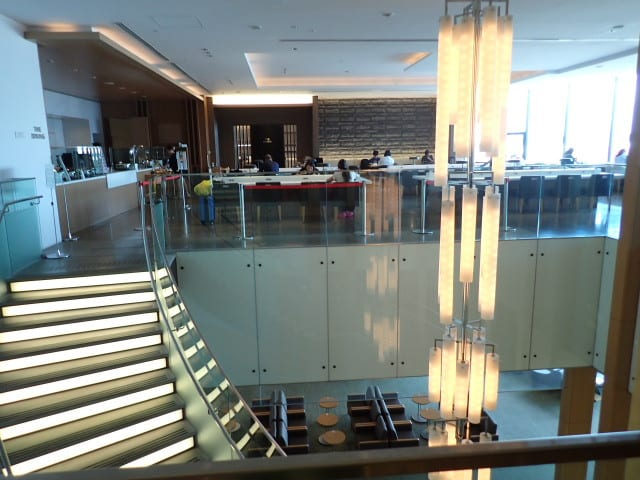

# 2024年8月，5度目の子連れモアルボアル，コロナ後初の海外へ！その1…コロナ明け初の成田空港へ．私にはレアなJALのプレミアムラウンジを使ってみた

📅 投稿日時: 2024-10-04 03:16:24

ひと月が過ぎていくのも速いけど．

1週間が過ぎていくのも早い…

もう金曜日か…

今週中の仕事が終わってないんですが（涙）

ヤバい…

なんでこんなに時間が経つのが速いのか．

普通は週末がやってくるのが待ち遠しい

けど，ここ1か月は週末もほとんど家で籠って

仕事なので，週末が嬉しくない…（泣）

そんな中．

モアルボアルの記事を書いていると，

現実逃避したくなる…

ということで．

現実逃避で書いたモアルボアル旅行記です！

ーー

（[前回はこちら](e8ef004b281217b28cb88063817f87aa8.md)）

ということで．

モアルボアル出発の日…

座間味から帰ってきたばかりで，

仕事の調子を取り戻さないうちに，

また出発なわけで．

いつも通り，前日はほぼ徹夜で仕事を

やっつけて．

睡眠2時間で朝9時に起き，高速道路を

成田に走ること2時間半．

駐車場に車を預け…

やってきました，成田空港！

いやー．

成田空港も，コロナ以来初めて戻って

来ましたが…

実に2019年の11月に海外出張して以来

だから…約5年ぶりですね．

そうか…5年間も海外に行ってなかったのか…

今回利用したのは，はフィリピンエアー（PR）

のセブ直行便．

なぜかこの日出発のチケットは，LCCの

セブパシフィックとフィリピンエアーで

料金がほぼ同じという謎の値付けだったので，

悩むことなくANAのマイレージが溜まる

フィリピンエアー一択！！

ってなことで，チェックインカウンターに

並んでチェックインしますが…

…そうなんです．

フィリピンエアーはスターアライアンスじゃ

ないけど，ANAとマイレージ提携しているので．

ANAのプレミアム会員は，フィリピンエアー

でもラウンジが使えるのです…！！

ってなことで，チェックイン時に家族分の

ラウンジ利用券が3枚もらえましたが…

PRはラウンジ提携しているのがAAなので．

ASPIREラウンジか，AAと提携している

JALのラウンジか，どちらか好きな方を

使える利用券でした！

このフィリピンエアーを使うことが，

ANAのプレミアム会員がJALのラウンジを

正攻法で使う唯一の手段なので．

ここはこの珍しいチャンスを生かし，一度

JALのラウンジを使ってみようじゃないですか…

と．

実に約5年ぶりになる出国ゲートを

くぐったら…

やってきました，JALのSakura Loungeです！

…ほう．

成田第２ターミナルのSakura Lounge.

2Fと3Fの2階建てで，食べ物は上の階で

提供されるみたいですね…

こんな感じで2フロアに分かれた，なんだか

かなりおしゃれなつくりのラウンジですが．

上のフロアからはこんな感じで飛行機が

眺められて…

奥の方にはカウンターがあって，ここで

ホットミールが注文できるようですね．

見た目，メニューの種類は少なく見えますが…

実際食べてみると，かなりレベルの高い

食事でしたよ～！

これは，カレーにラッサムスープ．

こっちはペンネですね…

どちらもかなりレベルは高め．

そして，コーヒーマシンに

赤ワインと白ワイン，

こっちには，左手に生ビールサーバー，

右手にはいろんなドリンクが入った冷蔵庫．

下には缶ビールもいろんな種類が揃って

たし…

スパークリングワインも何種類か

並んでますね～！

パンとか簡単なスナック的なものも

いくつか並んでいて．

うむ．

今日はもう，運転もダイビングもなくて．

ホテルに移動するだけだから…

まだ昼だけど，スパークリングワインで

乾杯！

…ってなことで，ラウンジで過ごすこと

1時間弱．

搭乗時間が迫ってきたので，搭乗口に向かい

ます…

ラウンジは第2ターミナル本体，搭乗口は

サテライトなので，搭乗口まで10分弱と，

かなり歩きますね…

そして．

PRとしては珍しく（？）定刻で登場開始！

いざ，フィリピンへ…！

([続く](e2892aa0a7866d5c87be3ce8f3f51ac41.md))

## 💬 コメント一覧

### 💬 コメント by (マルハバ)
**タイトル**: Sさん、また・・・
**投稿日**: 2024-10-04 07:01:30

晒しちゃってますよ～（汗）

### 💬 コメント by (Skier_S)
**タイトル**: ＞マルハバさま
**投稿日**: 2024-10-04 07:06:20

おっと．モザイク版をアップしたつもりだったのが…

ありがとうございます！

