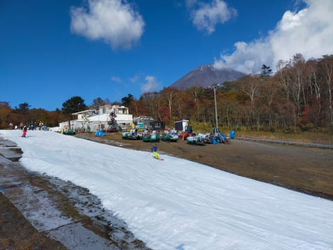
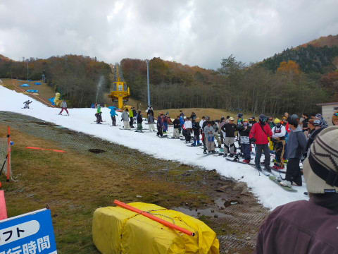
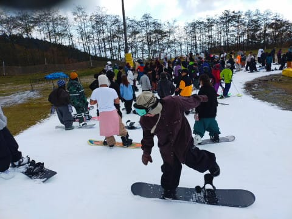
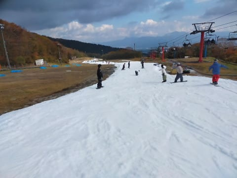
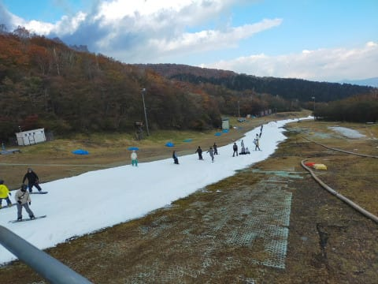
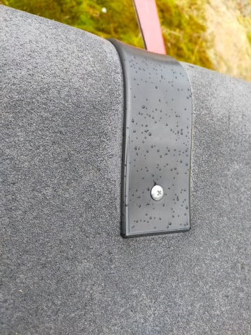
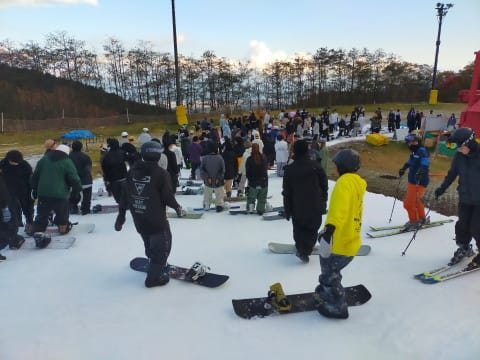
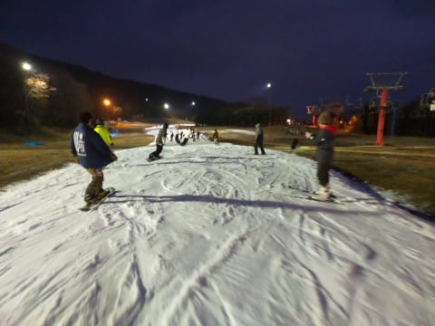
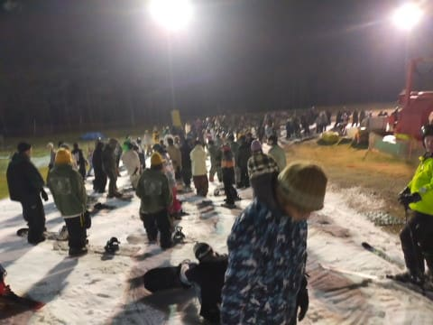

# 2023/10/28(土)，オープンから1週間のイエティ速報レポート！…雪のコンディションはよくなったけど混んだよ（泣）

📅 投稿日時: 2023-10-29 01:41:48

🏷️ カテゴリ: [2024スキー滑走日記](c453f687e8a0f05679e95831d0a02cd0c.md)

ということで．

今日も最近のお決まりのパターン通り，

滑ってるどころじゃなかった

という感じの本日で．

帰ってきてから今，泣きながら仕事

してますが…

帰ってきてから板をワクシングしてる

暇があったら，早くから仕事してりゃ

良かった…

と後悔しているSkier_Sです←それ，Blog書いてる場合じゃないでしょ

ってな状況なので．

本日のイエティは，速報レポートです…！

まず．

今日も朝9時のゲレンデオープンから

滑り始めましたが…

あさイチはガラガラで，富士山も

すっきり見える晴天！

日差しで暑いくらいの晴れ！

…だったけど…

オープン30分後の9時半には，

もうリフト待ちがかなり発生して．

そしてオープン1時間後には…

すごい列（涙）

先週に比べて，かなり混雑がひどくなった

感じだったんですが．

いつもなら混雑すると動き出す，クワッドと

平行にかかっているペアリフト．

こいつが今日は終日うごきませんでした…（泣）

だもんで．

今日は朝10時から16時まで，昼休みタイムに

ちょっとだけ混雑が減った以外は，

大体リフト待ちはこんな感じで，

平均待ち時間は10分程度．

1時間4本滑るのが精いっぱい…（激泣）

ゲレンデは先週と比べると結構コース幅が

広がり…

先週は最後の中斜面の部分とかは

穴が開きまくってひどかったけど，

今週は雪の厚さも増して，ゲレンデに

穴が開いているところはなかったです…！

ただ…ゲレンデの人口密度は先週より

ちょいと高め（涙）

そして．

天気は営業開始直後は日が差して暑く

感じるくらいだったけど．

10時ごろには曇りだし．

そして，昼頃にはぽつぽつと雨が

降ってきました…

ただ，雨は20分ほど，ほんのポツポツ程度

降っただけ．

それほどひどい降りにならなかったのは

良かったけど…

その代わり，混雑はほとんど減らず（涙）

いっそひどい降りになったほうが人が減って

良かったのに…←危険発想だ…

いつも通りナイターまで滑りましたが←だから，そんな暇あるの？？

ナイター開始後30分で，リフト待ち10分を

越えてきました（泣）

そして，さらに10分待ちを越えて，

昼間よりリフト待ちが伸びそうな

勢いだったので…

大人な私は，ナイター開始後1時間の

午後6時には．

混雑しているゲレンデを後にして，

帰路についたのでした…←仕事がヤバいと思っただけじゃないの？

ってなことで．

天気は晴れ→曇り→ぽつぽつ雨が10~20分ほど→曇り→晴れ

と，目まぐるしい天気で．

晴れると暑く，日がかげると寒という，

予想通りの天気だった本日．

強烈日差しで雪がやられずよく滑る

雪だったのはよかったし．

コース幅もちょっと広がり，穴も

ほとんど開いておらず，コンディションも

先週より良かったけど…

でも，混んでた（泣）

ペアリフトが動かず，終日10分を越える

リフト待ちにやられて，

死ぬ思いでやってきたわりに，

思ったほどストレス解消できず，

ちょっと残念に思ったSkier_Sだったのでした…

PS．今日は撮影した動画が上手く撮れておらず，

動画はなしです…すみません
