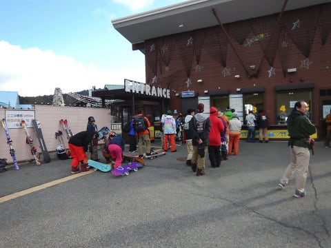
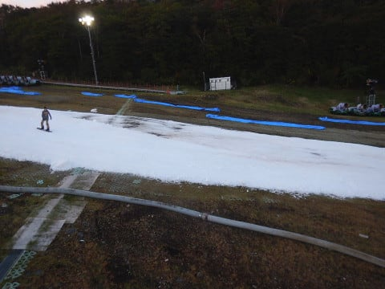
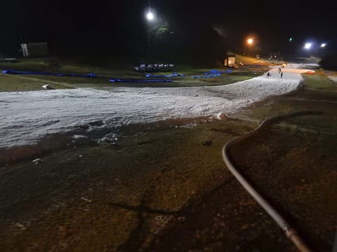

# 10月9日（月），2018シーズンのオープンから4日目，3連休最終日のイエティは…晴れのちガス，雪が減ったよ（涙）

📅 投稿日時: 2017-10-11 02:11:42

ということで．

昨日速報レポートした，3連休最終日，

月曜日のYeti．

本日は，詳細レポートです…

まず．

朝イチの御殿場市街から，すでに富士山が

すっきり見えてますね～！

実は，3連休，3日連続で御殿場に通ったのですが．

1，2日目は富士山は雲の中．

本日，初めて富士山の姿を拝めました…！

＃実は滑っていない3連休中日も，いろいろ

＃家族サービス（？）のために御殿場へ…

＃3日連続，御殿場往復（涙）

ってことで．

リフト営業開始前から，リフト券売り場に

並びますが…

うむ．

いつもの休日と比べると，入場待ちに並んでる

人が，かなり少ないですね…

…これは，今日は，

ゲレンデがガラガラか…？？

と，期待して，

8時オープンの朝イチのゲレンデに飛び込むと…

うおおおお！

誰もいない！

30分早くゲレンデにいれてもらえるシーズン券の

お客さんがいるはずだけど…

誰も滑ってない！

いいんですか！？？

こんなクリアラップをいただいていいのですか？？

…って感じで．

オープン後1時間くらいは，かなり人が少ない中…

リフトもがらがらの飛び乗りに近い状態で，

ガンガン滑れます！！

ええ，ガンガンです！！

…もう，あれですね．

シーズン2日目にして，いきなりのトップギア．

緩斜面だけど，ガッツンガッツンに飛ばして

もう，快楽のままに滑ってしまいました…

いや．

普通なら，シーズン最初の数日は大切に滑るところ．

…ええ．普通なら…

でも．もう，ダメです．

この快適ゲレンデに，リミッターが外れてしまいました．

ただ，9時を過ぎると．

さすがにちょっと人は増えてきたかな…

そして，ちょっと雲が増えてきたかな…

朝イチに見えてた富士山も，隠れちゃってます．

でも．

今日のリフト待ちは，最大でもせいぜいこの程度．

大体，これより短い待ち時間で．

いや…

これは快適でいいんでないかい？？

…と，思っていたけど．

うーむ．

今日はちょっと気温が高いなぁ…

この3連休，連日気温が高く．

雪もかなり解けて．

うーむ．

雪がきわどい感じで薄くなってるところがあるなぁ…

…と，心配していたところが…

昼ごろになると．

あり？

穴が開いてきちゃったんですけど…？？？

そして…

12時過ぎには．

ありゃりゃ？？

どわーーー！

なんじゃ，こりゃ！

ところどころ，ゲレンデに大穴が

空き始めてしまいました…（涙）．

ってことで．

昼過ぎのコース．

ゲレンデコンディションは悪くなり，

かなり凸凹してきたけど．

まだ人が少な目で，許すかな…

まぁ，タイミングによってはちょっと

人が多い時もあったけど．

それでも，まぁ激込みYetiに比べれば，

かなり恵まれてるよね…

と，思っていたところ．

午後2時ごろになると．

今度は…

え？なに？

ガス？？

…コース上に穴が開いた上に，

今度はガスですかっ…！（涙）

3時を過ぎると，ガスはかなり濃くなり…

うがぁ！

見えないっ！！

見えない中，いきなりゲレンデに

こんな穴ぼこが出てくるんだから…

ちょいと滑りにくい状況に（涙）．

この，ガス＆穴ぼこ攻撃に．

「楽しくない…」

と，帰ろうかと思いましたが．

うむ．

時計を見ると，もう4時近くじゃないですか．

4時にはコース整備が入り，圧雪されるので．

コースはまたピカピカフラットバーンに

戻るじゃないですか．

帰るにしても，穴ぼこだらけの楽しくない印象を

持って帰るより．

圧雪直後のピカピカバーンを

2-3本滑って，

最後は楽しく滑って帰る…

ってのも，いいじゃないですか…．

と．

コース整備タイムまで滑ってしまい…

17時のコース整備完了を待っていると．

うむ．

ガスが晴れましたよ！！

そして飛び込む，

コース整備後のピカピカバーン！

シマシマっ！

シマシマだよ！

うははは！

楽しいよ！！！

…ただ，ちょっと一部，

コース幅半分しか新しい雪を被せてなくて．

ちょっと凸凹したところもあったけど…

でも．

午後5時まで残った人は少なく．

圧雪かけたてのフラットなコースを，

自分の好きなラインで滑れます！！！

いや…

いい．

ナイター，楽しいよ！！！

リフト待ちもせいぜいこの程度．

ほぼ飛び乗り！！

うはははは！

楽しい！

ガラガラナイター，楽しいよ！！！

…と．

滑っていたら．

数本のつもりが．

なぜか，2時間も滑ってしまいました…

いや．

リフト待ちがこれで．

コースもガラガラで，結構気持ちよく

滑れたんだから．

もう，これは滑るしかないでしょう…

…という，気持ちいい状況にも関わらず，

ナイター終了まで残らずに，

わずか2時間で切り上げたというところに．

自分の抑制力を誉めてあげたいところ←普通は朝8時から夜7時まで滑り続けないから！基準がおかしいから！

…ということで．

シーズン2日目というのに．

朝8時から，ナイターの7時まで．

途中1時間の圧雪整備を挟んだものの，

10時間滑り続けてしまいました…

いやーー．滑った．

しかし．

Yetiのゲレンデ状況ですが．

ナイター中も．

ところどころ，コース上の雪が薄くなって

きていたので…

うーむ．

気温が高かった3連休．

雪を造るペースより，消えるペースが早かったか？？

もう数日，高めの気温が続くと．

ちょっとヤバそうだなぁ…

ってな感じで．

午後の雪はちょっとヤバげだったけど．

人が少なくて，

いやーー．

スキーって，こんな楽しかったんだ…

と，結構楽しめたYeti．

雪がこれ以上薄くならず．

かつ，来週以降も，

こんな感じのガラガラのままで

いてくれると嬉しいんだけどなぁ…

と，かなりのゼイタクな願いをしてしまう，

Skier_Sなのだった…

（薄暮の富士山シルエット）

## 💬 コメント一覧

### 💬 コメント by (yama)
**タイトル**: １０日のイエティ
**投稿日**: 2017-10-11 06:09:37

１０日は雲１つない天気が昼まで続いたので、昨日も穴が空いたところが２時間ほどで穴が空きました。さらにそれ以外のところも穴が空いたり、下地のマットが顔を出しているところもありました。ゲレンデにはほとんど人がいないのでリフト待ちはなしと言うより、ほとんど飛び乗り状態です。そんなゲレンデ状態でどうナイター前の整備をするのか心配し始めた３時前に本日ナイター営業なしの放送がありました。５時まで整備しないで営業と言われてもさすがに４時過ぎには撤去しました。9時スタートですがリフト６０本滑り温泉入って８時前には帰宅しました。大人の対応でした(^^;。気温が高いことと雨が多い今週は何日営業できるかわかりませんね。

### 💬 コメント by (つーちゃん)
**タイトル**: Unknown
**投稿日**: 2017-10-11 19:42:16

ひゃー穴ぼこだらけですねぇ(^_^;)

今日もナイター中止みたいですし

ちょっと気温高すぎです。

明後日あたりから気温がグンと下がるみたいですが

傘マークがギッシリ＼(^o^)／

どうなることやら、、、

### 💬 コメント by (Skier_S)
**タイトル**: 3連休は暖かすぎました…
**投稿日**: 2017-10-12 11:19:16

＞yamaさま

火曜はやっぱりすごいゲレンデコンディション

だったんですね…

今週末の雨で，ゲレンデがもつかどうか心配です．

少なくとも，今週いっぱいはナイター無理でしょうね…

それどころか，昼間営業も危機かもしれません．

今週末，大丈夫かなぁ…

＞つーちゃんさま

午後は結構荒れてきましたよ…

でも，5月下旬のかぐらや月山を滑ってると，

「こんなもんかな」と思えてくる自分がいます（笑）

今週末の雨でゲレンデクローズとならないことを

祈るばかりです…

