# ついに3月に突入！…2021/3/1の志賀高原スキー場は晴天慣れど高温の春スキー状態（涙）．そして明日は…昼前から雨，夕方から雪

📅 投稿日時: 2021-03-02 01:14:48

🏷️ カテゴリ: [日記](cc4b5682fb7b8b144980957a978653fb0.md)

…私が3月になっていいと

言った思い出は全くはないのに．

知らぬ間に勝手に3月になって

しまったのですが（涙）

…しかし．

1，2月のトップシーズンが．

コロナ禍でほとんどまともに

滑れないうちに終わって，ホントに

知らぬ間に3月って…

誰に文句を言えばいいのか…（泣）

とはいえ，

緊急事態宣言に伴い，営業短縮していた

志賀高原の中央エリア．

平日は運転を止めた寺子屋や，

午後だけ運転だった西舘も，

2月20日から平日も朝から運転の

通常モードに戻ったようです！

そして，平日は止まっていたタンネも，

3月1日から平日も運転に復活します！

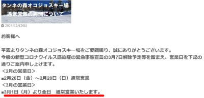

（[志賀高原中央エリアホームページ](http://shigakogen.co.jp/archives/9220)より）

さらに…

土曜のみ運転だった一の瀬ファミリーナイターも，

3月6日以降は水曜~土曜運転（日，月，火は運休）に

なります！

…ただ，3月20日でシーズン営業終了ですが…

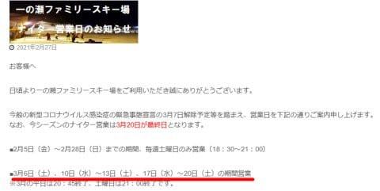

（[志賀高原中央エリアホームページ](http://shigakogen.co.jp/archives/9625)より）

…営業してくれるのは嬉しいけど．

土曜はダイヤナイター動かしてほしいなぁ…

ってなことで．

緊急事態宣言解除の都道府県が増えていくにつれ，

徐々に営業が拡大していますが．

本日の志賀高原はどうだったのか，

今日も特派員レポートをお送りします！

…今日も意外と多くの特派員が志賀で

活動してくれました…

まず，朝イチから気温は高くて．

朝からほぼ0℃という高温でのスタートと

なった本日．

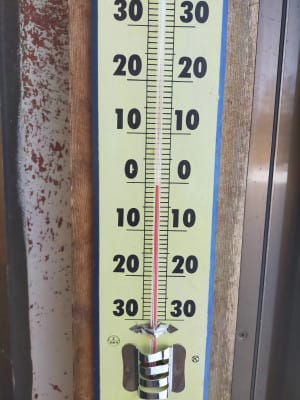

あさイチは一見きれいなシマシマ！！

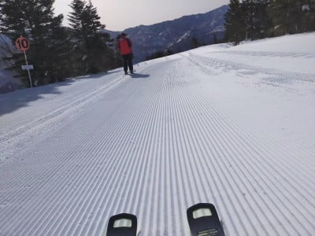

…に見えるけど，昨日の高温で緩んだ

雪が凍ったガチガチバーンで，エッジが

流れる，難しい状態だったようです…

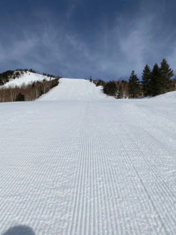

一の瀬ファミリーも，朝はちょっと硬そうですね．

しかし，日曜にほとんど緩まなかった奥志賀は，

結構いい雪質だったようで．

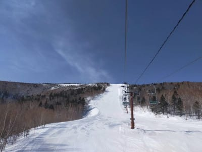

うはー！

結構おいしそうなシマシマですね…！

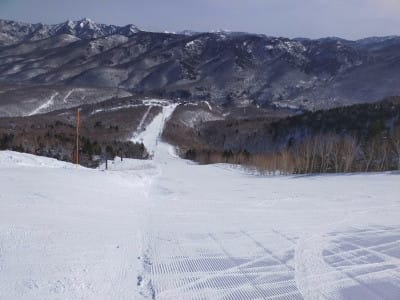

今日は昼間の気温が+8℃くらいまで

上がっちゃったようで．

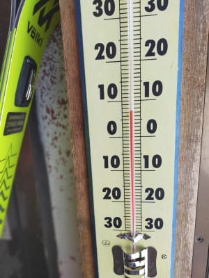

そのうえで，すっきり青空なのは

良いことですが．

晴天の強いひざしがゲレンデに

容赦なく降り注ぎ…

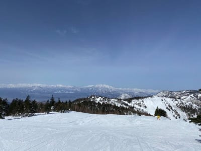

そのせいで，朝のうちはちょいと固めだった

雪はあっという間に緩んで，しっとりしていった

ようです…

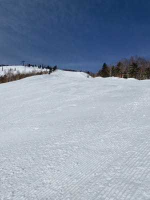

とはいえ，

人は少なかったので，ゲレンデはどこも

ガラガラで，雪はバーンは全く荒れなくて

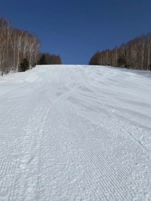

高天ヶ原も．

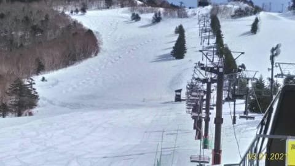

一の瀬も．

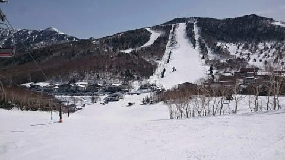

意外なことに西館方面も，

雪は重めながらもフラットで

そこそこ楽しめたというレポートが

入っています…

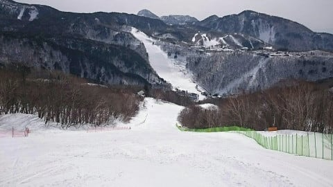

とはいえ，さすがに午後になるとかなり

重めの春雪になっていったようで．

でも，人が少なくてフラットなので

なんとか滑れたようです．

…って，ホントに人がいませんね（涙）

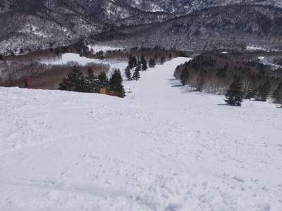

とりあえず，この日も気温がかなり上がって，

雪は4月の重い雪になりながらも．

夕暮れ時まで天気が崩れることなく，

すっきりいい天気の中で終日滑れたようです…

…が．

でも．

いい天気は今日で終わりです（涙）

すでに蓮池の気温が+5℃近くと，ありえないレベルに

上がっている今晩ですが．

…明日の2日は，朝から強い南風が吹き，

ゴンドラの営業はヤバいかも…

さらに明日は，朝10時頃までは雨は降らず

曇り空のまま何とか持ってくれそうですが．

昼前には，やっぱり降りますね…（涙）

液体が（屍）

昼前の降り始めは当然雨でスタート．

ただ，夕方には雪に変わり，最初は

重めの雪ながら，夜に向かって気温がぐっと

冷え込んでいき，3日（水）の朝には

10~20cmほど積もってそうです．

…この雪でまたゲレンデ状況回復するか？

と，信じたいところですが．

また，6日に液体が空から降ってくる危機が…

…昨日も書きましたが．

どうやらホントに，この週末は，雪質に

関しては期待しない方が良さそうです（涙）

## 💬 コメント一覧

### 💬 コメント by (レインボー73)
**タイトル**: Unknown
**投稿日**: 2021-03-02 06:43:36

火曜日の志賀高原情報？

出勤するか悩んでます。『てんきとくらす焼額山』で９時南風２０mの予報。南風１５mを超えたら、まずゴンドラはストップのはす。でも山の上の友人から

『低い雲の流れが早い。その切れ間は綺麗な青空。現時点で雨は降ってません。月も見えてます。風は時折強くなる程度。午前中もつかな？』

なんていう情報が。でも湯田中の雲は速い。

### 💬 コメント by (さち)
**タイトル**: Unknown
**投稿日**: 2021-03-02 08:30:12

予想が当たってますね、ゴンドラ止まってます…

Sさん、今週末解禁するのですか？

### 💬 コメント by (レインボー73)
**タイトル**: Unknown
**投稿日**: 2021-03-02 08:53:41

火曜日の志賀高原情報２

軟弱な私めは迷った末に整骨院を選びましたが、勇猛な現地泊の仲間から

『滑っているのは１０人位。すいてて快適。ゴンドラ20分待ちよりよっぽど良い』

とのレポートが。

### 💬 コメント by (レインボー73)
**タイトル**: Unknown
**投稿日**: 2021-03-02 10:30:59

火曜日の志賀高原情報３

動いているのは４ロマのみ。山の神もストップのはず。

なのに滑っている仲間からカラマツのシマシマ写真が２度も。うーん、どうやって帰ったんだろう？

そこでわたくしコナンが解明いたしましょう。

まず犯人は歩いて４ロマへ。あの距離は半端ない。走っても歩いても500mはあるはず。クロスカントリーの選手でもあるまいし、これは不可能です。

次に考えられるのはバス。そんなにバスは運行されてるのだろうか。わたくしコナンは0269-34-2024　に電話で確認しました。

西館前発は、8時40分 9時20分 10時08分 10時53分 11時50分 13時18分 15時08分 16時24分

これだと可能だ！　すげー！こんな日にも楽しんでる！

あ、また連絡が！

### 💬 コメント by (レインボー73)
**タイトル**: Unknown
**投稿日**: 2021-03-02 10:44:06

火曜日の志賀高原情報４

凄い。今度は西館フーディーの写真が送られてきた。動き出したんだ！10時08分のバスの次は、バスで逆走したのか！　凄すぎる。なんという執念！

ということで、状況をまめに把握して、バスを有効活用すれば、こんな日でも案外楽しめるもんですねえ。完敗です。

凄すぎる仲間ほかの勇士たちに、乾杯！

### 💬 コメント by (レインボー73)
**タイトル**: Unknown
**投稿日**: 2021-03-02 13:12:19

火曜日の志賀高原情報５

11時から本降り。なのにまだ滑り続ける強者達。

曰く『激混みのゴンドラに何十分も並ぶ根性はなくても、無人の貸切快適バーンを滑る根性はある』

腰が治ったら見習わなくては！

### 💬 コメント by (アリス)
**タイトル**: 平日は空いていますね
**投稿日**: 2021-03-02 16:41:26

Skier_S様

さすがに平日となると閑散としているようですね。

バーンが固めでも、雪が重めでも画像のような整備されたバーンを貸し切りで滑れるなら申し分ないですね♪♪

レインボー様

志賀高原には聞きしに勝る強者がいるんですね。

本当に雨が降ろうと、槍が降ろうと滑っちゃうんですから凄い執念です。

遅くなりましたが、記念日おめでとうございます。

私もレインボーさん同様、家での権力0です。

隣のゴールデンは、インディとイン子の血縁でしょうか？

### 💬 コメント by (Skier_S)
**タイトル**: 明日は冷え冷え！
**投稿日**: 2021-03-03 02:02:36

＞レインボー73さま

今日は整骨院だったんですね…

でも，お仲間さんの優秀なレポートにより，無事記事が書けました～！

ありがとうございます．

しかし，この天気で滑りに行くとは，皆さんあまりにも優秀な特派員すぎますね…（笑）．

すごすぎます．

感動しました．

＞さちさま

私が志賀高原の天気決めてますから，私が止まると言ったら止まるんです（噓）

今週末…仕事が一区切りつくようなら考えようかと思ってますが…

もしかしたらさちさんもゲレンデ復帰？

＞アリスさま

ガラガラ貸し切りバーンとはいえ，普通ならこの天気では

滑りに行きたくない感じですよね（笑）．

皆さんすごすぎます…

