# プロジェクトX2第2章…LEVORG E型にKENWOODナビ取り付け・ようやっとナビ本体の接続ができるよ…

📅 投稿日時: 2018-08-24 01:31:45

🏷️ カテゴリ: [車](cba0e8330b3f2ded7c1addfacc75d4547.md)

昨日はダイビング旅行記でしたが．

本日はまた徒然工作日記に戻ります…

ナビ取り付けもそろそろラストスパート！

さて．無事にナビは取り付け終わるのか…？

ってことで．

本日はナビ取り付けレポートへ，Go！

----

ってな感じで．

準備したケーブル類はすべて車両につながったので．

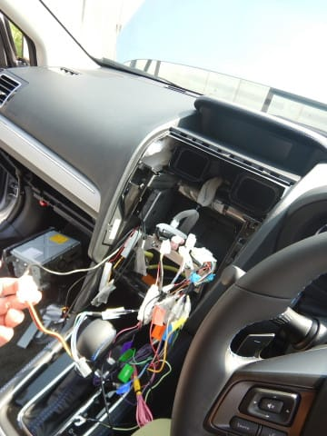

次は．

ようやっと，ナビ本体を取り付けます！！

…長かった…

ようやくナビ本体のお出ましだよ…

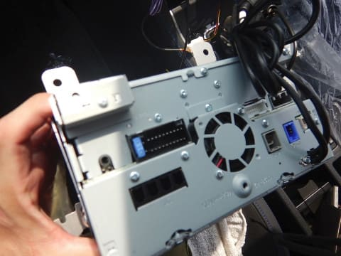

ここまでくれば，残り作業は30分もかかりません．

ナビ本体に，線をガンガンつないでいきますよ～！

まずは，ラジオアンテナ線．

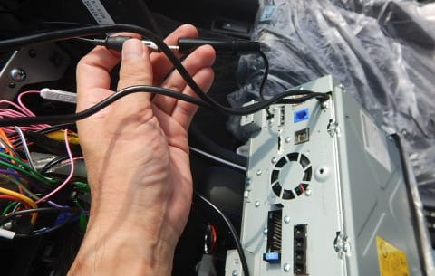

これは，ナビ後ろにぶら下がっている，

円筒形のラジオアンテナ接続用コネクタにつなぎます．

次は，バックカメラ線．

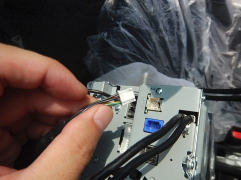

そして，ETC連動線＆ステアリングリモコン線が

繋がるコネクタ．

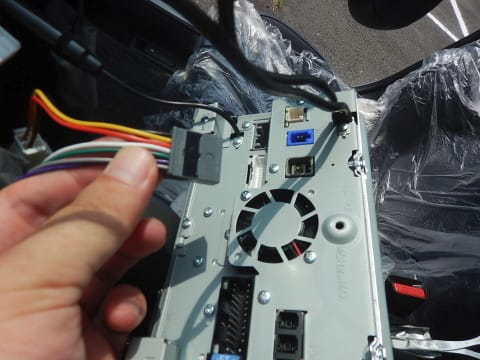

続いて，地デジアンテナからのコネクタ4個．

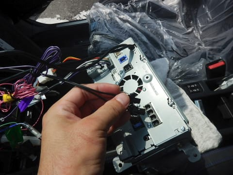

4個をさす順番は特に決まってないので，4個

それぞれどこにさしてもOKです．

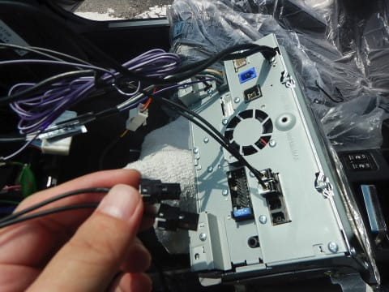

地デジアンテナコネクタが4個刺さったら．

次はGPSアンテナコネクタですね．

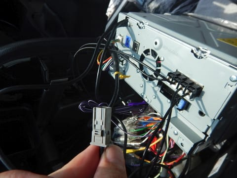

ほい．ここにプチンと挿しましょう．

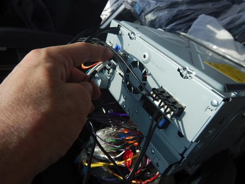

そして，各種電源＆オーディオ線がつながる，

ナビ付属のコネクタがここに刺さります．

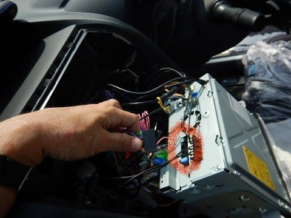

これで，ナビ本体につながる線，全てつながりました！

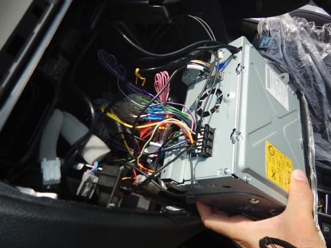

あとは一旦，ナビを所定のスペースに仮置きして…

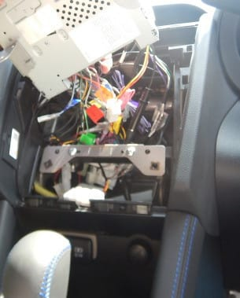

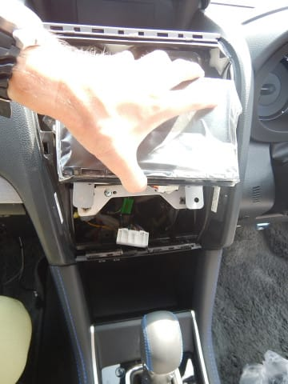

この状態で，ナビが動くか．

試しに起動です！

って．

そのためには．

まず外しておいたバッテリーのマイナスターミナルを

繋いで．

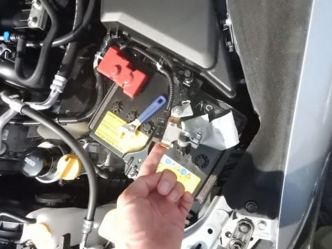

…緊張の一瞬です．

LEVORGのスタートボタンを押して，

いざ，起動っ！！

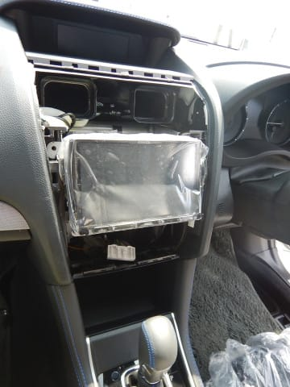

ナビ様，無事に動くのか…？？

…

…

ドキドキの一瞬…っ！！

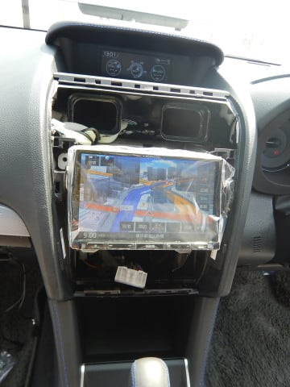

動いた～っ！！

一発で起動！

素晴らしぃ！

起動時に，

「ETCカードが挿入されていません」

の案内音声も出たので，ETCも正しく接続

されているようです．

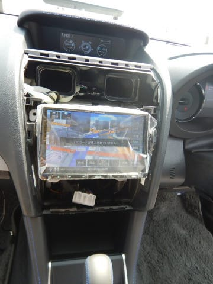

ETC車載器情報も，正しく見えてます．

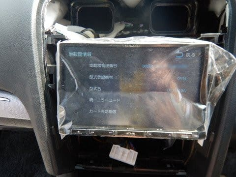

とりあえず，いろんな機能を試してみますが…

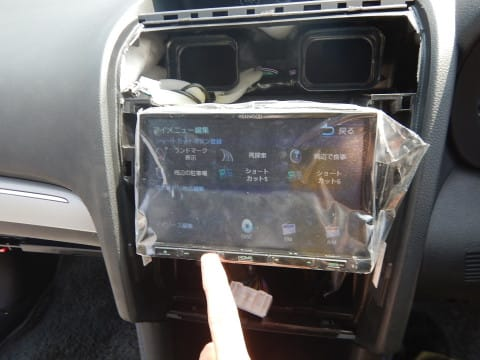

現在位置も正しくとらえました．GPSアンテナ，OK.

で．

テレビも見れます．

地デジアンテナ，OK.

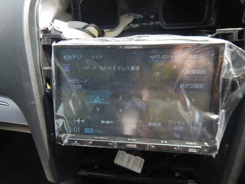

ラジオも聞こえるし…

ラジオアンテナ，OK！

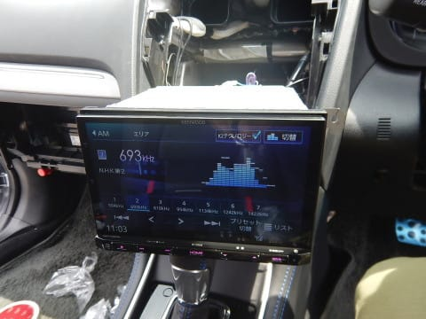

ステアリングリモコンも…

ナビに事前にセットされている

「スバルD」を選べば．

をを！

ちゃんとステアリングリモコンから

操作できますね…

ステアリングリモコン線，OK！

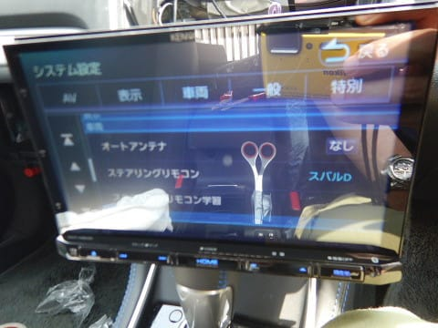

（映りこんでいるハサミにピントが合ってる…）

ってな感じで．

一発完全動作！

素晴らしい…！

残るは．

最後の山場，バックカメラの接続です．

これは．

LEVORG C型までのコネクタで準備してしまった，

カメラ側ケーブル．

こいつが，リアゲートに来ている，[純正リアカメラ用先行配線の
コネクタと形状が違い，つながらなかった](ea238efa81c7faa22626c054d5628ed1e.md)という

悲しい出来事があったのは，記憶に新しいところ（涙）．

繋がらないコネクタを何とかするため．

純正リアカメラ用先行配線のコネクタからピンを引き抜いて．

カメラ側ケーブルのコネクタに，こんな感じで

ピンをそのまま差し込むという[荒業で乗り切ろう](e0d61a04608a6a32ac684b08fc69da0f4.md)と

思っていたのですが．

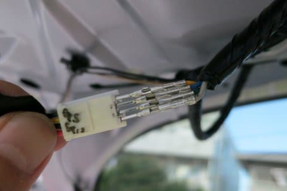

…ただ．

この先行配線の，どのピンにどの信号線が来ているか

全く分かりません（涙）

だもんで．

この先行配線がナビに繋がれた後で，

それぞれのピンをテスターで当たって

配線を解読，繋ぎこもう…という作戦

だったわけで．

今回．ナビが繋がったので．

ならば，これから配線の解析をしましょうか…

果たして．

まだ垂れ下がったままの，このリアカメラ配線．

無事解析できて，ちゃんと動かせるのか？？？

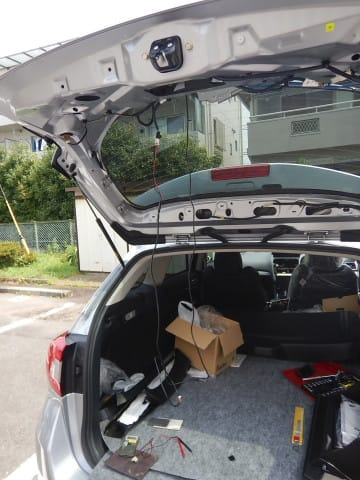

（続く）
