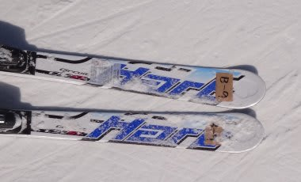
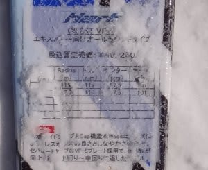
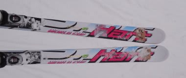
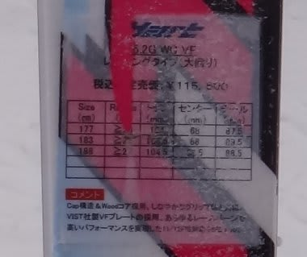

# まだもうちょい，2012/2013シーズンモデルのスキー試乗レポート　HART編

📅 投稿日時: 2012-04-19 01:04:09

🏷️ カテゴリ: [スキー板試乗](c0bd8048615710cee890e403a36cc9a2b.md)

まだスキー板試乗インプレッションが続きます．

今回はHart編です．

このあと，レポートはまだBlizzardと，

以前試乗したSalomon X-kert＆Volkl Platinum CDが残ってます…

-----

○Hart

C9.2ST VFS 165cm

…この写真，文字が読めないですね…すいません．

基礎系小回り板．

うーーーむ．

トップを押さえてはダメ.

トップを押さえても全く曲がらない…

トップを押さえるとむしろトップのグリップが抜けて，

トップが外に逃げる感じ．

かかと側に乗って，かかとより後ろ目をたわませるような動きで板が良く曲がります．

完全かかと操作．

ブーツセンターがずれているんじゃないかな？？？

と一瞬思ってしまいます…

とりあえず．

この板は，後ろ目をたわませるとトップまでグリップしてぐいぐい回ります．

ロッカー構造ならではの，トップを押さえなくても曲がってくる…

という，かかと～くるぶし荷重というよりも，

「テール部分をたわませると曲がる」という感じ．

性格としては，完全エッジグリップで曲がる板のように感じます．

あんまりズラシのコントロールはよくない感じ．

…でも，トップを押さえるとちょっとずれちゃうのが微妙．

うーん．このポジションに慣れるといい板なのかな～？？

板の張りはそこそこです．

試乗後に板を見るとやっぱりフルキャンバーでした．

とりあえず，リフト2-3本乗っただけでは，この板の

おいしいところを引き出せてないかも知れませんが．

私にとって謎な乗り味の板でした…

I5.2G WC FV 188cm

GS競技用．

R=23を借りようと思って，間違えてR=27を借りてしまった…

とりあえず．生まれて初めて履きましたよ．

R=27のGS板．

で．これは…

「ごめんなさい～っ！私が悪うございましたっ！」

って感じ．

私の常識を超える板でした（涙)．

R=27って，ここまでエッジグリップがルーズなのか…

お気楽レジャースキーヤーがゲレンデで履いちゃいけない板ですね．

板のトップが勝手にグリップして，板の方向を決めていってくれるような

軟弱な板ではありません．

板がグリップするというより，谷回りではルーズなグリップの中，

板をズラシながら，板の方向を決めてやらなくちゃいけないです．

自分の行きたい方向に，正確に板を運んでいかなくてはなりません…

それで，板の方向が決まったら重みをかける．

それも，かなりの気合を入れて．

そうすると，死ぬほど硬い板がたわんでグリップします．

普通に乗っただけではたわまない，グリップしない．

硬い斜面スペシャルでしょうね…

すいません．

この板も，私が履きこなせない板でした…

## 💬 コメント一覧

### 💬 コメント by (のび太)
**タイトル**: Unknown
**投稿日**: 2012-04-19 12:40:45

試乗レポ、楽しいですね。

今年も試乗会に行けなかったから、興味津々です。

さてさて、ハートの板（小回り系）ですが、、、2月に岡田デモ（ハートチーム)にこんな滑りを教わりました。

↓↓

http://www.youtube.com/watch?v=T7cKSXejzRE&feature=relmfu

言葉で言い表すのは大変ですが、、、動画を見れば、今回の試乗レポも頷けます。

参考までに。

### 💬 コメント by (Skier_S)
**タイトル**: そういう乗り方の板ですね…
**投稿日**: 2012-04-20 02:50:56

いやー．

最近の板，荷重ポイントがかかとよりになってきたなぁ…

と思っていたんですが．

C9.2は，荷重ポイントかかとより後ろなのでびっくりしました．

私の滑りの調整範囲を超えており，リフト2～3本では

板のベストポジションに体をもっていくことができませんでした…

本文にも書いたように，私はこの板のポテンシャルを

引き出せていないと思います(涙)．

相変わらずのレポーターの力量不足です(泣)

うーむ．動画見ましたけど，やっぱりこういう滑りをする板なんでしょうね…

