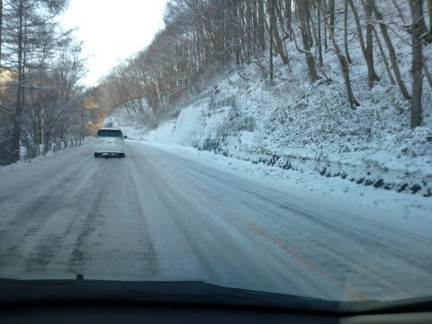
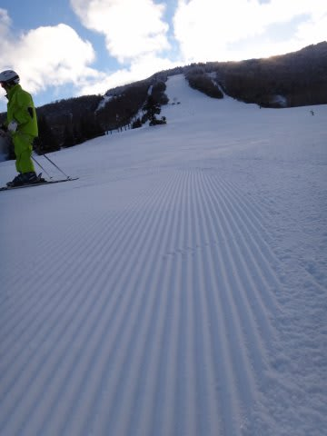
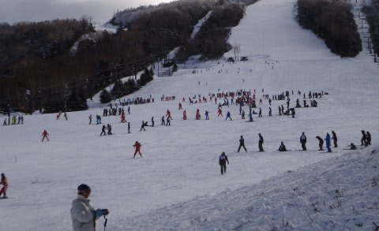
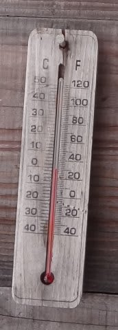
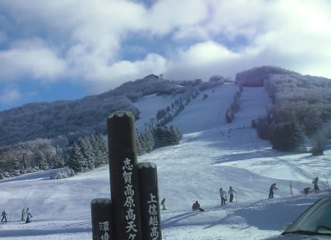
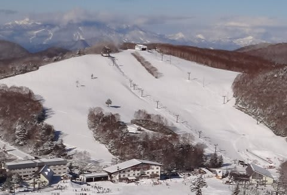
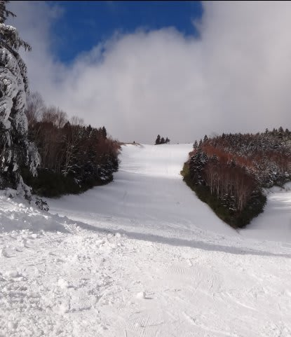
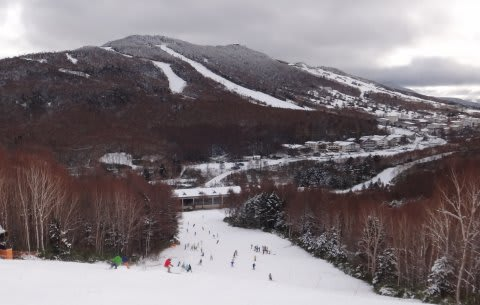

# この週末の志賀高原スキー場の状況は…

📅 投稿日時: 2011-12-13 00:17:46

という感じで．

今シーズン初めての志賀高原に行ってきたわけですが．

…雪が．

少ない．

志賀高原のリフトで現在動いているのは…

熊の湯ペア

高天ヶ原トリプル（下のゆるいところ）

一の瀬ペア

焼額第2高速

焼額第4ロマンス

…これだけです（涙)．

滑れるのは，人工雪のバーンのみ．

天然雪の積雪は10cmあるかな？

この土日も，1mmたりとも積雪は増えず．

だのに，路面はしっかり雪道という…意地悪な状況．

かなり滑りますのでご注意を．

で．

レポートしたとおり．

気温は低く，人工降雪がつけてあるところは結構いい感じなんですが．

一の瀬・高天ヶ原エリアは修学旅行生が結構来てまして．

普通なら一般スキーヤーがあまり滑らないタンネの森で

滑る修学旅行生ですが．

タンネの森が動いていないので，一の瀬はすごいことに…

土曜日は，焼額も大阪府の指導員研修会でかなり混雑していた様子．

という感じで．

雪が少ない上，かなりの混雑という2重苦．

うーーーーーむ．

うーーーむ．

しかし．

この週末，昼間も氷点下という気温の低さ．

(昼12時ごろの焼額の気温)

気温が低いので，人工降雪機はフル稼働．

現在．一の瀬は人工降雪機で必死に天狗コースの雪付けをしてます．

天狗コースがオープンすれば，修学旅行生はクワッドリフトに誘導

できますから…

高天ヶ原はコース上半分の雪付けをしていますね．

…ぱっと見，もうそろそろクワッド動かせそうな気もするんですが…

ダイヤモンドはまだまだまだまだ先でしょう．

わずかに人工降雪機を動かしたあとがありましたが，

この土日は全く動かしてませんでした．

焼額は，昼間は人工降雪機を動かしてませんでしたね～．

ゴンドラ動かすために，第2高速上部で人工降雪機動かしてるかと

思いましたが，人工降雪を打ったあとは無し．

真っ白に見えますが，雪は薄いです．人工雪は乗ってません．

夜中に第2高速沿いに人工降雪打ってるのかな？

予想より第2高速沿いはコース幅も広く，雪の厚みも

そこそこありました．

ブナ平・西舘下半分はまだ雪が覆ってない感じで．

上半分は一応白くなってるけど．

下半分はまだ完全に茶色くて，滑れるようになるまでには

まだまだかかりそう…

サンバレーはもう結構雪がつけてあるのか，トレーニングバーンとして

人が滑ってました．（一般には開放されず）

…どっちにしろ．

天然雪がどかっと降らないと，今週末にオープンできるのは

人工雪コースのみ．

おそらく，

・一の瀬天狗コース

・高天ヶ原てっぺんから

くらいが追加される感じですかね～．

こんな感じで，一の瀬方面はもう全面雪に覆われてるみたいに見えるんですけどね～．

とりあえず．この週末に向けて．どかっと雪が降ってほしいところです．

PS.そういえば．

志賀高原で微妙に変わったのが1点．

サンバレーからちょっと登ったところにあった，ガソリンスタンド．

なくなりましたね～．
