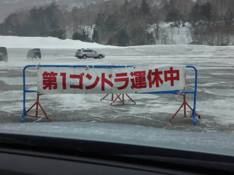

# 3月1日の志賀高原，詳細モード…強風＆アイスバーンの修行の一日（涙）

📅 投稿日時: 2015-03-03 03:46:24

ということで．

昨日速報した，日曜の志賀高原の詳細モードですが…

きょ，今日も帰宅が遅くて．

詳細モードを書くパワーが無いんだけど…

でも，書く．

偉いっ！！！←みんなにホメてほしいところ

んで．

昨日も書いたように．

朝，焼額に向かうと…

ふむ？

第2ゴンドラ，運休か…

まぁ，第2ゴンドラは風に弱いから．

また，第1ゴンドラに人が集中して

混むなぁ…

と，第1ゴンドラ側駐車場へ向かうと．

な，な，なんですとっ！！！！

第1ゴンドラも，運休？？

S「…う，運休ですか？…動きそうですか？？」

係員「午後からさらに風が強くなりそうなので，今日は一日動かないと思います…」

がががががーーーん！！

ショーーーーーっく！

これは，きっと．

みんなの日ごろの行いが悪いからに違いないっ！

土曜の夜の記事の最後で，しっかり警告したのに…

…みんなに，面白くないBlogでも「面白い」っていう，寛容さが無かったからに

違いないっ！！←違う．断じて，違う．

とりあえず，第2高速，第3高速，第4ロマンスの3本のリフトは

動いているようなので．

意気消沈しつつ，第2高速リフトに乗って，山頂へ上がると…

うほう！

ゲレンデは，薄日が射すピカピカシマシマバーン！！

しっかり締まった，最高の雪！

これは気持ちいいっ！

…気持ちいいのにっ！

…なぜ，ゴンドラが動いてないの…（残念）．

で．

ゴンドラが動いてないし．

奥志賀も全面運休なので．

リフトに人が集中するってことで．

第2高速のリフト待ちも最大10分ほどに伸びちゃったし…

（この写真の段階では，まだ3分程度の待ち）

第3高速リフトも，5分を超える待ち時間になり．

焼額は全体的にコースも混雑してきたので…

私としては珍しく，一の瀬方面へ脱出しました．

一の瀬方面は，寺子屋と東館山ゴンドラが運休している以外は，

普通に全面運転で，リフト待ちも全く無し．

風もそんなに強くなく，うっすら日も射して．

いやー．

リフト待ちのある焼額より，一の瀬がいいかも…

と，思っていたら．

一の瀬メインバーン上部．

これは．

アイスバーンだよ…（涙）．

でも．

あれですね．

このスキー場の不思議なところは．

こんなアイスバーンでも，結構な人が滑ってるんですよね…

＃あ，アイスバーンなのは上半分だけで，

＃下半分は，気持ちいい圧雪バーンでしたよ…．

まぁ，リフトがガラガラだから，

リフト待ちが長い焼額よりいいか…

と，一の瀬をしばらくぐるぐるして．

んで，一の瀬にも飽きてきたので，

高天ヶ原から東館経由で西館・ジャイアント方面へでも行こうかな…

と，思い始めた，お昼前に．

場内放送「強風のため，寺子屋スキー場と，一の瀬ダイヤモンドスキー場は運休しております」

…あれ？

えええっ？？

ダイヤモンドも止まっちゃったの！？？

な，なんとっ！！

…焼額まで滑っていけないじゃないか…（涙）

まぁ，バスで帰ればいいか…

と，気楽に考え．

高天ヶ原のてっぺんから，西館方面へ滑りに行こうと

思った，1時過ぎ…

ちょうど，パトロールさんが高天ヶ原のてっぺんで

看板を掲げているのに出くわしました．

…なんと…

西館も，運休になりましたかっ！

…危なかった．

あと1-2分前にここを通過していたら．

帰ってこれなくなるところだった…

と，一の瀬方向へ戻りますが…

お昼を過ぎてからは，全体的に風と雪が強くなりはじめ．

なんだか，滑るのがつらい感じに…

…でも，こんな状況でも，動いているリフトが少ないからか．

一の瀬メインバーンは人が多かったのが驚き…

コースも上半分は，アイスバーンなのに．

みんな，根性あるな～！←お前に言われたくない

＃でも，リフト待ちは無かったよ

そして．

午後2時半ごろには．

湿った雪がぼたぼた吹き付ける感じになり…

3時には，かなりの勢いの降りになってきました（涙）．

それでも，この悪天候の中，アイスバーン斜面を滑ってる人が

いますね～…信じられない…←お前も滑ってるでしょ

ということで．

ものすごく降りつける雪のせいで．

パーフェクターコースは，あっという間に柔らかい雪が積もり．

3時過ぎには人も結構減ってたので，

プチ新雪っぽい感じになってました…

…あ，急斜面の正面バーン上部はアイスバーン＆もさもさミックスの

超絶に滑りにくいバーンと化してました…（涙）．

ってことで．

強風＆雪＆アイスバーンという

「これ，何の修行？？」

って感じの，一日でしたが．

結局この日も，リフトストップまで滑ってしまったのでした…

でも．

これで，雨だったら死んでた．

ホントに死んでた．

降ったのが雪だっただけ，まだよかった…

と，自分を強く慰める，Skier_Sなのだった…

## 💬 コメント一覧

### 💬 コメント by (いか)
**タイトル**: Unknown
**投稿日**: 2015-03-03 12:00:26

志賀は風運休でしたかー

八方は風はなく運転はするものの、ガスで何も見えませんでした、笑

なかなか帰りの道がハードでしたね…

おしりふりふりな方々がたくさん…(´・ω・)

### 💬 コメント by (Skier_S)
**タイトル**: いかさま
**投稿日**: 2015-03-04 00:47:39

八方はガスだったんですか…

志賀は全くガスは無くて，そこは良かったのかな…

でも，風がなかったとは…

でも，やっぱりアイスバーンだったんですかね～？

