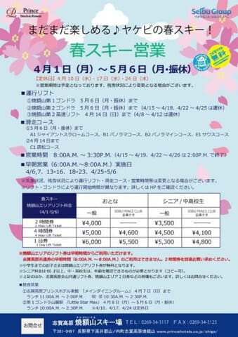
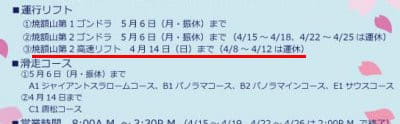
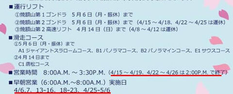
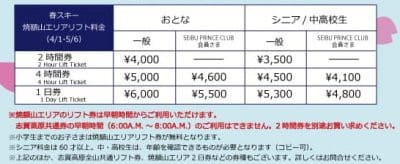

# 焼額山の春スキー営業の案内が出たよ…4/10以降GW期間以外水曜定休，4/13以降は平日も早朝営業！でも4/15以降の平日は14時終了．

📅 投稿日時: 2024-04-03 02:24:21

ってなことで．

やっぱり明日3日(水)の昼から4日の朝に

かけて，志賀高原でも結構な雨が降りそうな

今日この頃，皆様いかがお過ごしでしょうか（涙）

いや…

3日(水)は午前中…というか，昼前くらいまでは

降らないでいてくれそうですが．

朝から気温も上がって雪も緩めだし，

昼からは風もかなり強くなり，

空から液体が落ち始め，時折強く降ります…(泣)

そして，4日の早朝くらいまで降り

続けそうです．

うーん．

雨に耐えて，雪がそんなに解けないでいて

ほしい…

ってなことで，本題へ．

そろそろ4月に入り，志賀高原のスキー場も

春営業の案内が出てきました…！

とりあえず，ダメダメだった2月はほぼ

諦めていた春営業ですが，焼額山スキー場も

GWの5/6まで営業するんだとアナウンス

しています…！

（[焼額山スキー場Facebook](https://www.facebook.com/yakebitaiyama/posts/pfbid0CpBy5Hq9SXjgAqqeyFfNarS6KP7t4h92R9FwV5ubrSQ8MsTaeroAVauucoedqM15l)より，以下同じ）

これをよく見ると…

去年同様．4月10，17，24日の水曜は定休日に

なったのね…

でも，昔は4月は週末＆GWのみ営業

という時期もあったことも考えれば，

水曜以外は営業してくれるだけ

ありがたい…

そして．

以前，早朝営業の案内で明らかにされた

ように．

GWラストまで，第1＆第2の2本のゴンドラで

営業する予定です！！

第2ゴンドラは，14日以降は休日のみ運転になる

ようですが…

でも，2本のゴンドラが（雪がある限りという条件は

ありながら…）GWまで動くのはありがたい！

そして，早朝営業はやらない第2高速リフトは

4/14まで（4/8以降は平日休み）のようですね．

4/7に終わりかと思ったけど，1週間伸びたのは

うれしい限り．

で．

早朝営業の案内であったように，4/6,7の週末に

6:00~8:00の早朝営業が第1ゴンドラで始まり．

4/13以降は，毎日早朝営業をやってくれます！

さらに4/19以降は第2ゴンドラも加わる予定で．

早朝営業はかなりグレードアップ！！

ただ，4/15以降，平日は午後2時で終わっちゃう

のに注意が必要ですね…

まぁ，この時期．

早朝から滑れたら，そんなに遅くまで滑ろうという

人はそんなにいないと思いますが…

しかし．

早朝営業がゴンドラ2本とかなりパワーアップ

するものの…

リフト券もかなりいいお値段になっていて．

早朝2時間券が4000円か…（泣）

まぁ，焼額限定4時間券や1日券，2日券でも

早朝から滑れるので．

早朝券を別に買う必要があるのは

全山券の人のみなので．

早朝込み1日券が5500円と考えれば

安いのかも．

とりあえず．

4月以降もゴンドラ2本体制が続き，

14日まで2高も動き，

さらに早朝も19日以降はゴンドラ2本と．

焼額の春営業はかなり充実してますね…！！

3月の積雪がなければ，ここまで

贅沢な計画は出せなかったに違いないので，

3月の積雪に感謝…

そして，GWまでたっぷり雪が残ることに

期待…！！

そして．

志賀高原の，焼額以外の春営業情報ですが…

4月になり，

西舘山

東舘山

ブナ平

ジャイアント

山の神

丸池・蓮池・サンバレー

タンネの森

は営業終了．

タンネの森は，リフトは止まるけど，

高天ヶ原⇔一ノ瀬の移動のための

ルートは滑れるはず…

高天ヶ原・寺小屋・ダイヤモンドは

土日&4/27-5/6のGWのみ営業となります．

4月以降，中央エリアで平日動くのは

ファミリークワッドのみ

になりますね…

奥志賀は，第2，3，4リフトとゴンドラが

GWまで動きますが…

土日は8時から，平日は8時半からで，

4/3以降，25日まではゴンドラのみ月・火・水は

運休になります．

そして，4/6からの週末＆GWは，

第2ペアで朝6時半から早朝営業中です！

熊の湯は，5月12日まで営業予定！！

雪がある限り，第1，2ペアと第3クワッドが

動きますが…

第3クワッドは土日＆GWのみ動きます．

4月20，21日の週末と27日~5/6まで，

第2ペアが朝6時から早朝営業です！

横手山は，第1，2，3，4と渋峠ペアを

雪がある限り動かす…ということで，

終了日はまだ未定です．

第2トリプルは3/16からの土日祝で，

朝6時から早朝営業実施中！

あと，注意しなくてはいけないのが，

4月2日から，シャトルバス時刻表が

春ダイヤになり，本数が減ります！！

時刻表は[こちら](https://www.nagadenbus.co.jp/news/315350f1d6d129e13d9432c3c2999db16efaad1b.pdf)参照．

…ってな感じで，4月からは稼働リフトも

減りますが．

でも，まだまだ滑れる志賀高原．

早朝営業もあるし，GWまで

（雪が残れば）たっぷり楽しめますよ～！

とりあえず．

GWまで雪がたっぷり残るように，

このBlog読者の皆様におかれましては．

いつもの冷え冷え踊りをいっぱい踊って

くださいますよう，よろしくお願いいたします…

## 💬 コメント一覧

### 💬 コメント by (いか)
**タイトル**: Unknown
**投稿日**: 2024-04-03 08:49:31

昨日Webで週末に向けて焼額山1日券を買いましたが5,000円で、Web割引率が高くていいですね～。6時からは楽しみです。

### 💬 コメント by (Skier_S)
**タイトル**: ＞いかさま
**投稿日**: 2024-04-04 02:18:14

春営業のWeb割引も1000円引きだったんですね…！

Web割引料金がなかったので，てっきり春営業はWeb割引がないものだと思ってました．

5000円で6時から営業終了まで滑れたらお得かも．

2日券だとたぶん8800円かな？

これで2日間とも早朝滑ったら，かなりお得感は高いと思います！！

