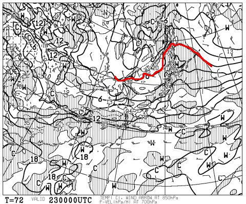
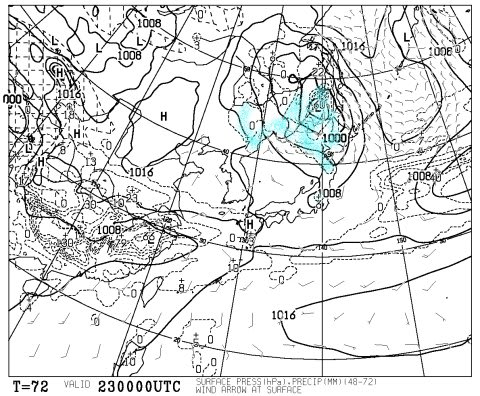
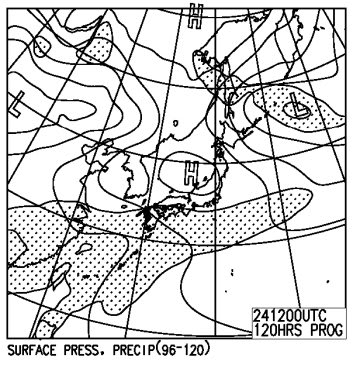
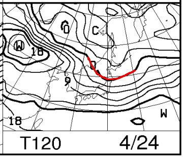

# 4月24日の週末の志賀高原の天気は…天気は良さそうなものの，気温が上がるよ（涙）

📅 投稿日時: 2016-04-21 01:34:02

えー．

ディープなスキーヤーの人たちも．

そろそろ今シーズンはいろんな意味で，

あきらめの境地に入ってきたようなので．

…まだシーズンオフに突入しておらず，

今週末のスキー場の天気が気になる…

という人がかなり減ってきているように思える

今日この頃．

皆様いかがお過ごしでしょうか…

とりあえず．

色々コメントとかもらいましたが．

[一の瀬ファミリー](https://www.facebook.com/297506993698844/photos/a.303419283107615.72613.297506993698844/946378972144973/?type=1&theater)は，もう上部はやばいし．

下もコース幅半分になってますね…（涙）．

奥志賀も，もうエキスパートは終わってしまい，

麓まで滑って降りられなくなり．

ゴンドラで上部へ登って，第3と第4リフトのみ

滑れるようです…

でも，[第3もコンディション悪化](https://www.facebook.com/okushiga.kogen/posts/606108902872755)しているみたいで（涙）．

今週末はどんな感じか…

渋，横手も．

[横手は今週末まで，渋峠は5月1日まで…](https://www.facebook.com/yokoteyama2305/posts/777980158968562)って感じのようです．

…それで．

さらに追い打ちをかけるように，明日は雨なので…

今週末は，もう壊滅的な予感…（涙）．

まぁ，志賀高原も，実質今週末がラストと思った方が良いのかも…

とりあえず．

今週末の天気予想ですが．

この状態では，もう雪質もへったくれもないですね（涙）．

気温は高いですし．

あと，気になるのは，雨が降るかどうかくらいですよね．

だもんで．

土日とも雨は降りません．

朝から気温は高いです．

以上．

…で終わっても，みなさんが欲しい情報がすべてそろっている

気がします…

…

…

でも．

あえて，細かく書くと．

土曜の850hpa気温はこんな感じで．

0℃線は北海道の北…

志賀は+6℃線がかかっているので．

この日は朝からプラス気温で．

昼間は+10℃くらいまで上がるのかな～．

春ですねぇ…（涙）．

土曜の地上天気図はこんな感じなので．

降水域の網掛け部分は志賀に掛かっていないので，

雨が降る危険性は低いです．

ただ，雲が多めかな～．

曇り時々日も射す，という程度．

で，日曜の地上天気図は，こんな感じなので．

雲が多いものの，高気圧の勢力で，

基本的に日が射す天気かな～

で．この日の850hpa気温図は…

うむ．やはりこの日も+6℃線が志賀高原に…

だもんで．

この日は朝イチは晴れた放射冷却で，一瞬固めかも

しれませんが．

すぐに緩んでザブザブ雪になります…

ってことで．

まとめると．

土曜：終日曇り，時折日も射す．朝から気温は高め．ザブザブ雪に…

日曜：雲が多めだけど，晴れ．朝イチは放射冷却で一瞬固いかも

　でも，すぐに緩んでザブザブ雪に…

　というより，また雪が解けていき，ゲレンデはすごいことに

　なってるでしょう．

…という感じです（涙）．

あー．

ダメですね．こりゃ．

今週末，1泊2日で滑って楽しいような

ゲレンデコンディションかなぁ…（泣）．

## 💬 コメント一覧

### 💬 コメント by (Goku)
**タイトル**: Unknown
**投稿日**: 2016-04-21 15:25:08

こちら長野

お昼から雨です…

もう、終わりですねU+1F630

### 💬 コメント by (Skier_S)
**タイトル**: Gokuさま
**投稿日**: 2016-04-21 23:56:39

雨ですね…（涙）

終わった感じですね…（泣）

今週末，今シーズンラスト志賀かも…

