# 12，1，2月の気象庁3か月予報を見てみた…そして12月3日(火)オープンの志賀高原一ノ瀬ファミリースキー場特派員レポート

📅 投稿日時: 2024-12-04 08:17:37

🏷️ カテゴリ: [日記](cc4b5682fb7b8b144980957a978653fb0.md)

えー．

今日もちょっと昨晩Blogを書く時間がなく，

朝更新になっちゃいましたが…

昨日の12月3日(火)に，志賀高原の一ノ瀬

ファミリースキー場，下半分だけ

オープンしました～！！

…下半分のペアリフトの長い方，

ファミリーペアB線がオープンしたよう

ですが．

あさイチは日陰になる西斜面ということも

あり，日が射さずバーンが見にくいうえ，

その見にくい中でカチカチの硬めの凸凹

斜面だった上に，コロコロも多く…

かなり手ごわかったみたいです．

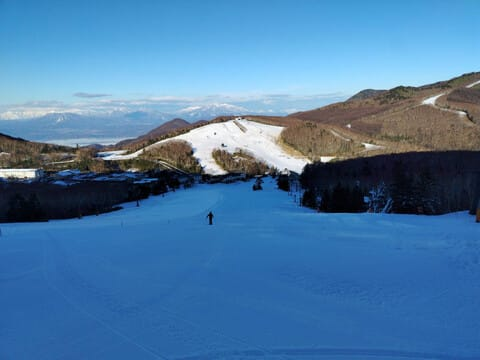

時間が経つと日が射してきたものの…

それでもコロコロが残って滑りにくかった

みたいですね…

人工雪がついているところはこの右半分

だけのようですが…

人工雪がついているところはブッシュは

なかったみたいです．

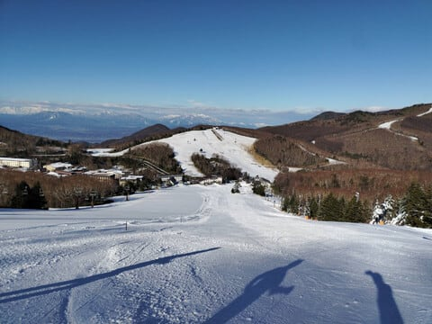

今日は高天ヶ原が良かったようで，

修学旅行の団体さんが入っていたものの，

リフトに乗らずに滑っていたようで．

バーンも堅くなくコロコロもなく

ブッシュもなく．バーンが緩い点を

除けば，快適に滑れたようです…

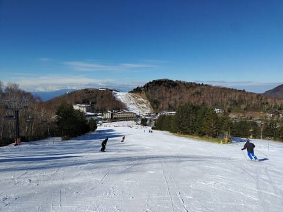

うーん．

志賀に次に雪が降るのは金曜夜

からかな…

今週は水・木・金と，人工降雪機は

動かせるけど天然雪はなさそうなので，

平日のバーンはそこまで改善しないかも(泣)

まぁ，土日に積もりそうなのでそこに

期待…

ということで本題へ．

ここしばらく，毎週木曜の1か月予報は

見ていたものの…

すっかり11月19日発表の3か月予報を見るのを

忘れてました…！！

ってなことで，本日になってようやく

[FCCX93](https://www.sunny-spot.net/chart/FCXX93.pdf)を見たわけですが…

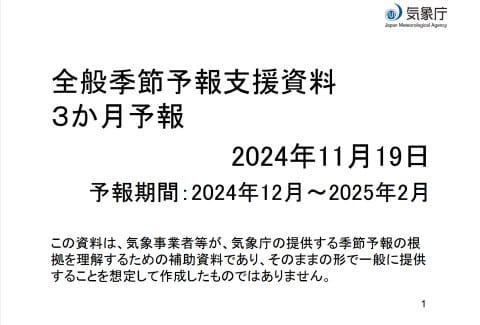

予想平均気温を見ると…

12月は平年よりちょち高めの予想ですが，

1月は平年より冷えて，2月は平年並みに

なりそうな予想ですね…

今の勢いだと，12月も平年より冷えそうな

感じなので，平年並みかそれより冷える

冬になりそうです…！！！

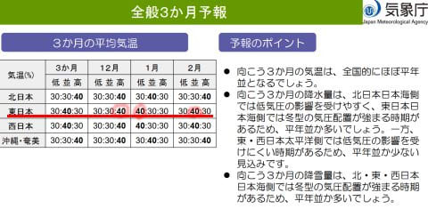

そして，降水量，降雪量を見ると…

12，1，2月とも，降水量は平年並みか多めで．

3か月間の降雪量も平年並みか多めという

スキーヤーにとってはちょっと安心な

予報です！！

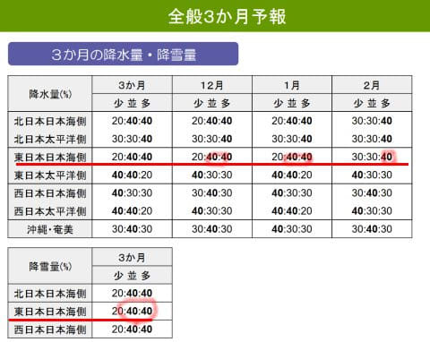

もう少し詳細を見ると．

12月の200hPa流線関数は赤く記した③の

ように低気圧性循環が出て，水色線のように

日本付近でちょうど偏西風が南下するパターン．

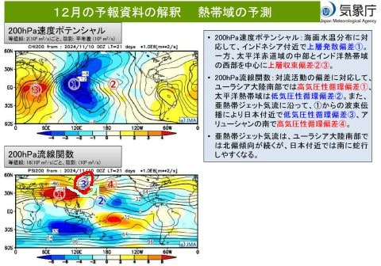

そのため，500hPa高度も，850hPa気温も，

ちょうど日本を囲むように冷える方向の

予想になっています…！

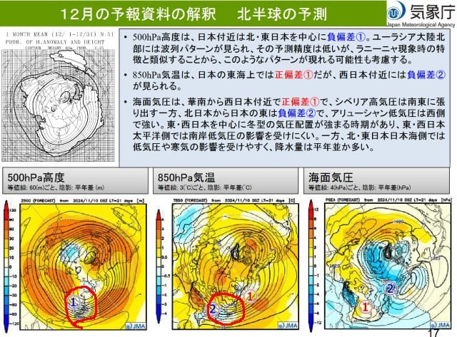

さらに1月も同様に，

200hPa流線関数は日本上空にちょうど②の

低気圧性循環があり．引き続き偏西風は

日本付近で南下するパターン．

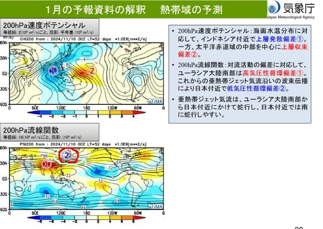

だもんで．1月も引き続き，見事に日本付近

だけ狙ったように850hPa気温が低温に

なりそうな，いい感じの予報です…！

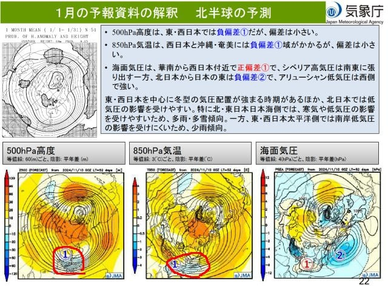

ちなみに2月も全く同じ傾向で．

日本付近の低気圧性循環は居座って

くれそうだし…

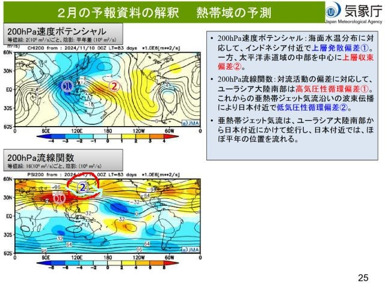

1月よりは冷えは弱いものの，850hPa

気温も周りが平年比より高い気温の中，

日本付近だけほぼ平年並みという，

周囲に比べると冷える予報です！

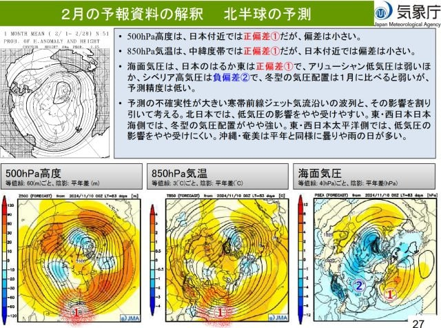

ってなことで．

ラニーニャ現象は弱いものの．

ラニーニャの影響っぽい，日本付近で

偏西風が南下する傾向が予報に

現れていて．

今のところ，まぁまぁ冷えて雪が

降ってくれそうな冬になりそうです！！

今週末から冷えて雪が降ってくれそうなので．

この冬は，昨年に比べればずっとマシに

なりそうな予感…！！

## 💬 コメント一覧

### 💬 コメント by (レインボー77)
**タイトル**: Unknown
**投稿日**: 2024-12-04 11:58:50

水曜日の志賀高原情報

９時過ぎに熊の湯到着。特派員A夫妻、特派員B氏は既に颯爽と滑っている。

だが上の方はどこを滑っても地肌が、、、

中間からは何とか大丈夫だったけど、2本目には濃霧までが！

高天や一ノ瀬が頭をよぎったけれど、結局、軟弱レインボー隊はこれにて終了して温泉直行。

まあ年寄りは、毛がなく、いや怪我なく滑れればいいのかと。

### 💬 コメント by (レインボー77)
**タイトル**: Unknown
**投稿日**: 2024-12-04 15:23:10

今夜の志賀高原は-3℃。人工降雪が期待できるので、明日はファミリーかなあ？

高天は団体さんがまだいるので。

熊の湯は上部があまりに薄いので、人工降雪が打ててもすぐに削られそうな気が。

### 💬 コメント by (Skier_S)
**タイトル**: ＞レインボー77さま
**投稿日**: 2024-12-05 03:29:10

明日は天然雪は期待できませんが，人工降雪はフル稼働できそうなので，

ゲレンデ状況はちょっと改善しそうです…

雪が降るのは金曜夜以降なので，週末を過ぎるとかなりコンディションよくなりそうですので，

今しばしの我慢ですよ~！

