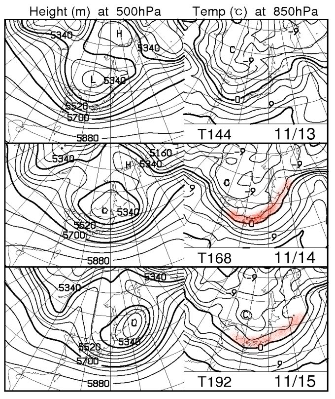
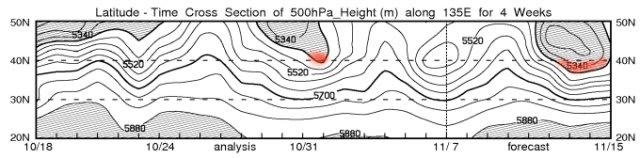
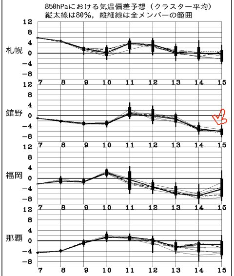

# うむっ!?　11月14，15日はむちゃくちゃ冷えるぞっ！

📅 投稿日時: 2012-11-09 01:43:41

さーて．

今週末の天気を予想しようかな～，と．

日課の天気図を見ていたとき．

あれれれれっ？

なんだか．11月14，15日．

むちゃくちゃ冷えそうな感じなんですけど…

FXXN519をみてみると…

なんだか．

山沿いで雪になる，850hpaの0度ライン．

日本をすっぽり覆ってるんですけど…

赤で記したのが，0度以下の空気．

これが，日本をすっぽり覆うくらい南下してるって…真冬並みの寒さ．

で，こいつ．FXXN519の，500hpa高度断面図ですが．

この，5400mの網掛け部分．

これが，北緯40度より南に下りてきていると，山では雪が積もる目安．

赤くマークした左側，前回雪が降った11月2日も，北緯40度よりわずかに下に下がってますが．

14，15日はこれより下に下がっているので．

かなり積もるかと…

んで，FZCX50の気温傾向を見ても…

14，15日は例年より4-6度気温が下がりそう．

冷えるよっ！！

これは．

これは．

来週の週末，17日は期待できそう…

熊の湯，オープンできるんじゃないかな？？

11月はそんなに冷えなさそうな感じだったのに…

うれしい誤算！

…

…

あ，そうそう．

この週末，10，11日の天気ですが．

10日は晴れ．

11日は曇り，午後から雨，って感じです．

特に，11日は南風が吹き，標高が高い山でも雨です…

まぁ，午前中は降らずに持ってくれるかな？

うーん．

この週末．

土曜日日帰りだけど．

Yetiに行こうか，軽井沢に行こうか悩み中．

軽井沢は混むだろうなぁ…
