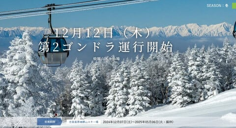
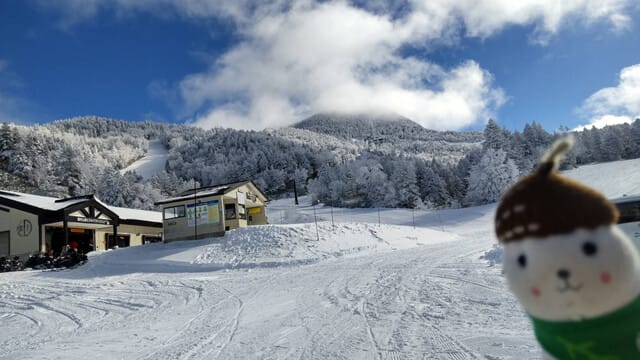
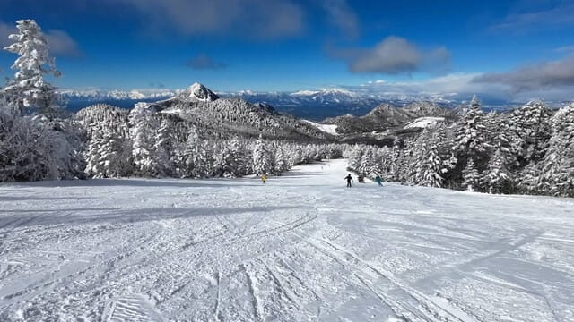
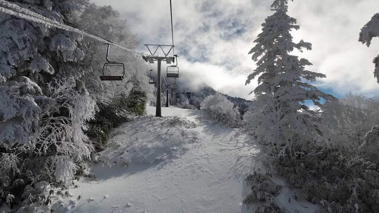

# 焼額山スキー場，12/12(木)より第2ゴンドラ運転！そして12/10(火)の志賀高原横手山スキー場特派員情報

📅 投稿日時: 2024-12-11 08:36:30

だめだ…

昨日も全く知らないうちに床で倒れたように

寝ていて，

気づいたら朝でした…

一体いつ寝たんだか…

ってなことで，

焼額山ですが，明日12日の第2ゴンドラ

オープンが決定しました～！

（[焼額山スキー場ホームページ](https://www.princehotels.co.jp/ski/shiga/winter/)より）

今シーズンはパノラマコースに人工降雪用

設備を入れたので，唐松より先に第2ゴンドラの

パノラマコースが開くようですね…

うーん．今週末までには第2高速リフトも

動いてほしい…

そして．いつものおこみん特派員から写真を

頂きましたが．

昨日の10日火曜日は，横手山に行っていたようです！

いやーー．

天気もいいし，雪も良かったみたいだし．

横手山は第1，第2，第4リフトと動いて，

かなり滑れる範囲も広がったようで．

かなり良さそうな感じですね～！

第2が滑れるようになれば，横手山も結構

いい感じですね…

おそらく志賀は今日も雪が降りそうなので，

今週末はいろんなコースがオープンしそう．

とりあえず，今週末に期待！

## 💬 コメント一覧

### 💬 コメント by (アツシ)
**タイトル**: Unknown
**投稿日**: 2024-12-12 01:44:24

明日から2ゴン運転開始〜‼️パチパチパチ

わたくし、明後日金曜日にヤケビで初滑りです。金土と滑って日曜は仕事なので土曜の夜に帰ります。

どの板を持っていこうか悩んでます。

①RC4SC(160cm)

②RC4CT(175cm)

③センター106mmの太板(180cm)

④センター76mmの荒れ荒れ雪蹴散らし板(163cm)

非圧雪コースはまだ先ということで③は置いていこうかなと。初滑りでいきなり高速大回りもないから②もまだ不要、となると①④でしょうか。というか①しか使わない予感しかしませんが。今日明日の雪降り具合はどうでしょうか？水曜恒例の天気予想を熟読して決めます❗️

### 💬 コメント by (Skier_S)
**タイトル**: Unknown
**投稿日**: 2024-12-12 02:07:23

>アツシさま

シーズンインで大回りしないってのであれば、1,4ですね…

雪降りモフモフて午後は荒れそうなので、4の出番が多いかも。

私は先週の日曜は一日Deaconを履いてました〜！

### 💬 コメント by (山内章啓)
**タイトル**: Unknown
**投稿日**: 2024-12-13 01:10:13

はじめまして

今季から志賀高原の一の瀬、蓮池地区でキッチンカー事業を展開することになりました

販促戦略担当の山内章啓と申します

インバウンド客が増えて、どこも食事の提供が足りてない状況を改善するためにはじめました

もし、よろしければ、利用していただけると幸いです

よろしくお願いします🤲

### 💬 コメント by (Skier_S)
**タイトル**: ＞山内章啓さま
**投稿日**: 2024-12-13 09:22:57

志賀高原でキッチンカーですか！

一ノ瀬，蓮池地区ということですけど場所はどこでしょうか…？？

あまりキッチンカーが出せそうな場所はないのですが…

### 💬 コメント by (アツシ)
**タイトル**: Unknown
**投稿日**: 2024-12-13 21:23:04

無事、今季開幕しました♪

板ですが、せっかくアドバイスしていただいたのに、結局①〜④の全部積んで行きました。車中泊時、若干狭かったです。

初日なのでゆっくり滑るつもりが、ゆっくり滑ったのは最初の2本だけ。ゲレンデが良すぎて我慢できず、3本目からガンガン大回りかましてもうてました。なので太板以外の3本に順番に乗った感じです。

### 💬 コメント by (Skier_S)
**タイトル**: ＞アツシさま
**投稿日**: 2024-12-14 00:47:13

ふふふ．今シーズンは雪がいいので，そんな我慢できませんよ…

我慢しちゃ身体に悪いです(笑)．

初日からガンガン行けたようで良かったですね！

