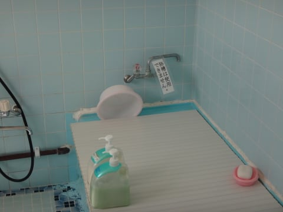

# 2016年8月　子連れ座間味ダイビング旅行記　その4…初めて泊まった座間味荘

📅 投稿日時: 2016-10-20 01:47:34

ありゃ？

しまった．

こっちの記事の前に書いておいたその3の記事．

投稿を忘れたまま，その4の記事を投稿しちゃってた

みたい…（涙）．

だもんで．

昨日の記事をその3に差し替えました

今日，改めてその4の記事を投稿です…

ってことで．

昨日このBlogを読んだ人は

「また同じ記事か？？」

…と，思ったかと思いますが．

そういう人は，改めて投稿した[「その3」の記事を](ece0fa02ee426b41a612e79ee172c7a11.md)

読んでください…

----

午後遅めに座間味に到着だけど，

その日のうちになんとか1本は潜りたい…

という，我が家のワガママに応えての．

我が家貸し切りスペシャルダイビングボートでの

本日1本を終えたわけですが．

ダイビング終了後，ボートは港へ戻ります…

もう，午後5時近いので，日はかなり

傾いてきました…

こんな遅い時間にスペシャルボート出してくれて，

感謝！

そして，無事港へ到着…！

港から歩いて，宿へ戻ってきました…

で．

今回泊まった，座間味荘．

ホームページも無ければ，どこのサイトでも

web予約が一切ない…という宿なので．

情報がほとんどないと思います…

＃私もそうで，行くまでどんな宿かドキドキだった

だもんで．

宿の中をちょいと詳し目に説明しましょうか．

まず．

宿の前のスペースに，こんな機材洗い場があり…

ここで器材を洗うことができます．

…基本的に，次の日も潜る場合は

器材は船に置きっぱなしなので．

実際に毎日洗うのは，カメラと

ウェットスーツですね…

ウエットスーツを干したら…

次は，シャワータイム．

この宿，お風呂場があるんですが…

あら．

浴槽は使えないんですね…

…でも．

暑い沖縄．

あんまりお風呂に浸かろう…って感じではないので．

シャワーで十分です．

ボディーソープやシャンプーは準備があります．

…タオルは準備がないので，自分で持って行きましょう…

で．

建物は古いですが．

お部屋は掃除が行き届いていて，

我が家的には十分合格レベル．

こんな感じの６畳間で，3人泊まりました．

エアコンも無料で，十分効くし．

我が家で泊まるには，十分なレベルかな！

トイレも，建物の古さの割には，

ちゃんと改装したのか，比較的きれいで．

これなら全然問題ないレベル．

今回，宿が貸し切りだったのもあって．

騒音は気にならなかったけど…

壁が薄いので，隣の部屋の音はちょっと

響くかも．

まぁ，お値段を考えればこんなもの

でしょうか…

後は，夕食ですが．

こんな広間みたいなところで，

座卓での食事です．

メニューはこんな感じで．

少なそうに見えますが，結構

カツが巨大で，おなか一杯になりました…

で．

ゆし豆腐のお吸い物も．

近所の手作りゆし豆腐らしく．

これがおいしかったなぁ～．

…でも．

食事はやっぱり，ペンション星砂さんの方が

かなりレベル高いですね…

まぁ，あそこはコストパフォーマンス

高すぎますから．

ってことで．

この日は完全徹夜明けの一日だったので．

＃良い子は徹夜でダイビングしてはいけません

夕食後，午後8時という早い時間に．

布団に倒れこんで，ぐっすり眠ったのでした…
