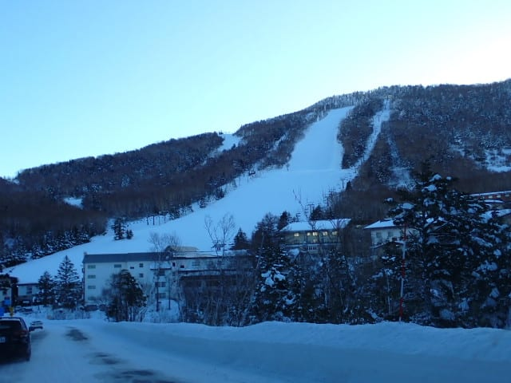
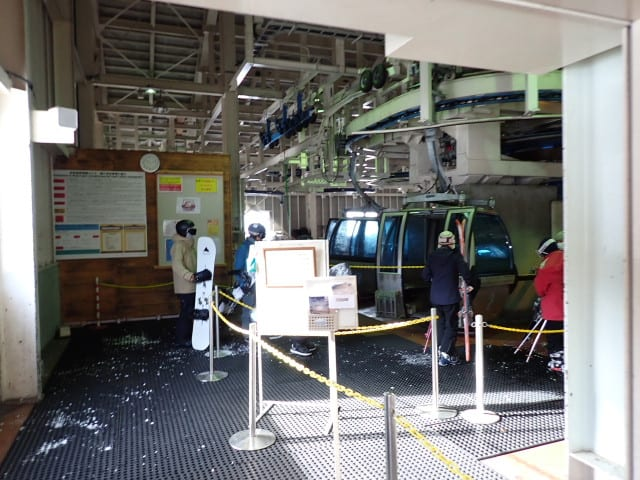

# 2024/12/21(土)の志賀高原焼額山スキー場は…晴れのち曇り一時雪，びっくりするくらいガラガラ！

📅 投稿日時: 2024-12-22 00:16:20

🏷️ カテゴリ: [2025スキー滑走日記](cacd3fbf84d4a679ee61a5894c3f95e14.md)

ということで．

今日も睡眠２時間ちょいで志賀高原へ

やってきましたが…

あまりにもコンディションが良すぎて，

今日もひたすら滑り続けてました～！！

いつも通り，今日もリフト営業開始前を

狙って志賀高原へ登っていきますが…

登りの道路の積雪は先週より少なめですが…

氷点下でところどころ凍ってるので注意！

今日は高天ヶ原も…

一ノ瀬も，山頂から滑れるようになっていて…

コースは完全に真っ白になりましたね…！

ってな感じで．

ゴンドラ運転開始8:30前に焼額に到着

しますが…

ををを！！

見事な晴天っ！！！

今日から第１ゴンドラ運転開始なので．

今シーズン初のわが住処，第１ゴンドラへ！

…土曜日にしては，列が異常に短いですね…

今日は天気がいいのに混まなさそう…！

ってなことで．

帰ってきたよ，第１ゴンドラ～！

…実に７か月振りの第１ゴンドラ，

久しぶりですが，我が家に帰ってきた

ようにほっとしますね…

そして，ゴンドラの上から見たコース，

シマシマですよっ！！

久しぶりの第１ゴンドラに感動して．

ゴンドラを降りて，いつもの温度計を

見るだけでも「戻ってきた」感があり，感動…

あさイチの気温は-５℃と，水曜の予想

ぴったり！

そしてまよわず今日オープンのGSコースに

飛び込みますが…

うほーーーーー！！

天然雪がしっかり締まった，トップシーズン

でも最高レベルの最高級シマシマっ！！

いや．

シマシマっ！！

1ゴンオープン日から，ブッシュの心配なく，

最高シマシマで幅いっぱいの大回りをかませる

このシアワセ…っ！！！

3週間前まで，紐ゲレンデのイエティで滑って

いたことを考えると，こんな最高級冷え冷え

シマシマのGSコースを思いっきりとは…

イエティの1億7000万倍くらいイイ！！！

とりあえず，今シーズン最高の，天然雪

シマシマバーンいただきました～！！

…そして．

こんな最高の天気で，最高のシマシマバーンを

楽しめるというのに…

第1ゴンドラはガラガラ！！

第2高速も全く人がいないガラガラだし…

第2ゴンドラも，ほぼ飛び乗り状態の

ガラガラっ！！！

営業開始から1時間以上たち，シマシマが

なくなっても…

晴天ながら雪質はそこまで悪くなく．

冷え冷えのトップシーズンの雪質の，

最高バーン！！

ただ，人工降雪が乗っていたGSコースの

一部は，朝はちょっとコロコロが出て

滑りにくいところもありましたが…

GSコースと唐松コースの一部以外の，

パノラマコースや白樺コースは朝から

一日中ずっとトップシーズン冷え冷えの

最高雪だったし．

昼頃にはGSコースのコロコロも消えたし．

これ，トップシーズンの最高の状態の

雪なのに…

昼前の一番混みそうな時間で，コースに

これだけしか人がいないガラガラでいいの？？？

昼前，一瞬だけ第1ゴンドラが混んだ

タイミングもありましたが…

ゴンドラが混んだのは，11時ごろの

1－2回くらいで，あとはほぼ待ちなし！

いやーーーー．

天気は晴天なのに最高気温は-3℃程度と

気温はそんなに上がらず，

雪はトップシーズンの最高だし，コースは

ガラガラだし．ゴンドラもこまないし．

これは最高…っ！！

…と思っていたら．

今日は昼間は晴れがずっと続くだろう…

と予想していたのに．

昼の12時ごろには薄曇りになっていき…

そして，午後2時ごろには雪が降り始めて

来ましたよ…！！

…予想では，リフト営業時間は降らず．

昨日予想したように，早くても土曜のリフト

営業時間くらいからの降り始めかな…

と思っていたのに…

予想外したか…（涙）

まぁ，雪はせいぜいぱらついた程度で．

3時過ぎには雪もやみ，薄日が射す

くらいになってきたので…

うーん．予想を完全に外したというわけ

では無さそうだな…

というか，予想を外したわけじゃない

よね…？？←自己弁護

ということで．

3時を過ぎると雪も完全に止み，

うっすら太陽もさすような天気になり…

午後2時の雪でみんな帰ってしまったのか．

土曜というのに，ほぼ無人になってしまった

ガラガラゲレンデを…

今日も日が暮れる，16時の営業終了まで

昼休みも取らず，ひたすら滑り続けたの

でした…

いやーーーー．

良かった．

雪もトップシーズンレベルで，

ガラガラって…恵まれ過ぎた一日でした！！

今晩，現在志賀高原では雪が降っているよう

なので…明日はうって変わって，吹雪で

激寒で雪がモサモサ積もる，根性のない

スキーヤーふるい落としデーになりそうです．

風も強いので，奥志賀ゴンドラ，動くかなぁ…

でも，明日朝までに30cmは積もりそうで，

新雪が楽しめそうなので…

明日も志賀高原楽しんできます～！！
