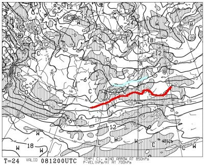

# 2月10，11，12日は3連休！！3連休の志賀高原スキー場の天気は…初日土曜は曇り，日曜は曇り時々雪，月曜は曇りのち晴れ，月曜はちょっと気温が上がりそう

📅 投稿日時: 2024-02-08 03:44:22

えー．

昨日はまた，Blogを書かずに倒れたように

寝てしまい．

朝起きたときに

「しまった～！！」

と思ったけど．

…昨晩はリビングのソファーで寝てたので．

床で寝るよりは進歩しているな

と，謎の比較論で満足した，

Skier_Sです．

ちなみに，水曜の志賀高原．

朝のうちは晴れていたけど，

昼頃から曇りはじめ．一部ガスも出た

らしいのですが…

でも，また夕方にうっすら日が差す

ような天気だったようです．

ただ，気温も冷えていて，月曜に

雪が降ったのもあり．

トップシーズンらしい，いい雪の状況を

キープしてるみたいですよ～！

ちなみに，今日の写真はいつもの特派員じゃ

ないので，焼額ではなく西舘山の写真でした…

ってなことで．

今週末は3連休．

自分は3連休，3日ともスキーに行けるのか

微妙な感じですが…（涙）

とりあえず，3連休の天気を予想してみま

しょう！

まず，

8日の木曜の850hPa気温図ですが．

まぁ，水色の-6℃線が志賀高原にかかる

レベルなので，この時期の平均的な感じ．

まぁ，2月らしい冷え込みの一日．

この日の地上天気図は…

わずかに日本海側に降水域が

かかっているので．

志賀高原は曇りで時折雪がぱらつく

天気かな～…

そして，続く9日金曜の850hPa図を見て

みると．

うーん．

この日は水色の-3℃線とその上の-6℃線の

間に志賀高原がありますね～…

でも，-6℃線のほうが近いかな．

まぁ，この日もおおむね冬らしい気温の

一日．

9日の地上天気図は，志賀高原近辺に

わずかに降水域が見られるので…

この日もおおむね曇り空，

ごくたまにパラパラ雪が舞うくらいかな？

で．

3連休初日になる，10日土曜の850hPa気温

を見てみると…

この日も志賀には水色の-6℃線がかかり，

2月らしい冷え込みですね．

この日の地上天気図を見ると…

日本海からの雪雲が伸びているのが

見えるので．

志賀高原でも雪が降りそう．

…ただ，そこまでの積雪量はないかな．

そして，3連休中日の11日の日曜は…

この日も-6℃線が志賀にかかり．

2月の平均的な冷え込みですね．

11日の地上天気図は，西から高気圧が

近づいてきますが…

夜9時の天気図で，本州は高気圧と低気圧の

ちょうど真ん中くらいなので，

午前中から昼間にかけては，まだ低気圧の

雲が残るかな…

で．

3連休ラストの12日の850hPa図を見ると．

うーん．この日は赤い0℃線が志賀に

近づいてきますね…

昼間，結構気温が上がりそう．

そして，この日の地上天気図を見ると．

本州は高気圧に覆われて，大体晴れそうですね…

ってなことで．

まとめると．

8日(木)：曇り時々雪が舞う．

　朝の気温は-10℃程度．

　昼の最高気温も-5℃程度と

　そこそこ冷える一日．

　あさイチはトップシーズンらしい

　いい感じのシマシマバーンを楽しめる．

　終日冷えて，雪はいい感じ．

　人が少ないので，そこまでゲレンデは

　荒れなさそう．

9日(金)：曇り．時折雪が舞う．前日からの

　積雪はほぼ無し．

　朝の気温は-9℃程度．

　あさイチは締まり気味のいいコンディション！

　この日も昼間はそんなに気温が上がらず，

　終日冷え冷えのいい雪質のバーンを

　楽しめる．

10日(土)：前日の夜からの積雪はゼロ．

　朝の気温は-7℃程度．

　曇りのち雪．昼間はうっすら積もる

　くらい雪が降るかも．

　この日も終日トップシーズンの雪を

　楽しめそう！

11日(日)：朝の積雪は1～2㎝くらいか．

　あさイチの気温は-10℃程度．

　曇り時々雪，午後は晴れ間も．

　結構冷えて，前日うっすら積もった

　雪のおかげでバーン状態は極上．

　あさイチのシマシマは最高．

　午後は急斜面はバーンが多少荒れて

　凸凹してくる．

12日(月)：朝までの積雪は0．

　あさイチの気温は-7℃程度．

　朝はちょっと雲が残るかもしれない

　けど，晴れそう！

　朝のうちはトップシーズンらしい

　いい感じの冷え冷え雪を楽しめる．

　昼間はちょっと気温が上がり，

　暖かく感じるほど．

　南斜面の一部はちょっと雪が

　しっとりするかもしれないけど，

　それ以外は終日いい雪を

　晴天で楽しめる，いい一日になりそう

ってな感じですかね～…

まぁ，3連休なので中日とかは死ぬほど

混みそうですけど．

2月らしいいい雪質を楽しめる3連休に

なりそうです…！

…ただ．

雪が積もる気配がない…

また今週も，新雪パウダーとは縁遠い

週末になりそう…

…そして．

3連休が終わった後，

13日以降の天気図を見てみると…

うげげげげげげ～っ！！！

なんじゃこりゃ？？？

13，14日とも，赤い0℃線が

志賀高原よりずっと北に行っちゃうん

ですが！？？

これ，4月から5月上旬並みの

感じなんですが！？？

これ，空から何か降ってきたら，

それは個体じゃなく液体の危機…！！

ただ，この2日間とも高気圧に

覆われて，空から何か降ってくる

心配はなさそうなので，ちょっと安心

ですが．

…まぁ，高温と日差しで昼間に緩んだ

雪が，夜に固まるパターン…(涙)

とりあえず．

なんだか残念なことに，来週は13日から

しばらく，「4月か？」と勘違いするほどの

高温期間が続きそうです…(泣)

なんてこった…

せっかくよくなった雪質が，

また悪くなりそうだし．

これから15日まで全く雪が積もる気

配がない…

うーん．

このままだと，今年の春スキーは

かなりヤバそうな感じ（泣）

やはり今年も，冷え冷え踊りを踊らねば

ならない年になりましたね…

さて．

そろそろ本気を出して冷え冷え踊りを

踊ろうかな…

## 💬 コメント一覧

### 💬 コメント by (レインボー76)
**タイトル**: Unknown
**投稿日**: 2024-02-08 13:59:55

木曜日の志賀高原情報

朝の上林-4℃　蓮池-11℃。寒い！だけど晴れてます。

先週の６連続極楽日に続いて、昨日から第二期極楽日が来てるようです。

特に朝のオリンピックは圧巻でした。

ヤケビがどこも素晴らしいので、今日は浮気なしで満足しちゃいました。

それからアリス様、

隊員が速すぎるので、結局離れてしまいました。またのお声掛けお待ちします。

### 💬 コメント by (アリス)
**タイトル**: Unknown
**投稿日**: 2024-02-08 15:13:39

Ｓ様

8時ダイヤクワッドで偶然にもレインボーさんと遭遇(^_^;)　

オリンピックコースで遥か彼方、、、

レインボー隊の皆さん、ほぼ直線的な滑りで90km/hは超えて見えました。

1ゴンでは、ヤケビ常連さんと合流させていただき楽しい時間ありがとうございました🙇

平日のヤケビやたら人が多い、これは裕福な外国人がプリンスに大勢滞在しているせいだと思います。（唐松入口ボーダーの横並び陣取りヤバいです）

早々にヤケビ脱出して、東館山、ブナ、ジャイアント、西館山を探検滑走、ガラガラでシマシマありで申し分なしです。

今日は、天気良し、雪良し、景色良しの一日でした。

### 💬 コメント by (地元民)
**タイトル**: Unknown
**投稿日**: 2024-02-08 23:40:18

郷、こんなにたくさん降って根雪にならない冬、異常です。

１月〜2月半ばにかけて、50㌢2回、30㌢1回、15㌢2回、10㌢1回。

### 💬 コメント by (Skier_S)
**タイトル**: 今週末はいいけど，来週からが怖い…
**投稿日**: 2024-02-09 01:17:28

＞レインボー76さま

今日も良かったみたいですね～！

…このGoodコンディションは，おそらく火曜の朝までです．

それ以降は気温がぐんぐん上がりそうなので…

火曜の朝までに，思う存分滑っておいてください！！

＞アリスさま

今日の焼額，平日なのに混んでたんですね…

でも，どこに行っても雪がいいから楽しめたのではないでしょうか．

今日は当たりデーだと思います…！

＞地元民さま

いや．

ヤバいです．ホントに降り方が極端すぎて，どっさり降って高温，どっさり降って高温…

来週もかなり極端な高温になりそうです．

そして，2月末まで大雪はなさそうな気配…

志賀高原，春スキーまで雪がもつのか心配です（涙）

