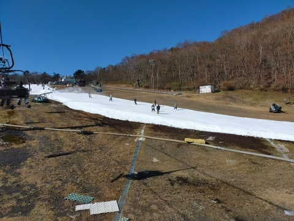
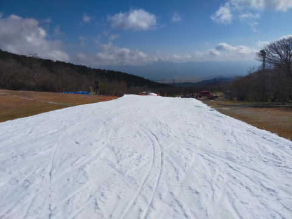
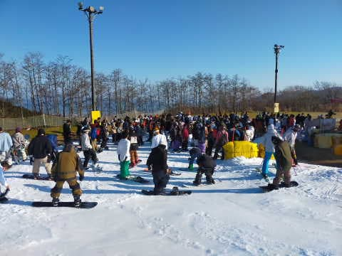
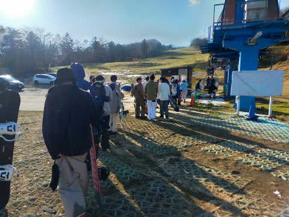
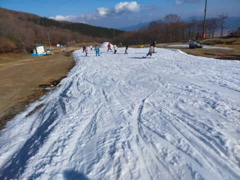
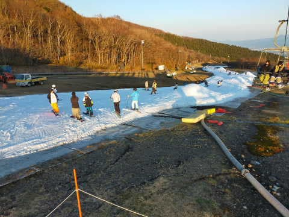
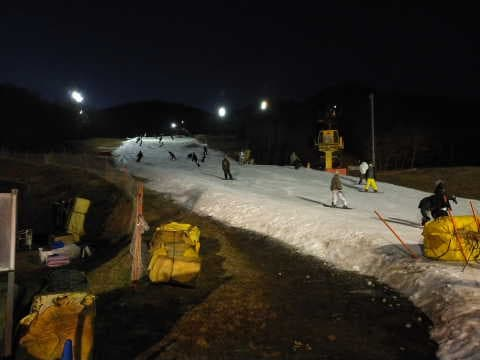
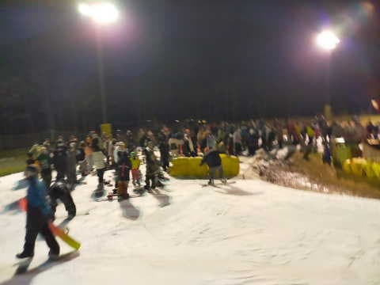
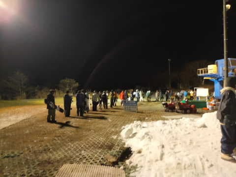

# 2022/11/12(土)イエティで滑ってきたコース状況動画…ゲレンデの幅は広がったけど，リフトは先週より待った

📅 投稿日時: 2022-11-13 00:34:36

🏷️ カテゴリ: [2023スキー滑走日記](cd943df30cfcc3d0896469e2ff98720cd.md)

ということで．

本日もイエティで滑ってきたので…

速報＆動画レポートです！

えー．

まず．

本日は朝から終日晴天！

気温も結構高めで，先週よりも

暖かくて，昼間はウェアのジャケットを

着ているとちょっと暑いくらい…

コース幅は先週よりさらに

広がりました！！

あさイチの30分ほどは，人も少なく

快適！！

でも…

快適だったのは朝の30分だけ．

それを過ぎると…かなり混みました(涙)

昼までのリフト待ちは先週と同程度

でしたが，午後は先週より混んで，

クワッドは平均7分待ちくらい，

最大10分待ちました…（泣）

さすがに今日はペアリフトも最大

3分待ちくらいまで行ったので…

クワッドが10分待ちになるのも

仕方ない感じ(涙)

でも．

コース幅は広くなったし．

天気が良くて日差しが強かったけど，

雪はそれほどひどく荒れず，コースに

穴が開くようなことも無くて．

夕方になってもそれほど凸凹になる

こともなく，この時期にしては

コースはいい感じだったんじゃないかな～．

…ただ．

16時のコース整備前のクローズ

直前になっても，コース上の人は

全く減らず．

かなりの人口密度でしたが（涙）

そして，17時からのナイターになっても，

人が減るどころか増えていって…

リフト待ち，昼間よりすごいんですけど！？？

そして，ナイターでも，ペアリフトにまで

並んでるんですけど？？

…ってなことで．

今日は結構リフト待ちがあった

Yetiだったのでした…

とりあえず．

今日のイエティのコース状況の動画です～！

## 💬 コメント一覧

### 💬 コメント by (はなげ親分)
**タイトル**: Unknown
**投稿日**: 2022-11-13 16:39:35

S様

動画、拝見しました

いや～

強烈な込みようですね（恐）

ミリ単位での滑走は私の技術ではムリ

やはり地元民は平日のナイターオンリーで志賀高原のオープンを待つことにします

### 💬 コメント by (Skier_S)
**タイトル**: ＞はなげ親分さま
**投稿日**: 2022-11-14 02:05:11

いや…

土日はかなり混みます．

土曜のナイターはこれより混みましたよ！！！

この混雑の中ミリ単位で滑る訓練をするのが，シーズン前の滑りの精度を上げるために重要なんです！！（大噓）

