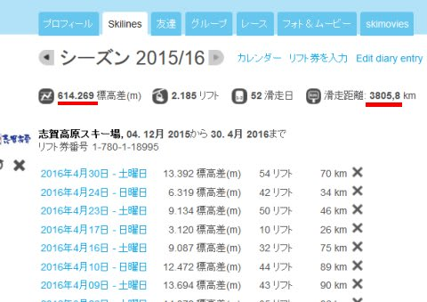
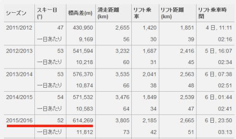
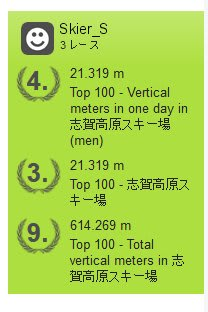
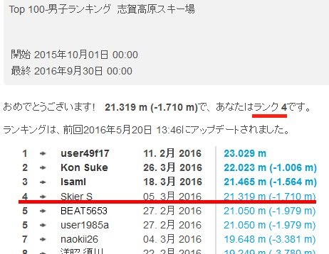
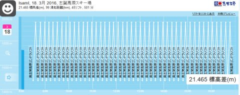
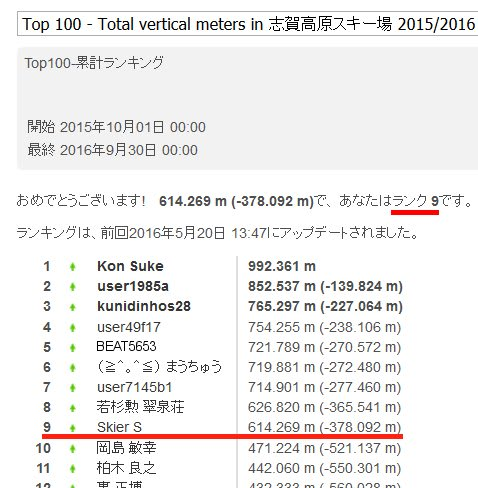
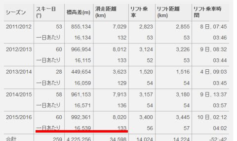

# 2016シーズン，志賀高原でどれだけ滑ったのかな…？　Skilineを振り返ってみる

📅 投稿日時: 2016-06-02 01:10:38

🏷️ カテゴリ: [スキー雑談](c1f9d2cb7478308da16419928ea3945e9.md)

えー．

まだ，2016シーズンは終わってないのですが．

ええ，終わってません．

月山がある限り，2016シーズンはまだ続いているのですが．

…でも，大変残念なことに．

志賀高原のシーズンはもう終わってしまったので．

今シーズンの志賀高原のまとめとして．

Skilineの結果を振り返ってみますか…

えー．

ふむ．

お？

シーズントータル滑走標高差，614269m．

シーズン60万m超えましたね～．

そして，滑走距離は3800kmですか…

まぁ，成田から香港やマニラも超えて，ハノイくらいまで

行っちゃう距離ですね．

で．

Skilineが始まった，2012シーズンからの記録を振り返ると…

こんな感じで，最初の年は40万m台．

それ以降3シーズン続けて，50万m台で

留まってましたが…

今年はついに初の60万m台ですね～！

まぁ，子連れで滑ることも多い

子連れスキーヤーとしては．

かなり頑張った数字かと…

そして，気になるランキングは．

をを！

すべてひとケタ！！

1日標高差（男性）   4位，

1日標高差（男女合わせて） 3位，

シーズン標高差　    9位

という結果でした～！

…って…

え？

なぜ，男性だけの順位で4位なのに，

男女合わせた順位が3位なの…？？

かなり謎が残るランキングですが．

とりあえず，今シーズンはついに

禁断の一日20000mを超えてしまいました…

トップの人と私は，ナイター込みの数字ですが．

2位のKon Sukeさんは昼間のみで22000mっ！！！

…やはり．この方．

スキー用に特殊改造されたサイボーグとしか思えません．

そして，一日滑走標高差3位の方は…

これも脅威．奥志賀ゴンドラ一日45回っ！！

奥志賀ゴンドラは，一日44回が限度だと思っていたのに…

まさか，45回乗る人が現れようとはっ！！！

…って．

そもそも八方とかニセコとか．

他のスキー場では，ゴンドラ45回乗っちゃう人って

いないですよね！？？

いやー．

やはり志賀高原．

かなりおかしなたいへん素晴らしい人が多いですね…！

で．．

シーズントータル標高差ランキングを見ると…

昨シーズンは13位と，Skiline始まってから

ずっとキープしていたTop10から落ちましたが．

今シーズンは9位ということで，無事Top10に復活です！

…しかし．

私の下は，50万m台がおらず40万m台って…

9位までとそれ以下で大きな差がついてますね～．

で．

雪不足の今シーズンは，実質2週間ほどシーズンが

短かった感じなので．

6位まで80万mを超えていた昨年より多少レベルは

落ちましたが…

それでもトップのKon Sukeさん，99万mまで行っており．

今シーズンの志賀がGWまで営業していれば，

100万m超えは確実．

いや，110万mは超えていたのでは…？？？

シーズン110万mって…

標高差が，1100kmなんですが？

東京から直線距離で，北海道の端まで行っても1000km．

鹿児島までも1000km行かないんですけど…？？

この方の記録を詳しく見てみると．

い，一日平均標高差16000m…！！？？

いや，平均ですよ！？？へ・い・き・ん．

シーズン前後の，リフトがまだまともに動いてない

時期含めての数字ですよ？？

そして，一日平均滑走距離が133kmって…！？？

シーズントータル滑走距離が，8000kmって…？？？

直線距離なら，毎日志賀高原～所沢くらいの距離を滑り続け．

ひとシーズンで成田～サンフランシスコくらいの距離を

滑ってるってことですね…

ひとシーズンで太平洋横断しちゃってますね（驚愕）．

うむ．

やはり．

志賀高原には，おかしな素晴らしい人が多いなぁ…!

## 💬 コメント一覧

### 💬 コメント by (Goku)
**タイトル**: 凄い方々
**投稿日**: 2016-06-02 19:21:31

Ｓさんと一緒の時、おかしな人、じゃなくて凄い方々と今シーズン何度かご一緒させていただきましたが、あのスピードは尋常ではないですね～。

正直私も遅いほうではないと思うのですが、あのスピードを一日キープできるのが凄すぎです。

ついていけるのは３～５本が精一杯かな～

いずれにしても、20000ｍ越えは本当に凄いです。

### 💬 コメント by (Skier_S)
**タイトル**: Gokuさま
**投稿日**: 2016-06-03 04:07:37

いやーーー．

私も，「自分以上に速く滑る人はそうそういないだろう」

と思い込んでいましたが．

その自信はあっという間に砕け散りました（笑）

私も，来シーズンは一回昼間ずっと一の瀬ファミリー

張り付きやってみようかな…

とか思ったりもするのですが．

私が朝から夕方まで一の瀬張り付きで

必死で滑ったら，何m行くかなぁ…

20000mは難しいかなぁ…

### 💬 コメント by (山)
**タイトル**: 今シーズンは二回
**投稿日**: 2016-06-03 10:17:35

今シーズンは２回20000mを達成しました。konさんは9回でした。若いSさんなら、簡単だと思います。off会の場所ですが、やはり会長の行きつけ神田が第一候補だと思います。何時にするかがまだ残っていますが。

### 💬 コメント by (Skier_S)
**タイトル**: 山さんへ
**投稿日**: 2016-06-04 03:03:28

2回も20000m超えてるんですね…

私はナイター含めた一回こっきりです（笑）．

20000mゴールド会員OFF会，やりたいですね～！

でも，私はまだ月山が終わってないので

OFF会を考える気分ではなかったですが（＾＾；

時期的には7月下旬くらいでしょうか…？

Kon　Sukeさん，Maeさんなどのご都合を

合わせてやりたいですね！

