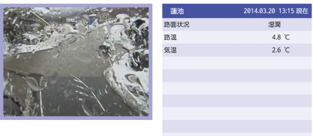
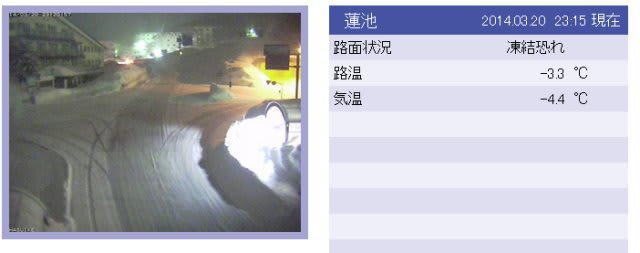
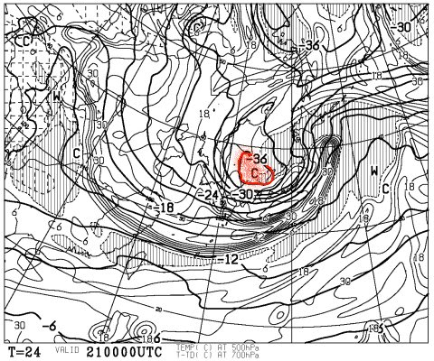
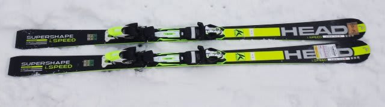
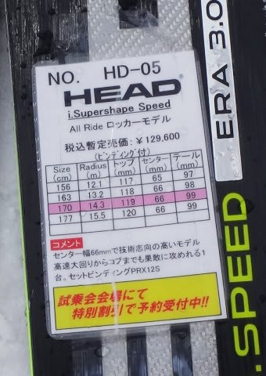
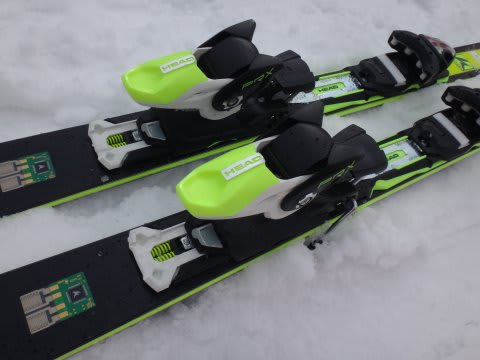

# 2015シーズンモデルのスキー試乗レポート第4回…HEAD編

📅 投稿日時: 2014-03-20 23:31:53

えー．

本日は．

やっぱり昨日の予想通り．

志賀高原も雨だったようで…（涙）．

こんな感じで．

蓮池ライブカメラのレンズに水滴が…（激泣）．

予想通り，夕方からは雪になったようですが．

…明日の朝の道路，氷の上に新雪ですので．

志賀高原の登り坂，息絶えている車がいっぱいでそう…

で．

金曜は，こんな感じで…

なんと！

500hpa面に，マイナス36度という．

真冬でもめったにお目にかかれない，

激烈な寒気様がいらっしゃると

予想されています…

…これは．やはり．

昨日の予想通り，金曜一日は，寒くて荒れ荒れ

吹雪の一日ですね．

…でも，まー．

冷えた雪が積もってくれるので，今日の

雨のアイスバーンを隠してくれることを期待…

＃あとは，ゴンドラが止まらないように

＃祈っておかないと

まあ，土曜朝は新雪が積もっていて．

土日は晴れそうなので．

土曜からが最高かなっ！

…ってことで．

あと3時間で出発です．

…今日もあんまり寝れない…（涙）．

なのに．

スキー板の試乗レポートを書いている私．えらい！←自分で誉めてどうする

今回は，ヘッド編です．

時間がないので1種類だけ…

では，どうぞ～．

---

○HEAD i.Supershape SPEED 170cm

基礎オールラウンド．

去年から結構構造を変えてきたらしいけど…

一番大きな違いは，このビンディング部分．

ビンディングのヒールピースの後ろ，こんな感じでスプリングがついて，

なにやらビンディングの固定方式が変わったようですが…

うん．

エッジグリップが，去年よりおとなしくなった？

エッジの立て方が甘いだけかな？

おかげで，ずらしのコントロールはすごく良くて．

板が動かしやすくなってます．

HEADの特徴として，フレックスも柔らかく感じます．

踏み応えが柔らかく，ぺたぺたな感じでたわんでいきます．

去年の板は，踏み初めにすっとたわんだあと，

ターンに入るとしっかり硬く感じたけど．

今年はターンに入っても，フレックスの柔らかさを感じる…

そして，板の返りもかなりおとなし目かな～．

ハイスピードでがっつりエッジが効いてキューンって

回ってくる板じゃなく．

中くらいの速度域がちょうどいい板になったかな．

コントロール性はよくて．軽快なんだけど．

去年のSpeedみたいに，エッジがしっかりグリップして，

切り替えで板が元気に戻ってくる感じの板ではなくなって

しまった感じ…

エッジの仕上げが甘く，アイスバーンのコンディションに

合わなかったのか．

あるいは，新しいビンディングが，板のたわみを

あまり抑えず，板を大きくたわませる構造になっているのが

効いてるのか…？

感覚的に，今年のSpeedよりも，ずらしのコントロールがしやすく

なって，軽快になった感じを受けました．

が…

エッジの仕上げがいまいちだっただけかもしれません（汗）．
