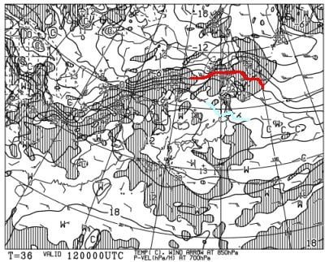
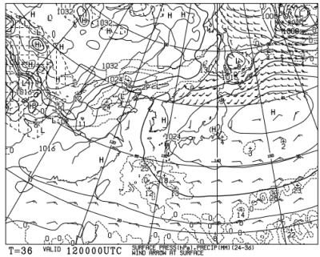
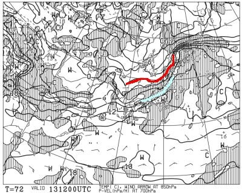
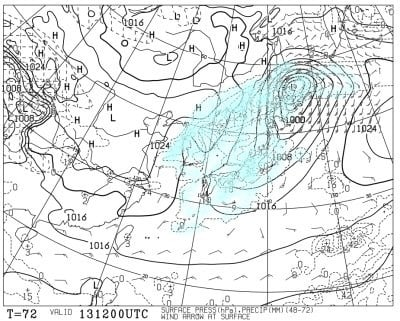
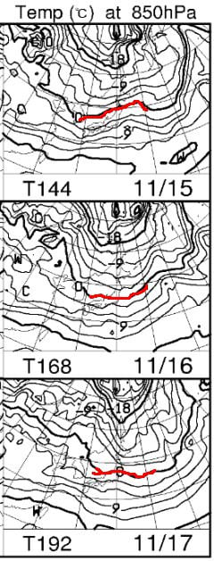
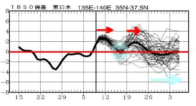

# 今週末は土曜は晴れ，日曜は晴れのち雨＆高温(涙)…そして，15日以降の冷え込みの予想は弱まってきた(泣)

📅 投稿日時: 2022-11-11 02:43:37

えー．

本日もなんだかんだで遅くなってしまい．

そろそろヤバい．

一応私も人間なので，滑らなかったら

死ぬだけじゃなく，寝なくても死ぬので，

今日は早くに寝たかったんだけど…

でも，そんな中でも，ちゃんとBlogを

更新する自分．えらい！！！

ってなことで，いつも通り自分をほめた

後は，本題へ．

Yeti，軽井沢，ウイングヒルズ，横手山が

オープンしているわけですが．

今週末の天気をざっと見ると…

まず，12日の土曜日は．

850hpa図を見ると，赤い0℃線は

北海道よりはるか北．

水色の+6℃線も東北くらいまで

上がっちゃうので…

かなり気温が上がりそう(涙)

横手の人工降雪は絶対無理です．

で，12日の地上天気図は．

高気圧に覆われるので，イエティも

軽井沢も横手も，基本的に晴れそう．

そして，13日の日曜日は…

850hpa図を見ると．

この日も赤い0℃線は北海道より

北くらいまで上がっちゃってて．

志賀近辺には水色の+9℃線が…

これ，かなり気温が高いです(涙)

日曜の午後9時の地上天気図を

見てみると…

…

ダメだ(泣)

全国的に，水色の降水域に囲まれてる…

この日は朝は晴れてるかもしれないけど．

すぐに雲が増えて，昼くらいから雨に

なりそう．

高温の雨で，雪が解ける…(涙）

ってなことで．

12日(土)：終日晴れ．気温は高め．

　ゲレンデでも暖かく感じるくらい．

13日(日)：朝は晴れ～曇り．軽井沢や

　横手山は昼ごろに雨．

　イエティはもう少し後まで耐えるか

　もしれないけど，午後に雨になる

　気温は高いけど，雨が降ると肌寒く

　感じる

って感じでしょうか…

そして．

昨日の段階では，その後の15，16，17日は

冷えそうと書きましたが…

最新の予想図を見ると．

16，17日はギリギリ志賀まで赤い0℃線が

下がってくれてるけど．

15日は赤い0℃線は志賀よりかなり北に

なっていて．

うーん．

冷えるのは，16，17日の

2日間だけか…

横手の人工降雪機が動かせるのは，

15日の夜からになりそう…

運がよければ，14日の夜だけ一瞬

人工降雪機が動かせるかも？

横手山，昨日のレポートでは，

かなり硬くて厚めの下地ができてる

ようだから．

13日の雨にゲレンデの雪が耐えてほしい…

耐えられなかったら，次のオープンは

おそらく17日以降かな…

そして．

大変残念なことに．

一か月予想の850hpa気温の推移を見ると…

左側の赤矢印で示した10日～13日ごろ

までの高温のあと，

水色の丸で囲った16，17付近で一旦

わずかに平年並みに気温が下がるものの，

その後また，19日からしばらく気温が

上がりそうな予想になってます…(涙)

これ．

ヤバいかも．

熊の湯，19日オープンできるかどうか

微妙な予想になってきました…（泣）

うーん．

ヤバい…

ただ，11月26日以降は，わずかながらも

冷えそうな予想になっているので．

そこに期待ですかね…

昨シーズンも，11月は23日あたりまで気温が

高くて，熊の湯やアサマ，鹿沢などの

オープンが軒並み遅れたけど．

でも，11月24日以降にぐっと冷え込んで，

焼額が12月初日からゴンドラが滑れたん

ですよね…

今シーズン，ちょっとそのパターンに

近くなってきた気が…

11月25日あたりまで，気温が高かったとしても．

その後ガンガン冷えて，12月第1週までに

むちゃくちゃ雪が積もってくれれば

許す．

昨シーズンみたいに，焼額オープンの週

までに雪が積もれば，許してあげよう！！←なんで天気の神様に向かってまでそんなに上から目線なの？
