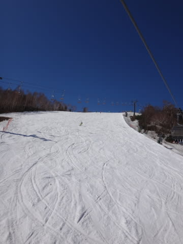

# 5月8日，GW最終日もかぐら！…晴天，がらがら，コース幅十分だけど…雪薄くなってきた

📅 投稿日時: 2016-05-09 03:24:14

🏷️ カテゴリ: [2016スキー滑走日記](c70c67ed5248e9432b899dcd5747048bb.md)

えー．

本日もかぐらに行ってきましたが．

明日から仕事なので．

今日は速報モードにて…

かぐらは本日，すっきり快晴の一日でした～！

でも，気温は結構低めで．

長袖Tシャツにウェアのジャケットを着ていて

丁度いいくらいの気温．

雪もストップスノーになることなく，

終日滑りいい感じでしたよ～！

で．

GW最終日だからか．

意外と混まず．

リフト待ちは最大でもこの程度で，

午前は搬器3-4台待ち程度，

午後は飛び乗り！

好きなだけグルグルできる感じで

良かったんだけど…

やっぱり，昼を過ぎると．

全面コブコブになってくるわけで…

コース取りつき部分と，リフトくぐってしばらく下の部分の

2か所．

コース幅いっぱい，雪が薄くなってきて．

ほぼすべてのコブラインで．土が出てきました（涙）

うーむ．残念…

でも．

まぁ，雪不足の今シーズンで，まだこれだけ滑れれば

満足かな！

また明日，詳細報告します…

## 💬 コメント一覧

### 💬 コメント by (山さん)
**タイトル**: シーズンラスト
**投稿日**: 2016-05-09 18:28:15

5月5日、7日と8日にチャオ御岳に行きました。5日はかなり混んで、最大20分待ちの状態でした。7日は雨模様だったのでリフトは飛び乗り状態で大満足でした。8日は朝一は冷えて硬いバーンで、スピードに乗って滑れましたが、コースアウトして怪我をしてしまい今シーズンは強制終了となりました。Sさんも気をつけてください。

### 💬 コメント by (のび太)
**タイトル**: Unknown
**投稿日**: 2016-05-09 20:01:39

素敵な自然コブですね。

とても魅力的です。

う～ん、やっぱりもう一度滑りたい。

### 💬 コメント by (Goku)
**タイトル**: Unknown
**投稿日**: 2016-05-09 21:04:35

私もなんだか無性に滑りたくなってきました。

### 💬 コメント by (Tomoko.Y)
**タイトル**: 来週末は
**投稿日**: 2016-05-09 22:22:37

14、15で月山行きます。

Sさまも是非おいでくださいませ～♪

### 💬 コメント by (Skier_S)
**タイトル**: かぐらは今週末までOK!
**投稿日**: 2016-05-10 01:15:37

＞山さん

え？

チャオ2往復ですか…

さすがですね．

しかし，怪我大丈夫ですか！？？？

あまり大したことが無いと良いのですが…

お大事になさってくだい．

＞のび太さま

まだ今週末も行けますよ～っ！！！

ぜひ，今週末にもう一度，かぐらへ山菜採りへ…

じゃなく，スキーしにいらしてはいかが

でしょうか？（悪魔の誘い）

＞Gokuさま

今週末，長野からかぐらへの長距離遠征

レポートをお待ちしています（笑）．

でも，今週末は結構厳しいゲレンデコンディション

になりそうな予感…

＞Tomoko.Yさま

いや…

かぐらが滑れる時期に，月山まで足を延ばす

根性はありません（＾＾；

月山は，かぐらが終わって禁断症状に

我慢できなくなったころに行きます…

月山楽しんできてください！

