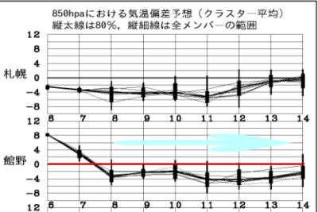

# GWが終わって，残るスキー場は渋＆横手とかぐら，そして月山のみ…8日からは冷え込みそうだけど，いまさら冷えても遅いよ（涙）

📅 投稿日時: 2023-05-08 04:50:44

🏷️ カテゴリ: [日記](cc4b5682fb7b8b144980957a978653fb0.md)

えー．

GWも終わり，丸沼も奥只見も営業が

終わってしまいましたが…（涙）

まだ，渋・横手とかぐら，そして月山が

残ってます！！

まだ，スキーシーズンは終わりませんよ～！！

ってことで．

雨がひどかった本日7日の志賀高原ですが．

お昼の硯川で気温12.6℃って…

気温が高すぎる（涙）

これでひどい雨だったら，雪はかなり

やられちゃいそうですね…（泣）

（[北信建設事務所道路気象情報カメラ](http://hokushin.pref-nagano-roadcamera.jp/)より）

でも，この雨と風にも関わらず，渋峠は

通常通り営業したようです…！！

（[横手山ホームページ](https://yokoteyama2307.com/news/19744/)より）

ただ…

深夜3時になっても志賀高原の気温は+9℃と

高く，さらに雨も降り続けているようです…（涙）

（[北信建設事務所道路気象情報カメラ](http://hokushin.pref-nagano-roadcamera.jp/)より）

うーん．

天気図を見ると，明日8日(月)の朝には，

横手山は雪になりそうな気温なんだけどな…

ただ，気温が冷えるころには天気も回復

してくるので，そんなに積もるほどの雪じゃ

なさそうな感じ…

そして．

8日以降は14日くらいまで，平年より気温が

2~6℃くらい低い日が続きそうなんですが…

冷えるのが遅いよ

今さら冷えても…（涙）

ちなみに，8日の朝，横手山は雪が降り．

昼くらいまでは湿った雪が降り続けそうだけど…

それ以降は止んで，そのあとは13日(土)の

夜までは降らなさそうな感じで．

14日(日)に雨になりそうです…

さて．

今週末の13，14日まで，無事渋・横手と

かぐらの雪はもつのか…？
