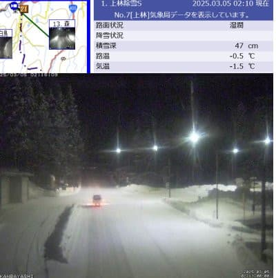
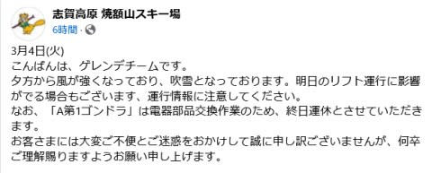
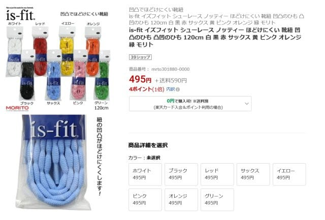
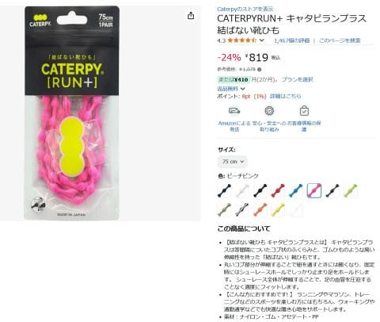
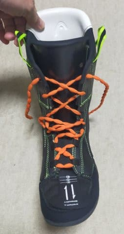
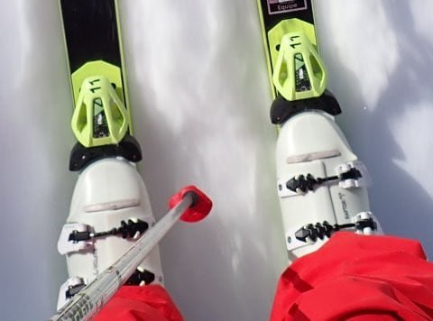

# スキーブーツのお話…HEADブーツのフォーミングインナーを，シューレースを使って履くようにしてみた

📅 投稿日時: 2025-03-05 11:12:22

えー．

この記事を投稿したつもりで、

下書きのまま投稿ボタンを押してなかった…（涙）

なので、昼前更新！！

まず、昨日4日火曜の志賀高原ですが．

朝から曇り時々雪が舞う天気だったようで．

月曜の冷え込み＆雪で，雪質もおおむね改善

してきたみたいで．

そして，深夜2時過ぎの今，そこそこの

雪が降っているみたいですね…！

（[北信建設事務道路気象状況カメラ](http://hokushin.pref-nagano-roadcamera.jp/)より）

ただ…今降っている雪は，残念ながら

5日の水曜日の朝には雨に変わり．

その後，5日は一日ずっと雨が降ったり

止んだり，時折強く降ったり…

風もそこそこ出そうなので．

かなりの悪天候になりそう（泣）

気温が上がって，雨＋風なので，

雪も結構やられそうな予感…（涙）

とはいえ．

6日は雪が降り，10~20cmくらい積もって

くれそうだし．

6日夜から7日朝にかけては30cmくらい

積もるかも？？

7日は結構降りそうな天気図なので…

7日の金曜はパウダーねらい目か？？

7日の積雪で，8日からの週末のゲレンデの

雪質は回復しそうです！！

また，週末の天気は明日の夜に

予想します…！！

で，焼額山のFacebookを見ると．

月曜にぶっ壊れた第1ゴンドラ．

どうやら水曜も一日修理のために運休に

なるようです（涙）

（[焼額山スキー場Facebook](https://www.facebook.com/yakebitaiyama/posts/pfbid0vUKoEDJoxj4hXLqXhhPGm2kuHKLeJF2qSTou2YmhJLRtorxW6yRPp777LYkLFcQNl)より）

まぁ，明日はどうせ悪天候だから，

実は修理にいいタイミングだな…と

思いつつも．

うーん…水曜に修理が終わって，木曜には

復旧してくれるのか…

まさかまた何日も直らずに運休が続く

ということはないと信じたいけど．

どうも最近，次々ゴンドラやリフトが故障で

運休するので，やっぱりそろそろ設備が

いろいろヤバい感じ…

…ってなことで，本題へ．

本日はブーツの話です！

いま，私がメインで履いているスキーブーツ．

日本では販売していない，

並行輸入品のHEAD純正フォーミング

インナーを使ったブーツで．

2023シーズン末にエキップさんで

作ってもらって，昨シーズンの2024シーズンから

メインで使用しているもので．

このブーツのインプレッションは，[こちら](e70b1b9763084170a8ba4bd99ed38fe80.md)に

書いていますが，

フレックス150のブーツなんて履きこなせる

かな…？

という心配をよそに．

むしろブーツが硬い方が，スピードが出た

ときには筋力で板を抑えなくても，ブーツが

勝手に板を抑えてくれるのですごい楽だと

いうことに気づき．

さらに，ぴったり調整されたブーツだと

複雑なことを考えず，常に上から

スキーを押していけばいいだけになるので

難しいことは考えなくてよくて，すごい

楽だ…！！

ということに気づき．

カントやソールもバッチリ調整され，

フォーミングでぴったりシンデレラフィット

しているHEADブーツ，ものすごく

気に入っているわけですけど．

けど．

このブーツにも欠点があって…

それは，あまりにも足形にぴったりしすぎて

いるので，履くときにちょっとでも完璧な

位置から足がずれていると，すぐに

痛くなってくる…

という感じで．

ぴったりフィットが追及されているので，

ブーツを履くときのルーズさが全く許容

されない

という欠点があり．

ブーツを履くのに何度も足の位置やら

タングの位置，インナーブーツと

シェルの位置関係や微妙なズレを

調整しながら，かなり時間をかけて

履かなくてはなりません…

まぁ，逆に言えば，ぴったり合った時に

すごい完璧に作ってあるので，それだけ

わずかなズレでもすぐに影響しちゃうって

ことなので…

それだけぴったり作りこまれているという

ことではあるのですが．

で．

エキップさんからは，

「シューレースを使って履け！」

というこで．

しっかりインナーブーツを靴ひもで

縛り上げてから，シェルを履かないと

ダメだと言われていたものの．

これまで，シューレースを使ってみても

余り差が感じられず，

「シューレースって，そんなに意味無いよね？」

…と，思っていたのですが．

今回，とある方から

「最近流行りの，凸凹がある靴紐が

　緩みにくくていいよ！！」

という話を聞いて，実物をもらったので…

半信半疑でお試しで使ってみました．

ちなみに，今回使ってみたのはこいつ．

まさに，「凸凹でほどけにくい靴ひも」

として売っているやつで…

お値段も500円程度とお手ごろ！！

（[靴ショップやまう楽天サイト](https://item.rakuten.co.jp/kutushopyamau/mrto301880-0000/)より）

スポーツ用品屋さんや靴屋さんに行くと，

似たような奴がいくつか売ってると思います．

…が，「結ばなくていい靴ひも」として

凸凹があるやつが売ってますが，これは

伸び伸びでしっかり締めあげられないので

スキーブーツ用として買わないように！！

伸びない，ラン用のこういったやつを

買ってください…！

（[Amazonサイト](https://www.amazon.co.jp/Caterpy-P-%EF%BD%B7%EF%BD%AC%EF%BE%80%EF%BE%8B%EF%BE%9F%EF%BE%97%EF%BE%9D-%EF%BE%8B%EF%BE%9F%EF%BD%B0%EF%BE%81%EF%BE%8B%EF%BE%9F%EF%BE%9D%EF%BD%B8-75cm/dp/B07R72WFR9/ref=rvi_d_sccl_3/357-1584676-1612911?pd_rd_w=adYdY&content-id=amzn1.sym.a4dc92d7-7100-437e-b3e3-2349e8298523&pf_rd_p=a4dc92d7-7100-437e-b3e3-2349e8298523&pf_rd_r=6CN7KWS9G5Y3Z5E25ZE6&pd_rd_wg=5xGSZ&pd_rd_r=f3248ab0-3edf-43db-b73e-c57495c8d4a0&pd_rd_i=B07R72WFR9&psc=1)より）

ってなことで．

実際この紐をこんな感じにインナーブーツに

通して，この状態でまずインナーブーツを

履いて紐をしっかり締めあげるわけですが…

うむ？？

これまでのシューレースのように，

一旦締めあげた紐が戻っていかないので…

なんだかこれまでのシューレースより，

しっかり締めあげられますよ！！

だもんで．

インナーブーツを履いただけの状態でも，

これまでのシューレースで結んだ場合より，

足とインナーのフィット感が高い感じが

する…！！

この状態でしっかりインソールと足裏の

位置を正確に合わせ，タングの位置を

正確に調整しておいてからシェルを履くと…

履いた後に

「ちょっとどこかズレてるな…」という

ことが減ったし．

シェルとインナーブーツとの一体感も，

高くなりますね…！！

そして，これまでは，シューレースを

かなりきつめに縛っても，一日滑って

激しい動きを繰り返したあとだと，

結構緩んでいたのが…

この靴ひもだと，1日滑ってもほとんど

緩んでませんよ！！

ということで．

どうやら今までは，シューレースを使っても

締めあげが緩かったみたいで．

緩まない紐でガッツリ締め上げると，

シェルとインナーの位置が正確に決まって，

どこかがずれて痛みが出ることも減ったし，

操作性が良くなった気がします…！！

ってな感じで．

今ではシューレース無しでブーツを

履くことが無くなったのですが…

ただ，

ブーツを履くまでに，これまでよりかなり

時間がかかるようになった

という欠点が…

だもんで，最近はいつもより10分くらい早く，

駐車場に着くように心がけるように

なりました…

ただ，ルーズさの無いギリギリのブーツは，

そのくらい時間をかけて履かないと性能を

出せないということが改めてわかって

来たので．

ぴったりのフォーミングブーツを買うような

方は，もうとっくの昔にわかっていると

思いますが．

ブーツはじっくり時間をかけて履きましょう…

でも．

これまでもいいブーツだと思っていた，

このHEADブーツ．

さらに気に入りました～！

いやーー．

人生最高に良いブーツだわ…これは．

## 💬 コメント一覧

### 💬 コメント by (レインボー77)
**タイトル**: Unknown
**投稿日**: 2025-03-05 13:36:00

水曜日の志賀高原情報

サンバレーまでは小雨。これを過ぎると突風混じりの風。案の定ニゴンは運休。一ゴンは修理で終日運休。三高運休、二高と四ロマだけがスタンバイしてくれたのですが、最悪な南風がどんどん強まってきて、結局全てが運休となりました。

ずっと待てば未踏の地を滑れそうだけど、常連さんはみーんな帰路に。

帰路はサンバレーだけがポール張って動かしてましたが、我らの誰からも滑ろうという意見は出ませんでした。

そんななか雪山一位のお方は、歩いて登って行かれましたよ。流石としかいいようがありませんです。

### 💬 コメント by (Skier_S)
**タイトル**: ＞レインボー77さま
**投稿日**: 2025-03-06 02:52:00

朝は風が強かったようですが，今日は午前に4ロマ，昼頃に2高が動いたようですね…

でも，雨~みぞれで雪がかなり悪くなった様子（涙）

明日の雪でゲレンデが回復すると祈るばかり…

しかし，荒天の中ハイクアップしていくのはすごい…

