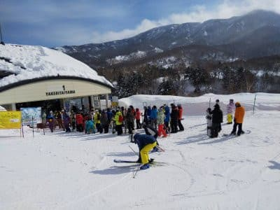
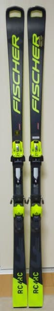
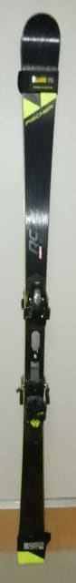

# 新たにGetした，'21 FISCHER RC4 Worldcup RC Pro 185cmのインプレッション！

📅 投稿日時: 2022-02-16 01:40:28

🏷️ カテゴリ: [スキー雑談](c1f9d2cb7478308da16419928ea3945e9.md)

えー．

本日15日の志賀高原．

晴れのいい天気だったようですが…

奥志賀ゴンドラが強風で運休，

焼額はコロナの影響による縮小営業で

第1ゴンドラ・第2高速のみ運転

となった影響で，平日にもかかわらず

ゴンドラはそこそこ混んだようです…

月・火と天気も晴れて，コンディションも

良かったみたいですが．

特派員からの報告によると，焼額第1ゴンドラは

どちらも平日にしてはちょいと混み気味だった

ということです…

ってなことで．

月・火と2日連続晴天だったらしい，

志賀高原．

今後，雪がドサドサ積もる予想な

わけですが…

これまでの予想より本格的な雪の

ピークが遅くなり，どうやら，

18日朝には止むと思った雪が，

18日の午後まで降り続けそうで…

18日は晴れの予想だったけど，

終日雪になりそうです…

16日(水)：朝までの積雪10cm程度？

　朝は-15℃近くまで冷える．

　昼間は曇ったり雪がぱらついたり．

　時折強く降る．

17日(木)：朝までには10～20cm程度？

　朝は-15℃以下まで冷えるかも！

　朝はそれほど深い新雪じゃ

　なさそうだけど，昼間はひたすら

　雪が降り，昼間にゲレンデに

　モサモサ積もる．

　根性の無いスキーヤーはふるい落とされる

18日(金)：朝までの積雪はかなり深そう！

　太もも～腰パフ期待！

　朝の気温は-12℃以下まで冷える．

　終日雪降り．夕方のリフト営業終了の

　頃には止むか…

19日(土)：前日新雪のあとの晴れ間？

20日(日)：みぞれっぽい雪→雪

って感じになりそうです…

週末の天気は，また明日詳細予想します！

　

ってなことで，本題へ．

以前書いたように，

大回り用の

'20 FISCHER RC4 Worldcup RC Yellowbase 180cmを人に譲り，

'21 FISCHER RC4 Worldcup RC Pro 185cmを

新たにGetしたわけですが…

こいつのインプレッションをば．

振り返って見ると，こいつの前に履いていた

'20のRC180cm．

こいつは名機でした…

グリップは強いし．

高速安定性もあるので，スピードを出しても

怖くないし．

スピードを出していけば良くたわんで

板にしっかり圧が溜まるし．

たわませていけばよく回ってくれて，

思いっきり踏んで行けば小回りチックな

ターン弧まで作れるし…

はっきり言って，大回りベースのオール

ラウンドとしては不満は無い．

非常に扱いやすく，大回りから小回りに

近いところまで，非常に扱いやすかったです．

ただ．

180cmのR=18.5m．

しっかり板が踏めるブーツを履くように

なってからは…

ちょっと曲がりすぎるかな？

と思うこともあり．

今回，185cmのR=20mの板にしてみた

わけですが…

早速この板を履いてみると…

うむ．

'20 RCの180cmと比べると…

ちょっとコアが硬めでメタルが弱いのか？

あるいは'21モデルからのM/Oプレートの

特性なのか？

板がちょいと固めに感じます．

そして，板の圧の溜まり方というか，

板の返りのバネ感が弱い感じ．

あくまで比較の問題で，それほど大きな

違いは無いんですが…直接比べてみると，

'20 RC 180cm の方が，’21 RC 185cmより

たわみやすく，たわんだ後の粘りが

あるというか，ウェットな感じがします．

そして，'20 RCは板に溜まった圧が返ってくる

ばね感が強く，ちょっとだけ返りが早めな

感じの元気な板だったので，小回りっぽい

ところまでもっていけますが…

'21 RC 185cmの返りは'20 RCほどばね感が

強くなく，よりゆっくりなので，大回り板

らしくゆったりと切り替わる感じ．

とはいえ，185cmの+5cmの長さの違いなのか，

M/Oプレートの安定感なのか．

板が硬めに感じることもあり，最高速での

安定感は，やはり’21 RC 185cmの方が

高いかな～．

…でも，強くて安定感がある'21 RCの方が

いいかというと，そうでは無くて．

意外と扱いやすい'20 RCの方が名機なのでは…？

という気が…

でも，そこは両者を直接比較しての違い．

全体のインプレッションとしては，

スピードを出して行った時のエッジグリップが

強くて，それもトップからテールまで，

エッジがかなり長く使える感じ．

だもんで，スピードを出して行っても

長いエッジがしっかり雪面を捉えてくれて，

安定感を感じます…

そして，たわみも作りやすく，

たわみの量で好きなように回転半径を

調整できるので，

板のコントロール性は高いです．

サイドカーブではなくたわみで曲がる板なので，

たわませなければまっすぐ行けるし，

たわませればR=20という数字で予想するより

小さく回って行けます．

ハイスピードでも，板が叩かれたり

暴れたりする感じは全く無し．

185cmは荒れた斜面だと手ごわいかな？

と思ったけど，むしろ安定感があるぶん，

荒れた斜面の走破性は高いかも…？

そして．

意外にも，ずらしのコントロール性もあります．

積極的にずらそうと思う板ではないですが，

どうしようもなくグリップ一本筋ではなく，

低速でずらして滑っていく小技も使えます…

でも．

やっぱりこの板も，ずらして滑っても

楽しくない板です．

思いっきりハイスピードで飛ばしていけば，

気持ちよい大回りから中回りでガッツリ

カービングして行けます．

板の求めるスピード域はかなり高めです．

ゆっくり滑る人は，あんまり楽しめないかも…

とりあえず．

人が少なめのかなり長めのコースを，

そこそこのスピードでかっ飛ばし，

ロングクルーズする…

という人には，極めてマッチする板だと思います．

人がいない斜面を大回りするとかなり

気持いいんだけど．

人口密度が多いスキー場では，あまり

実力を発揮できないかも…

## 💬 コメント一覧

### 💬 コメント by (カンタロス)
**タイトル**: Unknown
**投稿日**: 2022-02-16 08:50:33

Sさま、こんにちは。

私も最近、アトミックs9での大回りが不満になってきました。

サーボテックの効果なのでしょうか、たわみすぎてせいぜい中まわり程度にしかならないのです。

fisモデルは選手の要望（たわみすぎる）でサーボテックが外された理由をなんとなく実感です。

メインマシンをドーベルマン182センチ、r19に変更してみようかと考えている所です。

### 💬 コメント by (レインボー74)
**タイトル**: Unknown
**投稿日**: 2022-02-16 13:06:34

水曜日の志賀高原情報

朝の湯田中は新雪10cm。太板だ！上林-4℃　蓮池-8℃。晴れ時々曇り。

やけびを目指すも、途中でダイヤの美しさに食欲をそそられてダイヤスタート。

シマシマ3本のあとは、非圧雪を17本。思わず掛け声が出てしまうほど楽しい。一本あたり5分だから、かなりの早上がりでした。エス様からみれば「勿体なさすぎ根性なし」かと。正解です！

### 💬 コメント by (かず)
**タイトル**: Unknown
**投稿日**: 2022-02-16 17:19:26

Sさん今週末どうするのかな？僕はコロナ対策強化することにしましたよ 色々面倒ですけど滑れなくなるよりマシって思ってます！

### 💬 コメント by (Skier_S)
**タイトル**: 明日は降りそう．18日はパウダーデー
**投稿日**: 2022-02-17 01:37:40

＞カンタロスさま

S9では，大回りはさすがにきついかと…

大回りベースなら，182cmのR19っていい感じだと思います．

ただ，ドーベルマンの大回り板は履いたことがないです…

＞レインボー74さま

新雪10cm，予想通りでしたね！（自画自賛）

ダイヤ新雪，良かったんですね…

そして，たった20本で切り上げるとは勿体ない！

＞かずさま

週末，どうしようか悩み中です…

最悪土曜日帰りかも．

