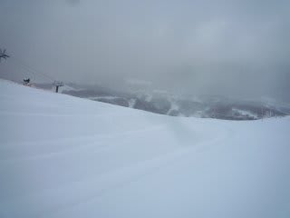
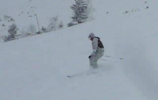
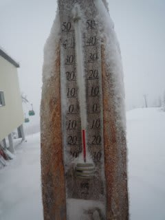
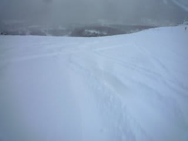
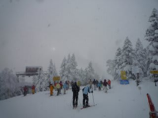
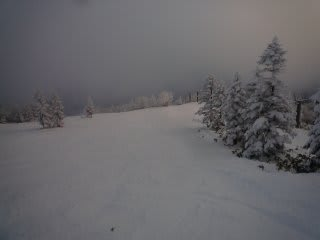
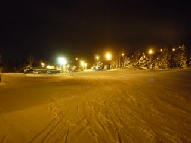

# 1月2日の志賀高原

📅 投稿日時: 2011-01-02 22:52:36

🏷️ カテゴリ: [2011スキー滑走日記](ca488c98cfb9169941c3e73770dcefb56.md)

1月2日の今日の焼額は．

朝，久しぶりに新雪がっ！

非圧雪コースのオリンピックコースは

ひざ下パフ．

それほど深くはないけど，久しぶりの新雪を堪能．

朝の気温はマイナス11度と，ここ数日に比べると

気温が高いですが，十分冷えているので雪は

かなり軽め．

圧雪コースも10cm弱の軽い雪が覆ってます．

天気は終日降ったりやんだりで，日がささないまま．

時折強く降って，前が見えないことも…

しかし，昼間に積もった雪の量はそれほどでもなかったですが．

リフト待ちは，この4日間でもっとも短かったですね～

焼額第一ゴンドラの待ちもゲートを越えて伸びることは

ほとんどなく，午前10時過ぎの1時間くらいですかね．

それ以外は1－2分待ちくらいで，ゴンドラぐるぐる

滑りが可能．

午後には予想通り，朝積もった新雪が溜まってコース上は

ほぼ全面かなりのでこぼこに．

天気も悪かったし，でこぼこってのもあって，夕方3時半ごろには

ゲレンデに人がほとんどいなくなっちゃった…

おかげでコブがそこそこ好きな私はかなり楽しめましたが．

圧雪かけたてのナイターも最高．

なんだかんだ言って，私は雪があると何でも最高で快適だという

説もありますが（笑）
