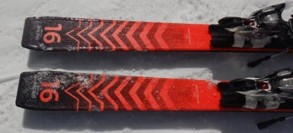

# 2023シーズンモデルのスキー板，試乗レポートその4…Volkl RACETIGER RC

📅 投稿日時: 2022-05-27 03:03:56

🏷️ カテゴリ: [スキー板試乗](c0bd8048615710cee890e403a36cc9a2b.md)

えー．

最近も相変わらず朝から晩までWeb会議が

続いている今日この頃なんですが．

3時間ほどWeb会議をやってメールを

読まないでいると，90件とかメールが

溜まっていて．

「まだ夜まで会議が続くのに，一体

　いつこのメールを処理しろというんだ…？」

と途方に暮れて．

いつも会議が終わった夜に，

リアル（？）インバスケット研修を

やっているSkier_Sです．

あ，インバスケット研修って，

相互に複雑に絡む数十件の大量の処理案件を

与えられて，2時間程度の制限時間内で

それら全てに対し適切な指示を書き上げる…

という研修なんですけど．

しばらく前，久しぶりにこの研修を

やらされた時に，

「本業の方がよっぽど時間当たり

　処理しなきゃいけない量が多くて，

　矛盾する案件やトラップが多いんですけど…

　この研修，楽すぎる」

と，謎の余裕をかますことができました．

うん．鍛えられてるね！！←謎のポジティブシンキング

ってなことで，本題へ．

今日も，来シーズンモデルのスキー

試乗インプレッション．

今回もフォルクル編です．

では，どうぞ～！！

○Volkl RACETIGER RC 170cm

基礎オールラウンド

この板は，今シーズンまでは日本に

導入されてないモデルだった気がするの

ですが…来シーズンから新たに

国内販売開始になるのかな．

170cmでR=15.6と，まぁまぁロング目の

オールラウンドな感じを受ける板です．

で，プレートもついておらず，シンプルな

vMotion12 GWビンディングがついていたので，

「中級者向けモデルなのかな…？」

と思って履いてみたら．

いや…

これ，意外といいよ！

何にしろ楽に曲がっていきます．

何もしなくても低速からサイドカーブに乗って

スルスルと楽に回り始めてくれます！！

低速からカービングで結構回ってくれるので，

これは高速になったら板がたわみすぎるか…？

と思ったら，さにあらず．

スピードを出して行くとそれに従って

張りが強くなるような感じがあって，

全然板が負けない！

かなりのハイスピードになっても，

強いエッジグリップをしっかりキープ

したまま，ロング～ミドルのカービングで

滑って行けます．

特に踏んでたわませたり，前後動とか

使うことなく，板のエッジを切り替える

だけでよく．

力を使うことなく，板の上に立って

傾くだけで，板がハイスピードロングターンを

オートマチックにしてくれる感じ…

傾きの量で回転弧を変えることができて，

あとは板が勝手にやってくれるような，

むちゃくちゃ楽な板です．

むちゃくちゃ楽です．

それなのに結構張りの強さがあり，

ハイスピード耐性もあって，

角づけを強くすれば小回りまでできるし，

傾かなければまっすぐ降りて行けるし．

力を入れなくても，板のトップからテールまで

ガッツリグリップしてくれて，

それでいて板の行きたい方向に行かされるのではなく，

傾きで好きに回転弧を制御できて．

これは，ある意味，丸一日いろんなゲレンデを滑る

オールラウンド板として，楽で疲れないし，

大回りで落ちていくことも深めの弧も

作れるし．

かなりいい板なんじゃないかな？？

これ，おススメ．

ある程度スピードを出す人で，

楽なオールラウンド板を探している人には

ぴったりの板です！！

## 💬 コメント一覧

### 💬 コメント by (naoちゃんねる)
**タイトル**: Unknown
**投稿日**: 2022-05-27 08:19:09

この板私も気に入りました！

本気で滑っても応えてくれるし、お気楽に流して滑ることも出来て、正にオールラウンド…

いやぁ…来シーズンは私のブーツも、娘のブーツも板も下手するとウェアーも買わないといけないんですよね…

買わないぞ！！…カワナイゾー…ｶﾜﾅｲｿﾞｰ…ﾀﾌﾞﾝ…

### 💬 コメント by (Skier_S)
**タイトル**: ＞naoちゃんねるさま
**投稿日**: 2022-05-28 00:01:12

私も，「プレートもないから中級板かな？」

と思って履いてみたら，いい意味で裏切られました．

この日に乗った板で，一番楽に滑れる板でした…

いや．来シーズンはブーツと，娘さんのブーツと板ですか？？

そこまで買ったら，あと板を追加するぐらいは誤差ですね！！！（悪魔のささやき）

### 💬 コメント by (ikkun)
**タイトル**: Unknown
**投稿日**: 2022-05-29 12:24:02

熊では乗れなかった奴です……残念フォルクルは基本的に乗りやすいですよね？ いかんせん試乗会半日では短めでしたね？

### 💬 コメント by (Skier_S)
**タイトル**: ＞ikkunさま
**投稿日**: 2022-05-30 02:37:00

試乗会半日は短いですね…

来シーズンもフォルクルはいい板が揃ってますよ！！

