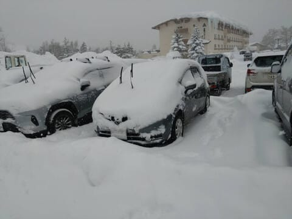
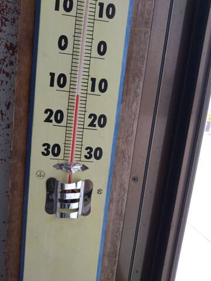
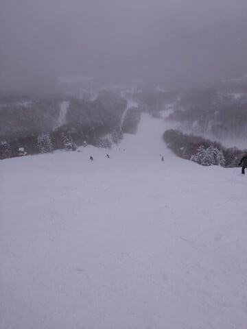
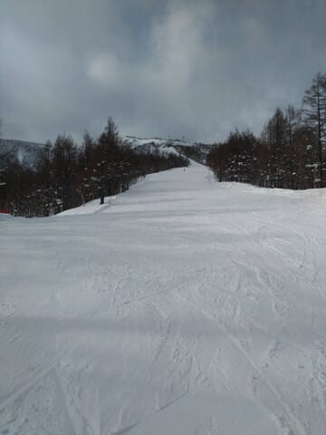
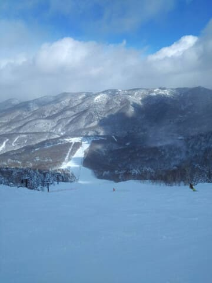
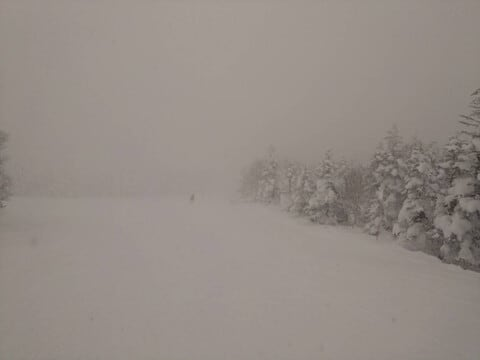

# 2月8，9日の週末の志賀高原スキー場の天気は？…土日とも終日雪降り．冷えるよ！！

📅 投稿日時: 2025-02-06 01:53:06

🏷️ カテゴリ: [日記](cc4b5682fb7b8b144980957a978653fb0.md)

えー．

本日も志賀高原の特派員から写真が

送られてきましたが…

特派員によると，2月5日の水曜日の志賀高原は．

日本海側の新潟近辺ではかなり積もったにも

関わらず，やはり西風のためにそこまで

積もらなかったようで…

まぁ，積雪は朝までに20cmほど．

気温は激寒で，昼間でも-10℃を下回る

レベルだったようですが．

基本的に曇り空で．時折雪も舞う天気

だったにもかかわらず．

風もなかったので雪が吹き付けることもなくて，

終日比較的穏やかな天気で．

昼間に雪が積もることはなく…

それどころか，ときおり日も射す

天気だったようです…！

意外に青空ものぞいてますね…

ただ．

午後3時を過ぎると，かなり強い雪降りに

なり．視界も悪くなるタイミングも

あったようです．

そして，雪が柔らかかったので，午後は

バーンがかなり荒れたとのこと…

とりあえず．

これからも数日間，雪が降り続けそうなので．

今週末に向かってはこんな感じの天気が

続くのかな…

と思いつつ．

本日は水曜深夜恒例の，週末の志賀高原の

天気予想です…！！

といっておきながら．

今日もかなり眠くて死にそうなので，

いつもの天気図解説は抜きにして，

いきなりまとめに行っちゃいます…

…最近，もう眠くてダメだ…

6日(木)：朝から雪降り．終日雪降り．

　朝の気温は-13℃と激冷え．

　基本的に志賀高原には降らない西風

　なんだけど，根性のある雪雲が

　北アルプスを越えて志賀まで届いちゃう

　パターンで，ドサドサ積もらないけど，

　終日降りそうな感じ…

　朝までに20cm，昼間に10cmくらい

　積もる感じかな…？

　雪が柔らかいので午後は雪が荒れていく．

7日(金)：この日も朝から雪降り．

　朝までの積雪は10cmくらい．

　雪が降ったりやんだりで，一瞬

　日が射したりするけど，基本的に

　曇り～雪．

　この日もそこまで積もらないまでも，

　コース上に柔らかい雪が乗るので

　午後は荒れる．

8日(土)：この日も終日雪降り．

　朝の積雪は10～20cmくらい．

　昼間もずっと雪が降り続ける．

　昼間も10～20cmくらい積もるかも．

　朝イチの気温は-12℃以下．寒い．

　朝は圧雪の上に軽い新雪が10cmほど．

　雪が柔らかいし昼間も雪が降るので

　終日モサモサで，午後は荒れ荒れに

　なる．

9日(日)：この日も終日雪降り．

　朝までの積雪は10～20cmほど．

　朝の気温はこの日も-12℃ほどで

　寒い．

　朝イチバーンは圧雪の上に軽い雪が

　数cm～10cmくらい

　昼間も10cmくらい積もりそう．

　バーンは午後から荒れていく．

…という感じでしょうか．

土日とも朝には10～20cmの新雪が積もり，

そこまでディープじゃなさそうだけど，

浅めのパウダーは土日とも楽しめそうだし．

10日までは雪降りの毎日になりそう…！！

で．

11日の祭日は晴れるかも．まだ予想精度は

低いですが…

ってなことで．

今週末はパウダーデーですよ～！！

(膝パフとか太ももパフとかまで行かない，

ブーツパフかせいぜい脛程度までの，

浅いパウダーだと思うけど…)

## 💬 コメント一覧

### 💬 コメント by (大阪のK)
**タイトル**: Unknown
**投稿日**: 2025-02-06 08:31:24

Sさんの天気予想を信じて、今週末は太板オンリーで臨みたいと思います🎵

まあ、週末は子守りのスキーなので、滑走速度遅め、休憩マシマシなんですけど😅

宿が発哺なので焼額山が遠く感じます。

### 💬 コメント by (レインボー77)
**タイトル**: Unknown
**投稿日**: 2025-02-06 14:59:18

木曜日の志賀高原情報

朝の蓮池なんと-12℃。シーズンベストです。

ずっとさらさら雪が舞って、新雪が25超え。

パノラマ、唐松は圧雪の上に8cm程。三高のミドルへ行くと、全面膝パフでほぼ踏まれてない。しかし３本目には早くも賞味切れ。

GSサイドもいいんだけど、なんか見えなくて怖い。ゴンドラで確認すると、メガネではなくゴーグル内側が凍っている。流石は最強寒波。オリンピックは賞味切れとのことなので、ダイヤへ。ここがシーズンベスト。いつもは圧雪されてるコースがなんと未踏！太ももパフでふっわふわの浮遊感を満喫して終了。太板の助けもあってしっかり楽しめました。

### 💬 コメント by (かず)
**タイトル**: Unknown
**投稿日**: 2025-02-06 18:07:29

週末イチゴン動きそうですか？

### 💬 コメント by (Skier_S)
**タイトル**: 明日も積もるよ！
**投稿日**: 2025-02-07 02:07:18

＞大阪のKさま

今週末は太板の出番になりそうですよ~！

ただ，志賀では脛パフ，行っても膝パフのような気がしますが…

でも，土日とも積もります！

＞レインボー77さま

今日は大体予想通りの天気だったようですね…

毎日新雪が楽しめてうらやましい！！

私も今週は新雪を楽しみます…！！

＞かずさま

動きます．風がそこまで強くないし，北風なのでたぶん大丈夫です．

