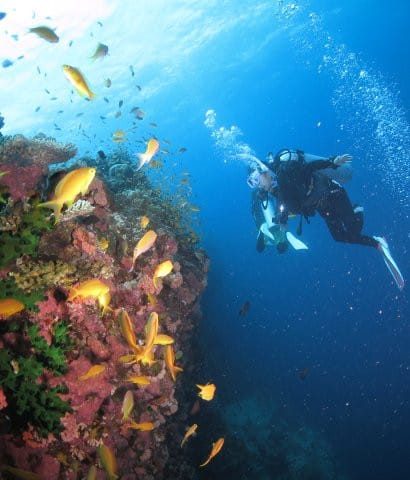
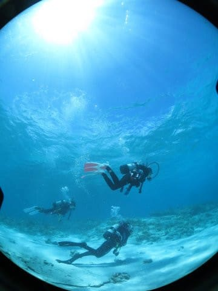

# 2018年8月，モアルボアルで小5の娘をダイバー化！…プロローグ

📅 投稿日時: 2018-11-15 00:42:20

10歳．

それは，ダイビングのジュニアオープンウォーター

のCカードが取得できる年．

そして，今年は．

子連れダイバーだったわが夫婦にとって．

待ちに待った，娘10歳の夏．

だもんで．

「今すぐにでも，娘をダイバーにするんじゃ！」

と思ったものの．

すでに書いた通り，

ジュニアオープンウォーターダイバーの

講習をやってくれるところがなかなか

見つからなかったわけで．

…しかし．

意外な盲点で，何度かお世話になった

モアルボアルのエメラルドグリーンダイビングセンター．

ここに問い合わせると，想定外にも

[ジュニアオープンウォーターの講習をしてくれる](e2392590e32bc00ee97700a405ee0e944.md)

ということで．

この夏休み．

娘のCカード取得のため．

わが家族にとって，

3度目のモアルボアル訪問となったのだった…

モアルボアルを全く知らない時に，

たまたま安かったから選んだんだけど．

まさか3回もリピートするとは思わな

かったなぁ…

ってなことで．

娘がCカードを取るまでの詳細については

[こちらでレポート](e236c9494959781d162d4ed151333cd21.md)してますが．

実際の旅行がどうだったかについては．

これからいつもの旅行記スタイルで

書いて行こうと思います…

しかし

ようやく一年以上前のパラオ旅行記を書き終えて．

やっと今年の旅行記を書き始めるわけですが．

もう，スキーシーズンに突入してますね…（涙）

だもんで．

この旅行記もほとんど更新されることなく

本格冬モードに突入してしまいそうな予感…

とりあえず，この8月に行ってきたモアルボアル旅行記．

始まり始まり～

## 💬 コメント一覧

### 💬 コメント by (マルハバ)
**タイトル**: 先日TVの・・
**投稿日**: 2018-11-15 07:13:12

「イッテQ」だったかな？

オスロブのジンベエと

モアルボアルのイワシの群れ

の映像がながれてましたね♪

それにしても・・

娘さん、講習中の初心者とは思えない

中性浮力をとってますね～

もうベテランのような落ち着きを感じますよ

### 💬 コメント by (Skier_S)
**タイトル**: マルハバさま
**投稿日**: 2018-11-15 22:36:43

あ，TVでオスロブとモアルボアル，やってたんですね…

見てみたかった…

で．

うちの娘は，講習をしていたインストラクターが驚くほどの

中性浮力の完璧さですから…

普通は初心者はもう少し立ち泳ぎになるものですが，私も講習中の

娘を見てびっくりしました．

完全に中性浮力を取れないと難しい，あおり足での移動を

普通にやってましたから…

