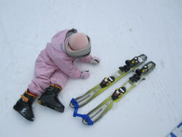
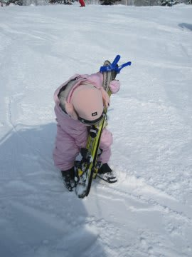
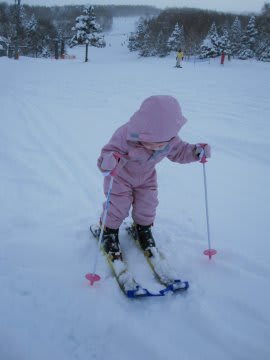
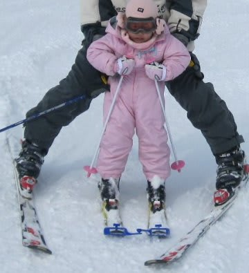

# 子供スキーの必殺道具，トライスキー

📅 投稿日時: 2011-03-31 00:41:39

🏷️ カテゴリ: [スキー雑談](c1f9d2cb7478308da16419928ea3945e9.md)

えーー．

3歳4ヶ月の我が娘．

そろそろ背負われて滑るばかりでなく，自分で滑るようになって欲しいなぁ，

と思いまして．

幼児にスキーを滑らせるにあたって，

「『とらいすきー』とやら称するものがよいぞよ」

と．

スキーの先輩から教わったので，

早速買ってみました．

トライスキーとは…

このスキーの先っちょについている，両方のスキーの先端を

つなげるアイテム．

みたことある人は多いと思います．

これで，強制的にプルークになるので，脚力の無い子供でも

勝手にプルークで減速して滑れるというスグレモノ．

さらに，真ん中の部分で簡単に左右が分かれるようになっているので，

こんな感じで，トライスキーをつけたまま左右のスキーを

分離することも可能です．

早速，トライスキーをつけたスキーを履かせてみましたが…

をを！

確かに，勝手に止まるくらいの平坦な斜面なら

一人で滑れるように！

左右のスキーがあっちこっちにばらばらに離れていかないので，

とりあえず勝手に止まるくらいの緩斜面なら

一人で勝手に滑れるようになったっ！！

…しかし．

やはり生まれて初めてスキーで滑った初日に，

スピードコントロールしたり曲がったりするのは

無理だったようで．

自分でブレーキをかけないと止まらないような，

ちょっとでも急な斜面になるとぜんぜんダメでした．

しかし，そんな斜面でも，ちょっと抱えてやれば

何とか滑れるようになりました…

最後のほうは，少し足で支えてやれば，結構な距離を

結構なスピードで滑るようになりましたが…

さすが初日は，ペタンコな斜面以外，一人で滑るには

至りませんでした…

リフト下の平坦な部分を，ちょっと滑れる程度です．

うーむ．3歳になったばかりの今シーズン，やはりリフトに

乗せて，一人でコースを滑るのは無理か？

と思ったのですが．

その次の週も，とりあえず練習させてみたところ，驚きの効果が！！

（続く）
