# VMG LEVORGのフロントストラット交換終了！そして3/30(火)の志賀高原スキー場は，すごい高温でGW並みのザブザブ雪＆黄砂が…

📅 投稿日時: 2021-03-31 02:04:10

えー．

本日．

[ダンパー不具合のため，フロントストラット交換](eb108d5138d414f76b2fc9cfdf34abf3b.md)に

出していたLEVORGが戻ってきました～！

2月中旬にダンパー交換が決まっていた

ものの，ディーラー工場の空きがなく，

本日になったのですが…

フロントストラット左右とも，

きれいになって帰ってきました～！

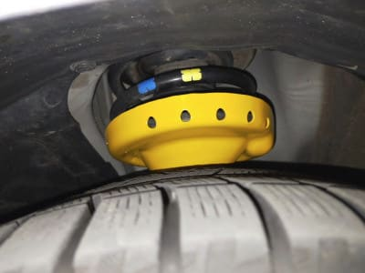

新しくなったのはストラットASSYだけで，

スプリングやダストブーツはそのまま

古いのがついてますね…

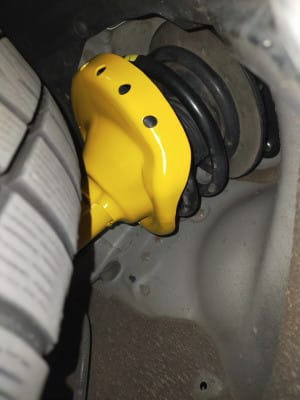

でも．

ひと冬過ぎて汚れた下周りの中で．

ストラットだけが，妙にピカピカに

なってますね…

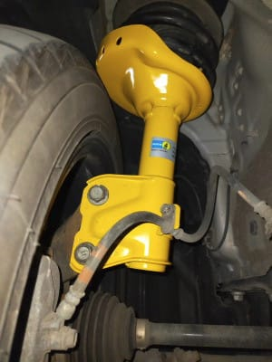

とりあえず．

時間がなかったので，数kmだけちょっと

走ってみましたが．

新品ショック，渋りが出たりするかな？

あるい68000km以上走った古いショックは，

実はもうヘタりかけていて，

新しいショックで走りが見違えるか？？

…と，期待したけど．

ボコボコいう不具合は消えたのは

確認できたものの．

ダンパーが新品になった違いは

数kmでは分かりませんでした

…もう少し走って，何か違いを感じたら

報告します…

でも，10分ほど街乗りしても，すぐに気づく

違いはなかったということは．

6.8万kmくらいじゃ，LEVORGの

ビルシュタインショックはヘタらない

…ということを感じた，Skier_Sだったのでした…

すぐにヘタって，新品と乗り比べると違いが

はっきり分かるスキー板よりも長持ちだな←比較するものが違う

ってなことで．

ショックを交換したことは面白いネタに

ならなさそうですが．

…スバルディーラーで準備してくれた

代車が，なぜかこんな車だったので．

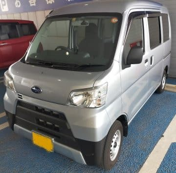

こいつの試乗レポートでも書いた方が

面白いかも…

また，気が向いたら書いてみます．

ということで．

本日もとりあえず，いつもの特派員情報です！

…でも．

今日はおこみん特派員は，昼の参戦だったらしく．

すでに緩んだ昼のおこみん写真からスタート！

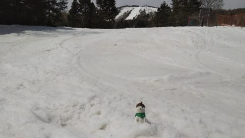

天気は多少空がかすんでいたものの，

見事な日差しの晴れで…

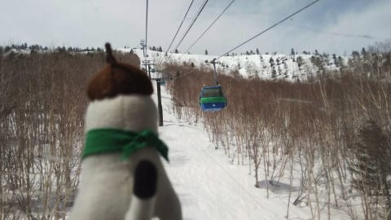

昼過ぎには気温は10℃近くまで

上がっちゃったようです(泣）

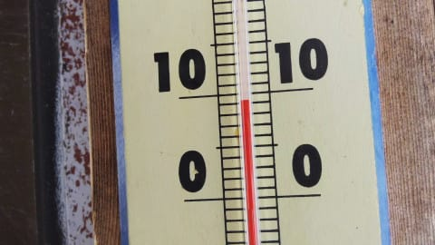

そして．

気温が高く，雪がザブザブで…

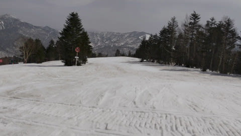

それだけじゃなく，黄砂で茶色く

汚れた寂しい感じの雪ですね(激泣）

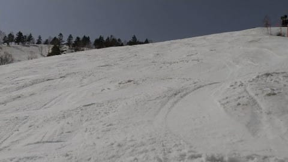

西舘方面は，雪は柔らかくても

人が少なくそんなに荒れて無いみたい

ですが．

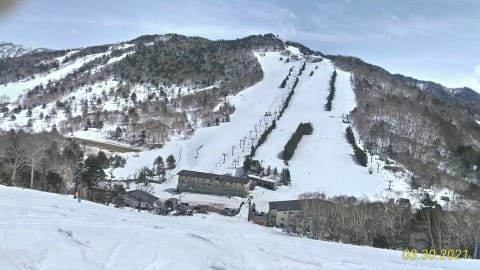

高天ヶ原ももうかなり重そうな感じの

雪ですね…

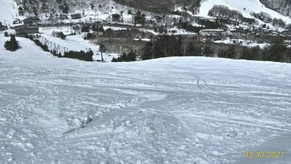

タンネの森は意外と良かったと

レインボー特派員の報告がありましたが．

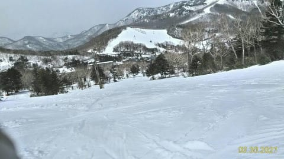

一の瀬ファミリー正面バーンも，

一見フラットで良さそうに見えますが…

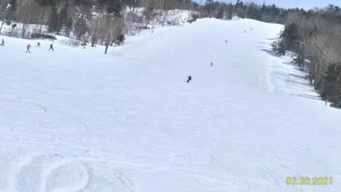

まぁ，さすが気温がプラス10℃まで

上がったので．

午前は日当たりが悪い一の瀬ファミリーでも，

雪はかなり重そうになってます(泣）

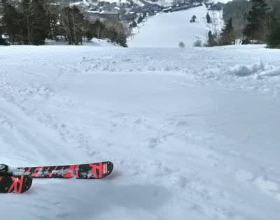

そして．

この日は高温＆日差しでGW並みの

重い雪になっただけじゃなく．

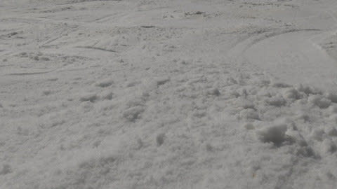

かなり黄砂で雪が汚れてしまって．

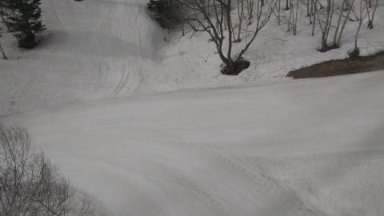

白い部分は滑りはいいけども，

汚れた部分は滑りが悪くて

突っかかる雪だったようです…

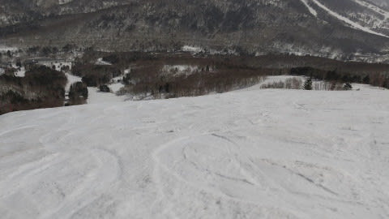

ってなことで．

雪解けだけじゃなく，

黄砂

という敵までやってきて．

あぁ…

春だ．

春というシーズンが

やってきたなぁ…

と，痛感させられますね．

「冬来たりなば，春遠からじ」

という言葉は，

楽しいことの後には，嫌なことがやってくる

という意味にしか受け取れない私は．

春の訪れを，花粉で鼻をズルズルにしながら

恨めしく思っているのでした…(泣）

## 💬 コメント一覧

### 💬 コメント by (雪バカ)
**タイトル**: Unknown
**投稿日**: 2021-03-31 06:06:33

3年ほどで68,000km走行とはすごいペースですね！

これだけ走ったら　ヘタリは間違いなくありますよ。

街乗りでは分かりにくいでしょうが、高速道路での収まりは良くなってるはずです。

でも、安いダンパーより　ビルは劣化いい方でしょうが

### 💬 コメント by (ダウンヒル)
**タイトル**: Unknown
**投稿日**: 2021-03-31 07:04:02

Sさま得意の、新しいスキーマテリアル·新車の試乗情報も楽しいんですが···「ディーラー代車の試乗情報」なるものが追加されようとしていて、思いっきり期待。

### 💬 コメント by (新米パパ)
**タイトル**: Unknown
**投稿日**: 2021-03-31 08:03:45

この代車はひどくないすか！笑

代車ってひそかに楽しみだったりするし、次のクルマを買う時の印象に割と影響しますからね、、

試乗レポがたのしみです。

### 💬 コメント by (大阪のK)
**タイトル**: 代車
**投稿日**: 2021-03-31 12:56:18

S様、ぜひ代車のレポをお願いします。

代車は自車より低グレードの方が気兼ねなく借りれますよね。

自分の場合、BMW　X3の代車が750iLだったので、駐車場所に困ってしまいましたよ。

全長が5250mmですもの。

### 💬 コメント by (レインボー73)
**タイトル**: Unknown
**投稿日**: 2021-03-31 17:52:44

水曜日の志賀高原情報

車には大国からの贈り物がびっしり。妙高も霞んでる。

朝の蓮池３℃。昨日より風が冷たい。山頂１℃。

まずはパノラマから１ゴンへ。シマシマパリパリが、パノラマの壁では緩んで快適に。

緩んでズクズクになるのをみこして、最近の使用板はヘッドｉ．SL

私は無知だけど、クラウンの人から戴いた板なので、きっといい物に違いないかと。誰ですか、猫に小判？

明日からはバスでしか滑れないＧＳは早くも勘違い快適バーンに。名残りを惜しんでＧＳ回しのあと、いつものように寺子屋へ。

硬い。今日は午後まで快適維持しそう。

そしてまたまた銀嶺でお昼。

昼食後、タンネに行くと故障でリフトストップ。困っていると、そこへ現れたのは正義の使者ハリマオ（古い。わかる人は私と同世代）。

『送りましょうか』

スノーモービル初体験！しかも、タダで！こんなことで運を使い果たしてしまうのではと心配しつつも、我が身に起こる幸運に酔いしれることができました。

パーフェクタとファミリーは甲乙つけがたい気持ちよさ。なんか、この時期の志賀高原は、捨てたもんじゃないなあ。来年から、生活パターンを変えてもいいかな、なんて、エス化されつつあるレインボーです。

それと昨年と大違いなのが、妖怪板つかみに出逢えないことです。私が思うに、多分、おそらく、いやきっと、エス様が、妖怪ホイホイをしかけたのでは？

### 💬 コメント by (かず)
**タイトル**: Unknown
**投稿日**: 2021-03-31 18:12:25

レインボーさん今シーズンいつ頃までいます？調べたらいつも出てくる銀嶺？に日帰り温泉があるみたいですね

### 💬 コメント by (レインボー73)
**タイトル**: Unknown
**投稿日**: 2021-03-31 19:02:34

お借りします。

かずさん、今日で109日。誕生日と同じ数の114日まで滑ったら、掃除洗濯布団干しして、帰って、山菜採り、渓流釣り、妻との逢瀬です。妻は逢いたがってくれてるのかは、いささか疑問。

春がこんなに滑れるのなら、来年からは（生きていれば）、もっとスキーかなあ。

### 💬 コメント by (はなげ親分)
**タイトル**: Unknown
**投稿日**: 2021-03-31 20:48:41

春ですね～

なんか1か月ほど早く季節が進んでる感じです。

4月第1週から早朝1本勝負となると寂しいものがあります(泣)

今週末より毎週ご神体に貢物を献上しないと・・・

＞レインボー様

快傑ハリマオ　見てましたよ！

時期的にはララミー牧場と同じ頃だったかと。

好きだった忍者部隊月光はもう数年あとだったかな～

### 💬 コメント by (Skier_S)
**タイトル**: イチゴン終了…（涙）
**投稿日**: 2021-04-01 03:57:13

＞雪バカさま

コメントありがとうございます～！

普段なら年3～3.5万km走るので，2年8か月で6.8万kmって

少ないほうなんです…

いつもなら1回目の車検で10万kmくらい行っちゃいますが，

ここ一年間は，コロナで走行距離がむちゃくちゃ少なかったです…

で，ショックの違いですが．

今日は通勤で走ってみたところ，違いを感じました…！

＞ダウンヒルさま

あら！？？軽のワゴンの試乗リクエストがあるとは！

このBlog読者にそんな需要があると思ってませんでした(笑)．

＞新米パパさま

交換がここまで伸びたのは，ディーラーの作業の空きがなかっただけじゃなく，

代車も確保できなかったのがおおきくて．

「サンバーしかないですが，この日が最速で代車が準備できる日です」

ということで，この日になったんです…

いや．

出来れば私ももっといい代車に乗ってみたかった．

＞大阪のKさま

あれ？大阪のSさまじゃなくて，Kさまですか…

750iLを代車にするって，すごいですね．

スバルもWRX STIとか代車にすればいいのに…(笑)

しかし，軽ワゴンの試乗レポートに需要があるとは…！

＞レインボー73さま

ええ！スノーモービルで送ってもらえたんですか？

それはラッキーでしたね…

よっぽど助けなきゃいけないような人に見えたんでしょうか(笑)．

…で，私はハリマオ分かりません…（涙）

114日滑走まであと5日ですか…

来週の週末はいらっしゃらないのですね．

ぜひGWあたりに戻ってきてみてください．

＞かずさま

あ，銀嶺は日帰り入浴できたんですね！

知りませんでした…

＞はなげ親分さま

春ですね…

私の一番嫌いな，春ですね…(涙）

4月の第2週以降は，2ゴン1本のみ．

奥志賀に逃げるにも，車で行かないと…

かなり不便ですね(泣）

そして早朝2500円…

ナイターと合わせると，ヤケビシーズン券を買ってもいいかもしれませんね…

