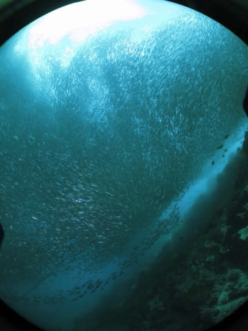

# 2016年8月　子連れで再訪！モアルボアル旅行記その7…1日目の午後のダイブはイワシを大満喫！

📅 投稿日時: 2017-08-18 02:14:11

🏷️ カテゴリ: [ダイビング日記](ce3a7a8d424d112fce83ee85c81a0e344.md)

今週末は，志賀高原で毎年恒例の

「[大蛇祭り](http://www.shigakogen.gr.jp/daija/index.html)」があるので，

志賀まで行ってみようかなぁ…

と考えている，Skier_Sです．←夏まで志賀に行くなんて，どれだけ志賀高原が好きなんだ…

でも．

確か．

今週土日で志賀高原に行っちゃうと．

その次の月曜に一日だけ仕事に行って．

翌日の火曜から，またパラオ旅行だった

気がするのだが…？

座間味から帰ってきて，中9日でパラオに行く

という計画だけでもおかしいのに…

その間に1泊2日で志賀高原にいくとは，

もう，いろいろ終わってますな．

ええ．終わってますね．

そうですよ．←なんか開き直ってるんですけど

…ってことで．

もう，今年の2回目のダイビング旅行が

迫っているというのに．

このBlogでは，1年前のモアルボアル旅行記，

続きます…

---

ということで．

娘が一人でお留守番してくれるという，

すごーーーーい有り難い申し出があったため．

夫婦で潜れることになったイワシダイビング

ですが…

エントリー直後から．

もう，見えてます．

そう，イワシの群れが…！

近づいていくと…

うはー．

やっぱり群れ，でっかいな～！！

長さは軽く100mを超えていて．

向こう端が見えないほど，長く

群れが続いてます…

そして近づいていくと…

群れ全体が，それで一つの生き物のように

動きます！

うひょーー！！

大迫力！

これだから，やっぱり

イワシダイビングはやめられないんだよな…

さらに群れに近づくと…

もう，ここまで寄れます．

かぶりつきです．

頭の上を群れに覆われると，

太陽が隠れて暗く感じるほど．

静止画で見ると，動きがないので

単調ですけど．

これを実際に見ると，ダイナミックに

動いて面白いんですよ…

もう，長さ100mを超える

イワシの群れに沿って泳いで，

ダイブタイム中ずっと，群れを眺め続けます…

もう，ボートの下に戻ってきて，

安全停止中もイワシの群れ！

動画も載せておきますが．

これ，群れの動きが面白いですよ…

動画でこれだけ面白いんですから．

ホンモノは見てて飽きません…

こっちの動画では，冒頭でホシカイワリに

群れが襲われて，一気に動きます！

その後，群れの大きさの全貌が分かる動画に…

ってな感じで．

ダイブタイム50分間．

たっぷり群れを眺められた，

満足の1本でした～！

やっぱり，イワシダイブ，面白い！

## 💬 コメント一覧

### 💬 コメント by (まうちゅう)
**タイトル**: Unknown
**投稿日**: 2017-08-18 19:59:41

これはスゴイ！

映像ではなく、間近に見るともっとスゴイんでしょうね。

ダイビングの醍醐味の一つなんですね！

### 💬 コメント by (Skier_S)
**タイトル**: まうちゅうさま
**投稿日**: 2017-08-19 00:50:54

いや，このイワシの巨大群れ．

すごいですよ！

こういうのを間近で見れるのが，

まさにダイビングの醍醐味です！！

そうそう，まうちゅうさんもこの夏に

志賀高原に行ってらしたのですね…

私は明日志賀高原へ行ってきます～！

